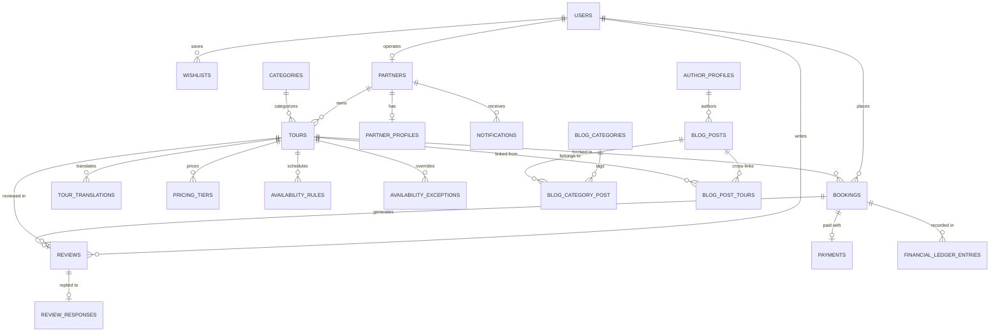

# Bookly Travel — Product Requirements Document (PRD)

> **Version**: 2.0.0  
> **Date**: 2026-08-28  
> **Author**: Product & Engineering  
> **Status**: Living Document (Phase 1 Complete — Specs 001–016 Delivered; Phase 2 Planned)  
> **Repository**: [bookly-travel](https://github.com/hatemsamirafifi/bookly-travel)

---

## Table of Contents

1. [Product Overview](#1-product-overview)
2. [Vision & Objectives](#2-vision--objectives)
3. [Target Users & Personas](#3-target-users--personas)
4. [Product Scope — Phase 1 Delivered MVP](#4-product-scope--phase-1-delivered-mvp)
5. [Functional Requirements](#5-functional-requirements)
6. [Non-Functional Requirements](#6-non-functional-requirements)
7. [System Architecture](#7-system-architecture)
8. [Data Model Overview & Schema](#8-data-model-overview--schema)
9. [API Design](#9-api-design)
10. [User Flows](#10-user-flows)
11. [Frontend Architecture & Design System](#11-frontend-architecture--design-system)
12. [Internationalization (i18n)](#12-internationalization-i18n)
13. [SEO & Content Marketing Strategy](#13-seo--content-marketing-strategy)
14. [Payment & Financial Requirements](#14-payment--financial-requirements)
15. [Security & Compliance](#15-security--compliance)
16. [Testing Strategy](#16-testing-strategy)
17. [Deployment & Infrastructure](#17-deployment--infrastructure)
18. [Feature Status & Roadmap](#18-feature-status--roadmap)
19. [Out of Scope (Phase 1 vs Phase 2 vs Future)](#19-out-of-scope-phase-1-vs-phase-2-vs-future)
20. [Risk Register](#20-risk-register)
21. [Success Metrics](#21-success-metrics)
22. [Glossary](#22-glossary)

---

## 1. Product Overview

**Bookly** is a multi-partner tours-only marketplace platform connecting travelers with verified tour operators across European destinations. The platform delivers instant-confirmation bookings, transparent pricing, and multilingual localization for travelers, while providing tour operators with self-service listing, pricing, and availability management, and giving platform administrators full operational governance, content moderation, and financial auditability.

### Product Type

B2C marketplace with B2B partner management and content marketing (Travel Insights blog).

### Core Value Proposition

- **For Travelers**: A seamless, multilingual discovery-to-booking experience with instant confirmation, guest checkout, wishlist curation, and tamper-proof digital vouchers.
- **For Partners**: A self-service portal to onboard, create and price tour listings, manage recurring availability rules, track bookings and revenue, and respond to traveler reviews.
- **For Admins**: Full-stack moderation, partner vetting, tour approval, financial oversight, static content management, and immutable audit capabilities via a dedicated Filament dashboard.
- **For Marketing & Editorial**: An editorial CMS for localized Travel Insights articles, author profiles, related tour cross-linking, scheduled publishing, and search engine optimization.

---

## 2. Vision & Objectives

### Vision

Become the leading tours marketplace in Europe by delivering a premium booking experience in multiple languages with instant confirmation, transparent financial operations, and high-quality curated travel insights.

### Phase 1 Objectives & Achievements

| Objective | Target | Status |
|-----------|--------|--------|
| Multi-language booking platform | Full EN, ES, IT support across all traveler surfaces | ✅ Delivered |
| End-to-end booking & payments | Stripe Payment Intents with immutable financial ledger | ✅ Delivered |
| Search & discovery engine | Full-text Meilisearch integration with filters, sort, and localized URLs | ✅ Delivered |
| Partner self-service & onboarding | Self-registration, admin invites, tour wizard, pricing, availability | ✅ Delivered |
| Platform moderation & governance | Laravel Filament admin dashboard with audit logging & role permissions | ✅ Delivered |
| Transactional communications | Asynchronous queued multilingual emails, PDF vouchers with QR verification | ✅ Delivered |
| Editorial content marketing | Travel Insights blog with JSONB localization, author profiles, related tours | ✅ Delivered |
| Public SEO performance | Lighthouse Performance ≥ 90 on public pages with dynamic sitemaps & JSON-LD | ✅ Delivered |

---

## 3. Target Users & Personas

### 3.1 Traveler (Public User)

| Attribute | Detail |
|-----------|--------|
| **Who** | Individual travelers and groups looking for tours and experiences in European destinations |
| **Goals** | Find tours by destination/category/date, compare options, book with instant confirmation, access digital vouchers |
| **Behavior** | Browses anonymously; uses guest checkout or creates/authenticates an account; manages bookings and wishlists |
| **Languages** | English (`en`), Spanish (`es`), Italian (`it`) |
| **Devices** | Mobile-first responsive web; desktop and tablet fully supported |

### 3.2 Partner (Tour Operator)

| Attribute | Detail |
|-----------|--------|
| **Who** | Local tour operators, guides, and experience providers |
| **Goals** | List tours, configure pricing tiers and availability schedules, manage bookings, track revenue, respond to reviews |
| **Behavior** | Registers publicly or via admin invite; awaits admin review; operates via `/partner` dashboard |
| **Constraints** | One account per partner organization in Phase 1 (multi-staff scheduled for Phase 2) |

### 3.3 Admin (Platform Operator)

| Attribute | Detail |
|-----------|--------|
| **Who** | Bookly platform administrators, operations, and compliance personnel |
| **Goals** | Approve/reject partners and tours, moderate reviews, oversee booking audits, manage site settings and static content |
| **Behavior** | Uses the Laravel Filament admin dashboard (`/admin`) for all operations |

### 3.4 Content Editor / Marketing

| Attribute | Detail |
|-----------|--------|
| **Who** | Internal marketing team and travel content writers |
| **Goals** | Author localized travel guides, assign authors/categories, link relevant tours, preview drafts, schedule publications |
| **Behavior** | Creates and manages blog posts via the Filament CMS |

---

## 4. Product Scope — Phase 1 Delivered MVP

Phase 1 delivers the complete marketplace MVP across **16 feature specifications** (`specs/001` through `specs/016`):

| Area | Specifications | Key Capabilities Delivered |
|------|---------------|----------------------------|
| **Authentication & Security** | `001`, `003`, `004`, `005` | Traveler registration, email verification, Sanctum bearer tokens, brute-force protection (lockout after 5 failed attempts in 15 min), rate limiting, guest identity capture, guest-to-account conversion |
| **Foundation & Public Frontend** | `002`, `010` | Three-surface architecture, Next.js 16 App Router, Tailwind CSS 4 design system, `next-intl` multi-language routing, accessible UI primitives |
| **Search & Discovery** | `006` | Full-text search (Laravel Scout + Meilisearch), filters (destination, category, price, duration, date), sort orders, category/destination landing pages, dynamic sitemap |
| **Booking & Checkout** | `007` | 4-step checkout (Select → Details → Payment → Confirmation), row-level locking overbooking protection, guest & authenticated flows, 8-character booking references, cancellation |
| **Payments & Ledger** | `008` | Stripe Payment Intents, Stripe Elements, append-only immutable financial ledger (`financial_ledger_entries`), webhook deduplication (`stripe_webhook_events`), refund tracking |
| **Reviews & Ratings** | `009` | Post-trip 1–5 star reviews with comments, 48-hour traveler edit window, partner response capability, admin hide/reinstate moderation, aggregate rating recalculation |
| **Traveler Account** | `011` | Booking history and detail views, voucher downloads, wishlist toggle and management, profile and password management, session token revocation |
| **Partner Dashboard & Catalog** | `012` | Multi-step tour wizard, media management (Cloudflare R2 presigned uploads), pricing tiers, recurring availability rules & blackout exceptions, booking updates, analytics |
| **Admin Moderation & Governance** | `013` | Filament 3 admin panel, partner approvals, tour review workflows, review moderation, static page management, global settings, immutable governance audit logs |
| **Notifications & Vouchers** | `014` | Queued multi-language transactional emails, PDF vouchers with QR codes, unauthenticated public verification page (`/v/{reference}`) |
| **Partner Onboarding** | `015` | Public partner self-registration, admin-initiated invitation tokens with auto-approval, partner profile lifecycle (`pending`, `approved`, `rejected`, `suspended`), re-submission workflow |
| **Editorial Blog & Insights** | `016` | Travel Insights blog, JSONB multi-language content, author profiles, category tagging, related tour cross-linking, cryptographically bound preview tokens, scheduled publishing |

### Key Design Decisions

| Decision | Resolution | Detail |
|----------|------------|--------|
| **Admin Surface** | Laravel Filament 3 | Server-rendered admin control panel for rapid back-office governance |
| **Public & Partner Surfaces** | Next.js 16 App Router | API-first architecture consuming Laravel REST API |
| **Guest Checkout** | Enabled | No account required to book; automatic account conversion offered post-booking |
| **Partner Structure** | One Account per Partner | 1:1 user-to-partner mapping in Phase 1 (multi-staff scheduled for Phase 2) |
| **Financial Ledger** | Append-Only Immutability | No `UPDATE` or `DELETE` on financial records; corrections logged as new ledger entries |
| **Voucher Verification** | Public Verification URL | QR encodes `https://bookly.travel/v/{reference}` resolving to a read-only verification page |
| **Blog Localization** | JSONB Storage | Multi-language blog content and author bios stored in JSONB columns with English fallback |
| **Search Engine** | Meilisearch via Laravel Scout | Real-time indexing for tour catalog with localized full-text querying |
| **Notification Channels** | Email Only (Phase 1) | Multi-language queued transactional emails via Redis; SMS/Push scheduled for Phase 2 |

---

## 5. Functional Requirements

### FR-001: Traveler Authentication

| ID | Requirement | Priority |
|----|-------------|----------|
| FR-001.1 | Travelers can register with email and password | Critical |
| FR-001.2 | Email verification is required after registration | Critical |
| FR-001.3 | Travelers can sign in with email/password and receive a Sanctum token | Critical |
| FR-001.4 | Travelers can sign out (token revocation) | Critical |
| FR-001.5 | Guest checkout captures email + name at booking time | Critical |
| FR-001.6 | Post-booking, guest is offered automatic account creation | High |
| FR-001.7 | If guest email matches an existing account, booking is linked to that account | High |
| FR-001.8 | Password reset flow via email | High |
| FR-001.9 | Account lockout after 5 failed login attempts within 15 minutes | Critical |
| FR-001.10 | Rate limiting: 10 auth requests per minute per IP | Critical |

### FR-002: Search & Discovery

| ID | Requirement | Priority |
|----|-------------|----------|
| FR-002.1 | Homepage displays featured tours, categories, and destinations | Critical |
| FR-002.2 | Full-text search across tour title, description, and location | Critical |
| FR-002.3 | Filter by: destination, category, price range, duration, date, language | Critical |
| FR-002.4 | Sort by: relevance, price (asc/desc), rating, newest | High |
| FR-002.5 | Paginated results (20 per page default) | High |
| FR-002.6 | Tour listing cards show: title, cover image, price, rating, location, duration | Critical |
| FR-002.7 | Only published tours with valid pricing and availability appear in results | Critical |
| FR-002.8 | Localized URLs: `/en/tours/...`, `/es/tours/...`, `/it/tours/...` | Critical |
| FR-002.9 | Category landing pages with filtered tour listings | High |
| FR-002.10 | Destination landing pages with filtered tour listings | High |
| FR-002.11 | Empty states displayed when no results match | Medium |
| FR-002.12 | Unpublished or unavailable tours return 404 if accessed directly | High |

### FR-003: Tour Detail

| ID | Requirement | Priority |
|----|-------------|----------|
| FR-003.1 | Tour detail page shows full information in the visitor's locale | Critical |
| FR-003.2 | Image gallery with cover image | Critical |
| FR-003.3 | Pricing display (per person) | Critical |
| FR-003.4 | Availability calendar showing bookable dates | Critical |
| FR-003.5 | Booking CTA ("Book Now") leading to checkout | Critical |
| FR-003.6 | Reviews section with aggregate rating and individual reviews | High |
| FR-003.7 | Tour details: duration, location, meeting point, inclusions, exclusions, highlights, group size | Critical |
| FR-003.8 | Related tours / category suggestions | Medium |

### FR-004: Booking & Checkout

| ID | Requirement | Priority |
|----|-------------|----------|
| FR-004.1 | Multi-step checkout: Select → Details → Payment → Confirmation | Critical |
| FR-004.2 | Guest checkout without account creation | Critical |
| FR-004.3 | Authenticated checkout with pre-filled traveler info | High |
| FR-004.4 | Collect: name, email, phone, participant count, special requests | Critical |
| FR-004.5 | Booking lifecycle: `created → pending_payment → confirmed → completed` with branches to `cancelled`, `expired`, `refunded` | Critical |
| FR-004.6 | Idempotent booking creation via client-generated idempotency key | Critical |
| FR-004.7 | Availability validated at booking time with row-level locking | Critical |
| FR-004.8 | Booking reference/confirmation code generated (8-char alphanumeric) | High |
| FR-004.9 | Financial snapshot (price, currency) locked at booking time | Critical |
| FR-004.10 | Confirmation page with booking summary and account creation offer | High |
| FR-004.11 | Traveler can cancel confirmed bookings before tour date | High |
| FR-004.12 | Auto-completion via scheduled job after tour date passes | High |
| FR-004.13 | 15-minute payment window; expired bookings release availability | High |

### FR-005: Payment Processing

| ID | Requirement | Priority |
|----|-------------|----------|
| FR-005.1 | Stripe Payment Intents API for payment creation | Critical |
| FR-005.2 | Stripe Elements for client-side card input (PCI-compliant) | Critical |
| FR-005.3 | Two-step orchestration: reserve availability → confirm payment | Critical |
| FR-005.4 | Webhook handling for: `payment_intent.succeeded`, `payment_intent.payment_failed`, `charge.refunded` | Critical |
| FR-005.5 | Immutable financial ledger (append-only, no edits, no deletes) | Critical |
| FR-005.6 | Ledger entries record: amount, currency, type, booking reference, Stripe references, status, timestamp | Critical |
| FR-005.7 | Automatic refund on eligible cancellation | High |
| FR-005.8 | Webhook event deduplication (idempotent processing) | Critical |
| FR-005.9 | Failed payment handling with user-facing error messages | High |

### FR-006: Reviews & Ratings

| ID | Requirement | Priority |
|----|-------------|----------|
| FR-006.1 | Review submission for completed bookings only | Critical |
| FR-006.2 | 1–5 star rating scale | Critical |
| FR-006.3 | Text comment (10–2000 characters) | High |
| FR-006.4 | One review per booking per traveler | Critical |
| FR-006.5 | Reviews displayed on tour detail page with average rating | High |
| FR-006.6 | Review editing within 48-hour window after submission | Medium |
| FR-006.7 | "Edited" indicator on modified reviews | Medium |
| FR-006.8 | Admin can hide/reinstate reviews | High |
| FR-006.9 | Aggregate rating and review count on tour listing cards | High |
| FR-006.10 | Review eligibility window: 30 days after booking completion | Medium |

### FR-007: Traveler Account

| ID | Requirement | Priority |
|----|-------------|----------|
| FR-007.1 | Dashboard with upcoming and past bookings overview | High |
| FR-007.2 | Booking list filterable by status (confirmed, completed, cancelled, refunded) | High |
| FR-007.3 | Booking detail with full info, voucher download, cancel action, review action | High |
| FR-007.4 | Profile management: name, email, phone, password change | High |
| FR-007.5 | Language preference setting (EN, ES, IT) | Medium |
| FR-007.6 | Wishlist: save/unsave tours, wishlist page with pagination | Medium |
| FR-007.7 | My Reviews page with pagination and edit links | Medium |
| FR-007.8 | Auth guard: unauthenticated users redirected to login with return URL | Critical |

### FR-008: Partner Dashboard & Tour Management

| ID | Requirement | Priority |
|----|-------------|----------|
| FR-008.1 | Dedicated partner dashboard (`/partner`) with business metrics, bookings summary, and analytics | Critical |
| FR-008.2 | Tour authoring wizard: Basic Info, Media, Pricing Tiers, Availability Rules, and SEO metadata | Critical |
| FR-008.3 | In-progress tour draft persistence with ability to resume editing | High |
| FR-008.4 | Tour media upload with presigned Cloudflare R2 URLs, drag-and-drop ordering, and cover designation | High |
| FR-008.5 | Tour status lifecycle: `draft → pending_review → published` (with `rejected`, `archived` branches) | Critical |
| FR-008.6 | Pricing tier CRUD supporting per-tier pricing, currency (EUR/USD/GBP), and participant limits | Critical |
| FR-008.7 | Availability rule configuration (daily, weekly, specific days) with start/end times and capacity | Critical |
| FR-008.8 | Availability exceptions (blackout dates, capacity overrides, custom price overrides) | High |
| FR-008.9 | Partner booking list with status updates (`completed`), details, and cancellation requests | Critical |
| FR-008.10 | Partner public responses to traveler reviews | High |
| FR-008.11 | In-app notification center for partner alerts (booking created, tour review outcome, status changes) | High |

### FR-009: Admin Moderation & Governance

| ID | Requirement | Priority |
|----|-------------|----------|
| FR-009.1 | Dedicated Laravel Filament 3 admin control panel with role/permission access control | Critical |
| FR-009.2 | Partner application vetting queue: approve, reject (with mandatory reason), suspend, reinstate | Critical |
| FR-009.3 | Tour listing moderation: approve for publishing, reject with feedback, unpublish | Critical |
| FR-009.4 | Read-only booking audit trail inspection across all platform transactions | High |
| FR-009.5 | Review moderation queue: hide inappropriate reviews, reinstate flagged reviews | High |
| FR-009.6 | Immutable governance audit logging (`governance_audit_logs`) tracking actor, target, before/after state | Critical |
| FR-009.7 | Static CMS page editing (Terms of Service, Privacy Policy) and system settings management | Medium |

### FR-010: Transactional Notifications & Proof-of-Booking Vouchers

| ID | Requirement | Priority |
|----|-------------|----------|
| FR-010.1 | Queued multilingual transactional emails (booking confirmed, cancelled, partner alert, partner approved) | Critical |
| FR-010.2 | Asynchronous email dispatch via Redis queue with 3-attempt exponential backoff | Critical |
| FR-010.3 | Admin alerting via logs/Slack on exhausted notification delivery failures | High |
| FR-010.4 | Dynamic PDF voucher generation with booking reference, tour itinerary, meeting point, traveler counts | High |
| FR-010.5 | Tamper-proof QR code on voucher encoding public verification URL `https://bookly.travel/v/{reference}` | Critical |
| FR-010.6 | Unauthenticated public verification endpoint (`/v/{reference}`) returning real-time validity without exposing PII | Critical |
| FR-010.7 | Direct voucher PDF download from traveler booking detail page for `confirmed` and `completed` bookings | High |

### FR-011: Partner Onboarding & Lifecycle Management

| ID | Requirement | Priority |
|----|-------------|----------|
| FR-011.1 | Public partner self-registration (`/auth/partner-register`) capturing company info, registration number, credentials | Critical |
| FR-011.2 | Admin-initiated partner invitations via signed single-use invitation tokens (`/partner-invite/{token}`) | High |
| FR-011.3 | Invited partners completing registration are automatically set to `approved` status | High |
| FR-011.4 | Partner lifecycle governance: `pending → approved` (with `rejected` and `suspended` branches) | Critical |
| FR-011.5 | Rejected partners can view rejection reason and resubmit updated profiles for admin re-evaluation | High |
| FR-011.6 | Strict capability gating: non-approved partners are blocked from creating, submitting, or publishing tours | Critical |
| FR-011.7 | Partner suspension hides all published tours from public search immediately | Critical |

### FR-012: Editorial Blog & Travel Insights

| ID | Requirement | Priority |
|----|-------------|----------|
| FR-012.1 | Public Travel Insights blog listing with pagination, category filter tabs, and estimated reading times | Critical |
| FR-012.2 | Localized article detail pages with cover media, rich HTML body, author byline, and published date | Critical |
| FR-012.3 | JSONB multilingual storage for titles, bodies, summaries, and SEO metadata with English fallback | Critical |
| FR-012.4 | Cross-linking up to 6 published related tours on article pages with live pricing cards | High |
| FR-012.5 | Filament CMS editorial interface for creating, editing, and categorizing blog posts | Critical |
| FR-012.6 | Cryptographically signed preview tokens allowing secure review of unpublished drafts | High |
| FR-012.7 | Scheduled post publishing via background worker job at `scheduled_at` timestamp | High |
| FR-012.8 | Automated XML sitemap integration and `BlogPosting` + `BreadcrumbList` JSON-LD structured data | High |

---

## 6. Non-Functional Requirements

### Performance

| Requirement | Target |
|-------------|--------|
| Lighthouse Performance score (public pages) | ≥ 90 |
| Lighthouse Accessibility score (public pages) | ≥ 95 |
| First Contentful Paint | < 1.5s |
| Time to Interactive | < 3.5s |
| API response time (95th percentile) | < 500ms |
| Search query response time | < 200ms |

### Scalability

| Requirement | Detail |
|-------------|--------|
| Concurrent users | Support 1,000+ concurrent users |
| Database | PostgreSQL with connection pooling (PgBouncer) |
| Caching | Redis for application caching and queue processing |
| Search | Meilisearch for fast full-text search |

### Availability

| Requirement | Target |
|-------------|--------|
| Uptime SLA | 99.9% |
| Planned maintenance windows | Off-peak hours with advance notice |
| Database backups | Automated daily backups |

### Reliability

| Requirement | Detail |
|-------------|--------|
| Queue retry | 3 attempts with exponential backoff (10s, 60s, 300s) |
| Webhook idempotency | Deduplication by event ID |
| Financial consistency | Immutable ledger, no data loss |
| Booking integrity | Row-level locking prevents overbooking |

---

## 7. System Architecture

### Three-Surface Architecture

```
┌─────────────────────────────────────────────────────────────────────────────┐
│                          CLOUDFLARE CDN / EDGE                              │
│              (SSL Termination · Edge Caching · DDoS Protection)             │
└───────────────────────┬─────────────────────────────┬───────────────────────┘
                        │                             │
        ┌───────────────▼───────────────┐ ┌───────────▼───────────┐
        │   Next.js 16 (SSR / CSR)      │ │    Laravel Filament 3 │
        │ ┌───────────────────────────┐ │ │   (Admin Dashboard)   │
        │ │ Public Surface (SSR/SSG)  │ │ │   Server-Rendered     │
        │ │ Tours, Blog, Booking, SEO │ │ └───────────┬───────────┘
        │ ├───────────────────────────┤ │             │
        │ │ Traveler Area (CSR)       │ │             │
        │ │ Account, Bookings, Favs   │ │             │
        │ ├───────────────────────────┤ │             │
        │ │ Partner Portal (CSR)      │ │             │
        │ │ Tours, Pricing, Analytics │ │             │
        │ └─────────────┬─────────────┘ │             │
        └───────────────┼───────────────┘             │
                        │                             │
        ┌───────────────▼─────────────────────────────▼───────────┐
        │                 LARAVEL 11 API BACKEND                  │
        │ ┌─────────────────────────────────────────────────────┐ │
        │ │ REST API Endpoints: /api/public, /api/partner, ...  │ │
        │ ├─────────────────────────────────────────────────────┤ │
        │ │ Domain Services:                                    │ │
        │ │ Auth · Search · Booking · Payment · Reviews · Tour  │ │
        │ │ Partner · Pricing · Notifications · Blog · Admin    │ │
        │ └──────────────┬────────────┬────────────┬────────────┘ │
        └────────────────┼────────────┼────────────┼──────────────┘
                         │            │            │
             ┌───────────▼──┐  ┌──────▼─────┐ ┌────▼──────────┐
             │  PostgreSQL  │  │   Redis    │ │  Meilisearch  │
             │  (Primary DB)│  │Cache/Queues│ │ (Search Index)│
             └──────────────┘  └────────────┘ └───────────────┘
```

### Surface Mapping

| Surface | Technology | Route Prefix | Rendering | Target Audience |
|---------|-----------|-------------|-----------|-----------------|
| **Public traveler website** | Next.js 16 (App Router) | `/[locale]/` | SSR/SSG | Travelers, Public Visitors |
| **Traveler account** | Next.js 16 (App Router) | `/[locale]/my-*`, `/profile` | CSR (Auth-Guarded) | Authenticated Travelers |
| **Partner dashboard** | Next.js 16 (App Router) | `/[locale]/partner/` | CSR (Role-Guarded) | Verified Tour Partners |
| **Admin operations** | Laravel Filament 3 | `/admin/` | Server-rendered | Platform Operators, Moderators |
| **Public verification** | Next.js 16 (App Router) | `/v/{reference}` | SSR / Lightweight CSR | Tour Guides, Public Verification |
| **Backend REST API** | Laravel 11 (PHP 8.3+) | `/api/public/*`, `/api/partner/*`, `/api/admin/*` | JSON REST | Frontend Clients & Webhooks |

### Technology Stack

#### Backend
| Component | Technology | Version | Detail |
|-----------|-----------|---------|--------|
| **Framework** | Laravel | 11.x | Robust domain-driven REST API backend |
| **PHP Runtime** | PHP | 8.3+ | Strict typing, typed properties, readonly classes |
| **Admin Panel** | Laravel Filament | 3.x | Back-office management, CMS, moderation |
| **Authentication** | Laravel Sanctum | 4.x | Token-based API auth, stateful SPA session support |
| **Database** | PostgreSQL | 15 / 16 | Primary relational storage with JSONB support |
| **Cache & Queue** | Redis | 7.x | Tagged caching, job queues, session store |
| **Search Engine** | Meilisearch | 1.10+ | Fast full-text search via Laravel Scout |
| **Payment Gateway** | Stripe (stripe-php) | 13.x | Payment Intents API, webhook processing |
| **Testing** | Pest PHP | 3.x | Expressive unit and feature testing framework |

#### Frontend
| Component | Technology | Version | Detail |
|-----------|-----------|---------|--------|
| **Framework** | Next.js (App Router) | 16.x | React Server Components, SSR, dynamic routing |
| **Language** | TypeScript | 5.x | Strict mode type checking |
| **UI Library** | React | 19.x | Modern concurrent rendering, server actions |
| **Styling** | Tailwind CSS | 4.x | Design token utility-first CSS |
| **Internationalization** | next-intl | 4.x | Localized routing and message catalog management |
| **Server State** | TanStack React Query | 5.x | Asynchronous data fetching, mutation, caching |
| **Client State** | Zustand | 5.x | Lightweight client UI state management |
| **Form Handling** | React Hook Form + Zod | 7.x / 4.x | Schema-driven form validation |
| **Payments Form** | @stripe/react-stripe-js | 6.x | Secure client-side Stripe Elements integration |
| **Testing** | Jest + Playwright | 30.x / 1.x | Unit, component, and full browser E2E tests |

#### Infrastructure & Cloud
| Component | Technology | Detail |
|-----------|-----------|--------|
| **Edge CDN** | Cloudflare | SSL termination, DDoS protection, edge caching |
| **Media Storage** | Cloudflare R2 | S3-compatible object storage for tour media and assets |
| **Web Server** | Nginx Alpine | Reverse proxy and static file server |
| **Containers** | Docker Compose | Reproducible local and deployment environment orchestration |

### Domain Boundaries

```
app/Domains/
├── Admin         → Governance audit logging, static CMS pages, system settings, permissions
├── Auth          → Registration, authentication, brute-force protection, guest identity conversion
├── Blog          → Articles, categories, author profiles, related tours, preview tokens, scheduling
├── Booking       → Lifecycle state machine, concurrency row locking, checkout, digital vouchers
├── Partner       → Onboarding, invitations, company profiles, tour authoring wizard, analytics
├── Payment       → Stripe Payment Intents, Elements, webhook deduplication, immutable ledger
├── Reviews       → Verified submissions, ratings, 48h editing, partner responses, moderation
├── Search        → Meilisearch indexing, multi-parameter filtering, localized listings
├── Traveler      → User profile, session token revocation, wishlist collections
└── Wishlist      → Saved tours and traveler bookmarking
```

---

## 8. Data Model Overview & Schema

### Entity-Relationship Diagram



### Core Database Entities

| Table | Domain | Description & Key Columns |
|-------|--------|---------------------------|
| `users` | Auth | Central user entity (`id`, `email`, `password`, `name`, `phone`, `role: traveler\|partner\|admin`, `locale`, `email_verified_at`, `login_attempts`, `locked_until`, `created_at`, `updated_at`) |
| `guest_identities` | Auth | Unregistered checkout identities (`id`, `email`, `name`, `phone`, `device_fingerprint`, `ip_address`, `user_id`, `created_at`) |
| `personal_access_tokens` | Auth | Laravel Sanctum API tokens (`id`, `tokenable_type`, `tokenable_id`, `name`, `token`, `abilities`, `last_used_at`, `expires_at`) |
| `auth_audit_logs` | Auth | Security audit logs for login, logout, lockouts (`id`, `user_id`, `action`, `ip_address`, `user_agent`, `metadata`, `created_at`) |
| `partners` | Partner | Registered tour operator accounts (`id`, `user_id`, `status: pending\|approved\|rejected\|suspended`, `company_name`, `invited_by_admin`, `created_at`) |
| `partner_profiles` | Partner | Partner business credentials (`id`, `partner_id`, `business_registration_number`, `website`, `bio`, `contact_email`, `phone`, `rejection_reason`, `created_at`) |
| `partner_settings` | Partner | Partner notification & operational preferences (`id`, `partner_id`, `email_notifications`, `instant_booking`) |
| `partner_invitations` | Partner | Admin-initiated onboarding invitations (`id`, `email`, `company_name`, `token`, `expires_at`, `accepted_at`, `created_at`) |
| `categories` | Catalog | Tour taxonomy (`id`, `name`, `slug`, `icon`, `sort_order`, `created_at`) |
| `tours` | Catalog | Main tour catalog listing (`id`, `partner_id`, `category_id`, `status: draft\|pending_review\|published\|rejected\|archived`, `slug`, `duration_minutes`, `location`, `destination`, `meeting_point`, `min_group_size`, `max_group_size`, `price_cents`, `currency`, `cover_image_url`, `average_rating`, `review_count`, `is_featured`, `created_at`) |
| `tour_translations` | Catalog | Normalized multilingual tour content (`id`, `tour_id`, `locale: en\|es\|it`, `title`, `description`, `highlights`, `inclusions`, `exclusions`, `meeting_point`, `created_at`) |
| `tour_media` | Catalog | Image gallery assets (`id`, `tour_id`, `file_url`, `file_type`, `sort_order`, `is_cover`, `created_at`) |
| `tour_drafts` | Catalog | In-progress tour authoring wizard drafts (`id`, `tour_id`, `partner_id`, `draft_data_json`, `step`, `created_at`) |
| `pricing_tiers` | Pricing | Custom pricing options (`id`, `tour_id`, `name`, `price_cents`, `currency`, `min_participants`, `max_participants`, `created_at`) |
| `availability_rules` | Availability | Recurring schedule configurations (`id`, `tour_id`, `frequency: daily\|weekly\|monthly\|once`, `days_of_week`, `start_time`, `end_time`, `capacity`, `start_date`, `end_date`, `created_at`) |
| `availability_exceptions` | Availability | Blackouts and schedule overrides (`id`, `tour_id`, `date`, `is_blackout`, `override_capacity`, `override_price_cents`, `created_at`) |
| `bookings` | Booking | Tour reservation records (`id`, `tour_id`, `traveler_id`, `guest_email`, `guest_name`, `guest_phone`, `participant_count`, `booking_date`, `start_time`, `status: created\|pending_payment\|confirmed\|completed\|cancelled\|expired\|refunded`, `total_amount_cents`, `currency`, `idempotency_key`, `booking_reference`, `stripe_payment_intent_id`, `confirmed_at`, `cancelled_at`, `completed_at`, `anonymized_at`, `created_at`) |
| `booking_audit_logs` | Booking | State transition audit logs (`id`, `booking_id`, `action`, `actor_type`, `actor_id`, `before_state`, `after_state`, `created_at`) |
| `payments` | Payment | Gateway payment records (`id`, `booking_id`, `stripe_payment_intent_id`, `stripe_charge_id`, `amount_cents`, `currency`, `status`, `type`, `metadata`, `created_at`) |
| `financial_ledger_entries` | Payment | Append-only immutable financial records (`id`, `booking_id`, `type: charge\|refund`, `amount_cents`, `currency`, `stripe_payment_intent_id`, `stripe_charge_id`, `status`, `metadata`, `created_at`) |
| `stripe_webhook_events` | Payment | Webhook deduplication log (`id`, `stripe_event_id`, `type`, `payload`, `processed_at`, `created_at`) |
| `reviews` | Reviews | Post-trip traveler reviews (`id`, `booking_id`, `traveler_id`, `tour_id`, `rating: 1-5`, `comment`, `locale`, `is_visible`, `is_hidden_by_admin`, `submitted_at`, `edited_at`, `created_at`) |
| `review_audit_trails` | Reviews | Review modification history (`id`, `review_id`, `old_rating`, `new_rating`, `old_comment`, `new_comment`, `edited_by`, `created_at`) |
| `review_responses` | Reviews | Partner public responses to reviews (`id`, `review_id`, `partner_id`, `response_text`, `responded_at`, `created_at`) |
| `wishlists` | Wishlist | Traveler bookmarked tours (`id`, `user_id`, `tour_id`, `created_at`) |
| `notifications` | Notification | In-app user notifications (`id`, `user_id`, `type`, `title`, `message`, `data`, `read_at`, `created_at`) |
| `blog_categories` | Blog | Blog taxonomy (`id`, `slug`, `name_jsonb`, `description_jsonb`, `sort_order`, `created_at`) |
| `blog_posts` | Blog | Travel insights articles (`id`, `author_profile_id`, `slug`, `status: draft\|scheduled\|published\|archived`, `title_jsonb`, `body_jsonb`, `summary_jsonb`, `meta_title_jsonb`, `meta_description_jsonb`, `cover_image_url`, `published_at`, `scheduled_at`, `created_at`) |
| `author_profiles` | Blog | Article author credentials (`id`, `user_id`, `name`, `bio_jsonb`, `avatar_url`, `role_title`, `created_at`) |
| `blog_post_tours` | Blog | Article to tour relation (`id`, `blog_post_id`, `tour_id`, `sort_order`) |
| `blog_category_post` | Blog | Article to category pivot (`id`, `blog_post_id`, `blog_category_id`) |
| `governance_audit_logs` | Admin | Administrative oversight audit trail (`id`, `admin_id`, `action`, `target_type`, `target_id`, `before_state`, `after_state`, `ip_address`, `created_at`) |
| `admin_permissions` | Admin | Granular admin staff capability flags (`id`, `user_id`, `permission`, `created_at`) |
| `static_pages` | Admin | Localized legal and static CMS pages (`id`, `slug`, `title_jsonb`, `content_jsonb`, `is_published`, `created_at`) |
| `settings` | Admin | Global platform configuration (`id`, `group`, `name`, `payload`, `created_at`) |

---

## 9. API Design

### URL Prefix Conventions

- `/api/public/*`: Public visitor, catalog, blog, and authenticated traveler actions.
- `/api/partner/*`: Authenticated partner operations (protected by `auth:sanctum` and `partner` middleware).
- `/api/admin/*`: Specialized admin endpoints (augmented by Laravel Filament control panel at `/admin`).

### Core Endpoints

#### 1. Public & Traveler API (`/api/public/`)

| Method | Endpoint | Description | Rate Limit |
|--------|---------|-------------|------------|
| POST | `/auth/register` | Register traveler account | 10 req/min |
| POST | `/auth/login` | Traveler / Partner login (returns Sanctum bearer token) | 10 req/min |
| POST | `/auth/logout` | Revoke active Sanctum session token | 10 req/min |
| POST | `/auth/forgot-password` | Send password reset email | 10 req/min |
| POST | `/auth/reset-password` | Reset password using email token | 10 req/min |
| GET | `/auth/email/verify/{id}/{hash}` | Verify traveler email address | 10 req/min |
| POST | `/auth/resend-verification` | Resend verification email (auth required) | 10 req/min |
| PUT | `/auth/change-password` | Change password (auth required) | 10 req/min |
| POST | `/auth/guest/identity` | Store or match guest checkout identity | 10 req/min |
| POST | `/auth/guest/convert` | Convert guest bookings to newly created account | 10 req/min |
| POST | `/auth/partners/register` | Public partner self-registration | 10 req/min |
| GET | `/auth/partners/invitation/{token}` | Validate admin partner invitation token | 10 req/min |
| POST | `/auth/partners/invitation/{token}/complete` | Complete invited partner registration | 10 req/min |
| GET | `/auth/me` | Fetch authenticated user profile & role | 120 req/min |
| GET | `/search/tours` | Search catalog with filters, sort, and pagination | 60 req/min |
| GET | `/tours/{slug}` | Detailed tour information, gallery, and pricing | 120 req/min |
| GET | `/categories` | List active tour categories | 120 req/min |
| GET | `/categories/{slug}/tours` | Tours filtered by category | 120 req/min |
| GET | `/destinations` | List featured destinations | 120 req/min |
| GET | `/destinations/{slug}/tours` | Tours filtered by destination | 120 req/min |
| GET | `/homepage` | Curated homepage payload | 120 req/min |
| GET | `/sitemap.xml` | Dynamic multi-language XML sitemap | 10 req/min |
| GET | `/blog` | Paginated Travel Insights articles | 60 req/min |
| GET | `/blog/{slug}` | Full article detail with related tours and author | 120 req/min |
| GET | `/blog/category/{slug}` | Articles filtered by category | 60 req/min |
| GET | `/blog/{slug}/preview` | Token-authorized draft article preview | 120 req/min |
| POST | `/bookings` | Create tour booking & Stripe PaymentIntent | 5 req/min |
| GET | `/v/{reference}` | Public unauthenticated voucher verification | 60 req/min |
| POST | `/webhooks/stripe` | Stripe webhook event receiver (signature verified) | Unlimited |
| GET | `/tours/{slug}/reviews` | Paginated public reviews for a tour | 120 req/min |
| POST | `/reviews` | Submit post-trip review (auth required) | 10 req/hr |
| PUT | `/reviews/{review}` | Update review within 48h window (auth required) | 10 req/hr |
| GET | `/traveler/bookings` | Traveler booking history (auth required) | 60 req/min |
| GET | `/traveler/bookings/summary` | Traveler booking counts summary | 60 req/min |
| GET | `/traveler/bookings/{reference}` | Traveler booking detail (auth required) | 60 req/min |
| GET | `/traveler/bookings/{reference}/voucher` | Download PDF voucher (auth required) | 60 req/min |
| POST | `/traveler/bookings/{reference}/cancel` | Cancel booking before tour date | 5 req/min |
| GET | `/traveler/profile` | View traveler profile | 120 req/min |
| PUT | `/traveler/profile` | Update profile information | 120 req/min |
| POST | `/traveler/profile/change-password` | Update account password | 10 req/min |
| GET | `/traveler/sessions` | View active login sessions | 120 req/min |
| DELETE | `/traveler/sessions/{tokenId}` | Revoke specific session token | 120 req/min |
| GET | `/traveler/wishlist` | View traveler saved wishlist tours | 120 req/min |
| POST | `/traveler/wishlist` | Add tour to wishlist | 120 req/min |
| DELETE | `/traveler/wishlist/{tour_id}` | Remove tour from wishlist | 120 req/min |
| GET | `/traveler/wishlist/status` | Check saved status for tour IDs | 120 req/min |
| GET | `/traveler/reviews` | View traveler's submitted reviews | 120 req/min |

#### 2. Partner API (`/api/partner/`)

| Method | Endpoint | Description |
|--------|---------|-------------|
| POST | `/uploads/signed-url` | Generate Cloudflare R2 direct upload URL |
| GET | `/tours` | List partner's tours with status filters |
| POST | `/tours` | Create new tour listing |
| GET | `/tours/{id}` | Get full tour data for editing |
| PUT | `/tours/{id}` | Update tour details |
| DELETE | `/tours/{id}` | Delete unpublished draft |
| POST | `/tours/{id}/drafts/save` | Save in-progress wizard draft |
| GET | `/tours/{id}/drafts/latest` | Retrieve latest draft data |
| POST | `/tours/{id}/submit` | Submit tour draft for admin review |
| POST | `/tours/{id}/archive` | Archive published tour |
| GET | `/tours/{tourId}/pricing` | List pricing tiers for tour |
| POST | `/tours/{tourId}/pricing` | Create pricing tier |
| PUT | `/tours/{tourId}/pricing/{tierId}` | Update pricing tier |
| DELETE | `/tours/{tourId}/pricing/{tierId}` | Delete pricing tier |
| GET | `/tours/{tourId}/availability` | List availability rules and exceptions |
| POST | `/tours/{tourId}/availability/rules` | Create recurring availability rule |
| PUT | `/tours/{tourId}/availability/rules/{ruleId}` | Update availability rule |
| DELETE | `/tours/{tourId}/availability/rules/{ruleId}` | Delete availability rule |
| POST | `/tours/{tourId}/availability/exceptions` | Create blackout date or capacity override |
| PUT | `/tours/{tourId}/availability/exceptions/{id}` | Update availability exception |
| DELETE | `/tours/{tourId}/availability/exceptions/{id}` | Delete availability exception |
| GET | `/bookings` | List partner bookings across all tours |
| GET | `/bookings/{reference}` | View booking details and traveler contact |
| PATCH | `/bookings/{reference}/status` | Update booking status (`completed`) |
| POST | `/bookings/{reference}/cancellation-request` | Request booking cancellation with evidence |
| GET | `/reviews` | List reviews for partner's tours |
| POST | `/reviews/{id}/responses` | Post public response to traveler review |
| PUT | `/reviews/{id}/responses` | Update existing review response |
| GET | `/analytics` | Business analytics (booking volume, revenue metrics) |
| GET | `/financial-summary` | Partner earnings and ledger overview |
| GET | `/profile` | View partner company profile |
| PUT | `/profile` | Update partner company profile |
| GET | `/settings` | View partner operational settings |
| PUT | `/settings` | Update partner operational settings |
| GET | `/onboarding-status` | View partner onboarding review status |
| POST | `/onboarding/resubmit` | Resubmit rejected application with updated profile |
| GET | `/notifications` | List partner in-app notifications |
| POST | `/notifications/{id}/read` | Mark notification as read |
| POST | `/notifications/read-all` | Mark all notifications as read |

#### 3. Admin Operations & Filament Panel

| Interface | Resource / Route | Description |
|-----------|-----------------|-------------|
| Filament Resource | `PartnerResource` | Approve, reject (with reason), suspend, reinstate partners |
| Filament Resource | `TourResource` | Review pending tours, approve/publish, reject with reason |
| Filament Resource | `BookingResource` | Read-only audit inspection of all platform bookings |
| Filament Resource | `ReviewResource` | Review moderation queue (hide/reinstate, audit actions) |
| Filament Resource | `BlogPostResource` | Full editorial CMS (create, edit, JSONB localize, schedule, preview) |
| Filament Resource | `BlogCategoryResource` | Manage blog categories and descriptions |
| Filament Resource | `StaticPageResource` | Manage static CMS pages (Terms, Privacy Policy) |
| Filament Resource | `GovernanceAuditResource` | Search and inspect immutable operational audit logs |
| Filament Resource | `AvailabilityResource` | Read-only oversight of tour availability calendars |
| Filament Page | `Dashboard` | High-level platform KPIs, revenue, and active bookings |
| Filament Page | `Settings` | Platform-wide operational, booking, and SEO settings |
| GET | `/api/admin/audit/bookings` | API endpoint for booking audit trail |
| GET | `/api/admin/audit/bookings/{reference}` | API endpoint for single booking audit detail |
| GET | `/api/admin/financial-ledger` | API endpoint for immutable financial ledger |
| GET | `/api/admin/reviews` | API endpoint for review moderation queue |
| POST | `/api/admin/reviews/{review}/hide` | API endpoint to hide review |
| POST | `/api/admin/reviews/{review}/reinstate`| API endpoint to reinstate review |

---

## 10. User Flows

### 10.1 Traveler Booking & Confirmation Flow

```
┌──────────────┐     ┌──────────────┐     ┌──────────────┐     ┌──────────────┐
│ Search /     │────▶│ Tour Detail  │────▶│ Select Date  │────▶│ Traveler     │
│ Discovery    │     │ Page         │     │ & Travelers  │     │ Details Form │
└──────────────┘     └──────────────┘     └──────────────┘     └──────┬───────┘
                                                                      │
┌──────────────┐     ┌──────────────┐     ┌──────────────┐            │
│ Confirmation │◀────│ Stripe Card  │◀────│ Availability │◀───────────┘
│ & QR Voucher │     │ Payment      │     │ Locked (15m) │
└──────────────┘     └──────────────┘     └──────────────┘
```

### 10.2 Booking Lifecycle State Transitions

```
                    ┌─────────┐
                    │ created │
                    └────┬────┘
                         │ Stripe PaymentIntent created
                    ┌────▼──────────┐
                    │pending_payment│
                    └──┬─────────┬──┘
                       │         │
        payment        │         │ 15-minute timeout
        succeeds       │         │
              ┌────────▼┐  ┌─────▼───┐
              │confirmed│  │ expired │
              └──┬───┬──┘  └─────────┘
                 │   │
      traveler   │   │ tour date passes
      cancels    │   │ (auto-complete job)
        ┌────────▼┐ ┌▼──────────┐
        │cancelled│ │ completed │
        └────────┬┘ └───────────┘
                 │
        admin manual refund
        (Stripe webhook)
        ┌────────▼┐
        │refunded │
        └─────────┘
```

### 10.3 Partner Onboarding & Invitation Flow

```
┌─────────────────────────────────┐
│ Self-Registration / Invite Link │
└────────────────┬────────────────┘
                 ▼
┌─────────────────────────────────┐
│ Business Profile Submission     │ ──▶ Status: pending
└────────────────┬────────────────┘
                 ▼
┌─────────────────────────────────┐
│ Admin Review in Filament        │ ──▶ Approved / Rejected (with reason)
└────────────────┬────────────────┘
                 ▼
┌─────────────────────────────────┐
│ Partner Workspace Unlocked      │ ──▶ Status: approved (can author tours)
└────────────────┬────────────────┘
                 ▼
┌─────────────────────────────────┐
│ Tour Authoring Wizard (5 Steps) │ ──▶ Draft saved (resumable)
└────────────────┬────────────────┘
                 ▼
┌─────────────────────────────────┐
│ Submit Tour for Review          │ ──▶ Status: pending_review
└────────────────┬────────────────┘
                 ▼
┌─────────────────────────────────┐
│ Admin Approves Listing          │ ──▶ Status: published (Searchable)
└─────────────────────────────────┘
```

### 10.4 Digital Voucher Verification Flow

```
┌───────────────────────────┐
│ Traveler Presents Voucher │
│ (Mobile PDF or Printout)  │
└─────────────┬─────────────┘
              ▼
┌───────────────────────────┐
│ Guide Scans QR Code URL   │
│ (https://bookly.travel/v/)│
└─────────────┬─────────────┘
              ▼
┌───────────────────────────┐
│ Lightweight Public Page   │
│ Renders Real-Time Status  │
│ (VALID / CANCELLED / EXP) │
└───────────────────────────┘
```

### 10.5 Editorial Blog Publishing Flow

```
┌───────────────────────────┐
│ Editor Authors Article in │
│ Filament CMS (JSONB body) │
└─────────────┬─────────────┘
              ▼
┌───────────────────────────┐
│ Attach Author, Categories │
│ & Cross-Link Related Tours│
└─────────────┬─────────────┘
              ▼
┌───────────────────────────┐
│ Preview Draft via Secure  │
│ Signed Token URL          │
└─────────────┬─────────────┘
              ▼
┌───────────────────────────┐
│ Publish Immediately or    │
│ Schedule via Worker Job   │
└─────────────┬─────────────┘
              ▼
┌───────────────────────────┐
│ Live on Travel Insights   │
│ + Sitemap XML Regenerated │
└───────────────────────────┘
```

---

## 11. Frontend Architecture & Design System

### Route Map

```text
frontend/src/app/
├── [locale]/
│   ├── (public)/
│   │   ├── page.tsx                           → Homepage
│   │   ├── search/page.tsx                    → Tour search & filters
│   │   ├── tours/[slug]/page.tsx              → Tour detail view
│   │   ├── categories/[slug]/page.tsx         → Category landing
│   │   ├── destinations/[slug]/page.tsx       → Destination landing
│   │   ├── blog/page.tsx                      → Travel Insights blog feed
│   │   ├── blog/[slug]/page.tsx               → Article detail view
│   │   ├── blog/category/[category]/page.tsx  → Blog category feed
│   │   ├── booking/[slug]/page.tsx            → 4-Step checkout flow
│   │   ├── privacy/page.tsx                   → Privacy policy
│   │   └── terms/page.tsx                     → Terms of service
│   ├── (auth)/
│   │   ├── auth/login/page.tsx                → Traveler/Partner login
│   │   ├── auth/register/page.tsx             → Traveler registration
│   │   ├── auth/partner-register/page.tsx     → Partner self-registration
│   │   ├── auth/forgot-password/page.tsx      → Password reset request
│   │   ├── auth/reset-password/page.tsx       → Password reset complete
│   │   ├── auth/verify-email/page.tsx         → Email verification notice
│   │   └── partner-invite/[token]/page.tsx    → Invitation onboarding
│   ├── (traveler)/
│   │   ├── my-bookings/page.tsx               → Booking history
│   │   ├── my-bookings/[reference]/page.tsx   → Booking detail & voucher
│   │   ├── my-reviews/page.tsx                → Reviews management
│   │   ├── wishlist/page.tsx                  → Saved tours
│   │   └── profile/page.tsx                   → Traveler settings
│   └── (partner)/
│       └── partner/
│           ├── page.tsx                       → Partner dashboard
│           ├── tours/page.tsx                 → Tour listings & status
│           ├── tours/create/page.tsx          → Multi-step tour wizard
│           ├── tours/[id]/edit/page.tsx       → Tour editor
│           ├── bookings/page.tsx              → Partner booking management
│           ├── reviews/page.tsx               → Review response center
│           ├── analytics/page.tsx             → Performance metrics
│           ├── profile/page.tsx               → Partner profile & credentials
│           └── onboarding/page.tsx            → Application status view
├── v/
│   └── [reference]/page.tsx                   → Unauthenticated voucher verification
└── robots.ts / sitemap.xml                    → SEO crawl directives
```

### Rendering Strategy

| Route Group | Rendering | Rationale |
|-------------|-----------|-----------|
| `(public)` | SSR/SSG | SEO-critical, crawlable HTML |
| `(auth)` | SSR + client forms | Fast first paint |
| `(traveler)` | CSR with auth guard | Protected user data, no SEO |
| `(partner)` | CSR with role guard | Protected partner data |

### Design Tokens

| Category | Tokens |
|----------|--------|
| **Brand** | Navy `#0A2540`, Gold `#FFB800` |
| **Background** | Page `#F7F9FB`, Surface `#FFFFFF` |
| **Text** | Primary `#102033`, Secondary `#5D6B7A`, Inverse `#FFFFFF` |
| **State** | Success `#11845B`, Warning `#B76E00`, Danger `#C62828` |
| **Typography** | Inter (body), 400/500/600/700 weights |
| **Spacing** | 8px base grid: 4, 8, 12, 16, 24, 32, 48, 64px |
| **Radius** | sm 8px, default 12px, lg 16px, full 9999px |
| **Shadows** | sm, card, dropdown, modal elevation levels |
| **Breakpoints** | Mobile 390px, Tablet 780px, Desktop 1280px |
| **Transitions** | Fast 150ms, Default 200ms, Slow 300ms |

### Component Library

Built in-house with Tailwind CSS:

| Category | Components |
|----------|-----------|
| **UI primitives** | Button, Card, Input, Select, Modal, Toast, Badge, Avatar, Tabs, EmptyState, ErrorState, LoadingSkeleton |
| **Layout** | Header, Footer, Sidebar, MobileNav, ProtectedLayout, AuthGuard |
| **Tour** | TourCard, TourGrid, TourDetail, TourGallery, TourFilters, SearchBar |
| **Booking** | CheckoutStepper, BookingCard, BookingDetail, PaymentForm, CancelBookingModal |
| **Account** | DashboardStats, BookingList, ProfileForm, PasswordChangeForm, WishlistGrid, WishlistButton |
| **Reviews** | ReviewList, AggregateRating, ReviewCard, StarRating, ReviewForm, MyReviewsList |
| **Partner** | PartnerStats, TourForm, TourList, AvailabilityCalendar |

---

## 12. Internationalization (i18n)

### Supported Locales

| Language | Code | URL Prefix | Status |
|----------|------|------------|--------|
| **English** | `en` | `/en/` | Primary / Default Canonical |
| **Spanish** | `es` | `/es/` | Fully Supported |
| **Italian** | `it` | `/it/` | Fully Supported |

### Multi-Tier Localization Architecture

| Layer | Approach | Implementation Detail |
|-------|----------|-----------------------|
| **Frontend routing** | `next-intl` middleware | Path prefixing with automatic locale detection and cookie preference storage |
| **Static UI messages** | JSON message catalogs | Per-locale catalogs in `frontend/src/messages/{locale}.json` |
| **Catalog content** | Relational `tour_translations` | Normalized translations for titles, descriptions, highlights, inclusions, meeting points |
| **Editorial blog content** | PostgreSQL JSONB columns | Direct JSONB localization on `blog_posts`, `blog_categories`, `author_profiles` with automatic English fallback |
| **Transactional emails** | Multilingual Blade templates | Rendered and queued according to traveler/partner preferred locale |
| **SEO & hreflang** | Next.js Metadata API | Localized canonical URLs, `hreflang` alternate tags, and per-locale OpenGraph tags |

---

## 13. SEO & Content Marketing Strategy

| Technique | Implementation & Standards |
|-----------|----------------------------|
| **Server-Side Rendering (SSR)** | All public pages (tours, categories, destinations, blog) rendered server-side for crawlability |
| **Dynamic Meta Tags** | Unique localized `<title>`, `<meta description>`, OpenGraph cards, and Twitter summary cards |
| **Structured Data (JSON-LD)** | `TouristAttraction` & `Product` on tour detail; `BlogPosting` & `BreadcrumbList` on blog articles |
| **Content Cross-Linking** | Travel Insights articles surface up to 6 published related tours with interactive pricing cards |
| **Automated XML Sitemap** | Endpoint `/api/public/sitemap.xml` automatically indexing all tours, destinations, categories, and published blog posts |
| **Canonical URLs & hreflang** | Explicit canonical link tags and `hreflang` references across English, Spanish, and Italian versions |
| **Image Optimization** | Next.js `<Image>` component delivering WebP formats with responsive widths and lazy loading |
| **Performance Target** | Lighthouse Performance ≥ 90, Accessibility ≥ 95, SEO ≥ 95 |

---

## 14. Payment & Financial Requirements

### Stripe Payment Processing

| Aspect | Technical Specification |
|--------|-------------------------|
| **API** | Stripe Payment Intents API |
| **Client Form** | Stripe Elements via `@stripe/react-stripe-js` (PCI-DSS compliant, zero card storage) |
| **Idempotency** | Client-generated UUID idempotency key attached to checkout requests |
| **Webhooks** | Secure signature-verified handling: `payment_intent.succeeded`, `payment_intent.payment_failed`, `charge.refunded` |
| **Currency Support** | EUR (base operational currency), USD, GBP |
| **Monetary Storage** | Integer cents in database columns (e.g. `price_cents`, `amount_cents`) preventing floating-point errors |

### Immutable Financial Ledger

| Invariant | Operational Rule |
|-----------|------------------|
| **Immutability** | Append-only: `UPDATE` and `DELETE` operations are prohibited on `financial_ledger_entries` |
| **Entry Types** | `charge`, `refund` |
| **Audit Linking** | Every ledger row is strictly linked to a `booking_id`, `stripe_payment_intent_id`, and `stripe_charge_id` |
| **Reconciliation** | Webhook deduplication in `stripe_webhook_events` ensures exactly-once ledger insertion |

---

## 15. Security & Compliance

### Authentication & Access Control

| Layer | Implementation |
|-------|----------------|
| **API Authentication** | Laravel Sanctum token-based authentication with bearer token storage and revocation |
| **Admin Panel Auth** | Secure session-based authentication for Laravel Filament with CSRF protection |
| **Role-Based Authorization** | Explicit Laravel Policies per model; `traveler`, `partner`, `admin` roles enforced via route middleware |
| **Brute Force Defense** | Automatic 15-minute account lockout triggered after 5 consecutive failed login attempts |
| **Rate Limiting** | Strict per-route throttle middleware (10 req/min auth, 60 req/min search, 5 req/min booking creation) |

### Data Protection & Privacy

| Area | Detail |
|------|--------|
| **Password Hashing** | Bcrypt hashing with configurable work factor; plaintext passwords never logged |
| **PII Minimization** | Voucher QR codes and verification endpoints expose zero traveler names, emails, phones, or payment records |
| **Draft Security** | Blog and tour draft previews protected by cryptographically signed tokens bound to slug and expiration |
| **GDPR Compliance** | Right-to-be-forgotten booking anonymization (`anonymized_at` timestamp with PII scrubbing) |
| **Audit Trails** | `auth_audit_logs`, `booking_audit_logs`, and `governance_audit_logs` record actor, IP, before/after states |

---

## 16. Testing Strategy

### Test Pyramid

```
          ╱╲     E2E Tests (Playwright 1.x)
         ╱  ╲    → Critical traveler booking, partner onboarding, blog reading
        ╱────╲
       ╱      ╲   Integration Tests (Pest PHP 3.x & Jest 30.x)
      ╱        ╲  → REST API endpoints, state machines, webhooks, auth policies
     ╱──────────╲
    ╱            ╲  Unit Tests (Pest PHP 3.x & Jest 30.x)
   ╱              ╲ → Actions, transformers, policy engines, UI components
  ───────────────────
```

### Critical Flow Test Coverage

| Test Area | Scope & Assertions | Priority |
|-----------|--------------------|:--------:|
| **Traveler Auth & Lockout** | Registration, email verification, session restore, 5-attempt lockout, password reset | Critical |
| **Search & Filtering** | Meilisearch querying, category/destination filters, price ranges, localized slugs | High |
| **Booking & Concurrency** | Row-level locking overbooking prevention, idempotency key deduplication, 15-min timeout | Critical |
| **Payments & Webhooks** | Stripe PaymentIntent orchestration, webhook signature validation, ledger append | Critical |
| **Reviews & Ratings** | Post-trip eligibility check, 48h editing window, partner responses, aggregate calculation | High |
| **Partner Onboarding** | Self-registration, admin invite validation, auto-approval, rejection resubmission | Critical |
| **Partner Tour Wizard** | Multi-step wizard validation, draft saving, pricing tier CRUD, availability rules | Critical |
| **Admin Governance** | Tour approval/rejection, partner review, review moderation, governance audit logging | Critical |
| **Notifications & Vouchers** | Queued email dispatch with retry, PDF voucher rendering, `/v/{reference}` verification | High |
| **Blog & Travel Insights** | JSONB localization, draft preview tokens, scheduled publishing, sitemap integration | High |

---

## 17. Deployment & Infrastructure

### Containerized Environment (Docker Compose)

| Container Service | Base Image | Port / Mapping | Responsibility |
|-------------------|------------|----------------|----------------|
| `bookly-frontend` | Node 20 Alpine | `3000` | Next.js 16 App Router (SSR & CSR) |
| `bookly-backend` | PHP 8.3 FPM | `9000` | Laravel 11 REST API & Filament Admin |
| `bookly-nginx` | Nginx Alpine | `80 / 443` | Reverse proxy, static file routing, SSL termination |
| `bookly-queue` | PHP 8.3 CLI | Background | Redis queue worker (emails, PDF, cache, auto-complete) |
| `bookly-scheduler` | PHP 8.3 CLI | Background | Laravel task scheduler (scheduled jobs, cleanups) |
| `bookly-postgres` | PostgreSQL 15 | `5432` | Relational database storage |
| `bookly-redis` | Redis 7 Alpine | `6379` | Application cache, sessions, and queue broker |
| `bookly-meilisearch`| Meilisearch 1.10| `7700` | Full-text search engine index |

---

## 18. Feature Status & Roadmap

### Phase 1 (Delivered Specifications) — Complete (16/16)

| Spec # | Feature Title | Backend | Frontend | Admin | Status |
|:------:|---------------|:-------:|:--------:|:-----:|:------:|
| `001` | Traveler Auth (Architecture) | ✅ Done | — | — | ✅ Complete |
| `002` | Foundational Implementation | ✅ Done | ✅ Done | — | ✅ Complete |
| `003` | Traveler Registration | ✅ Done | ✅ Done | — | ✅ Complete |
| `004` | Traveler Sign-In & Sessions | ✅ Done | ✅ Done | — | ✅ Complete |
| `005` | Brute Force Protection | ✅ Done | — | — | ✅ Complete |
| `006` | Public Search & Discovery | ✅ Done | ✅ Done | — | ✅ Complete |
| `007` | Tour Booking & Checkout | ✅ Done | ✅ Done | — | ✅ Complete |
| `008` | Payment Processing & Ledger | ✅ Done | ✅ Done | — | ✅ Complete |
| `009` | Reviews & Ratings | ✅ Done | ✅ Done | ✅ Done | ✅ Complete |
| `010` | Public Frontend Design System | — | ✅ Done | — | ✅ Complete |
| `011` | Tour Management (Traveler Account) | ✅ Done | ✅ Done | — | ✅ Complete |
| `012` | Partner Dashboard & Catalog | ✅ Done | ✅ Done | — | ✅ Complete |
| `013` | Admin Moderation & Governance | ✅ Done | — | ✅ Done | ✅ Complete |
| `014` | Notifications & Vouchers | ✅ Done | ✅ Done | ✅ Done | ✅ Complete |
| `015` | Partner Onboarding & Invitations | ✅ Done | ✅ Done | ✅ Done | ✅ Complete |
| `016` | Blog & Travel Insights | ✅ Done | ✅ Done | ✅ Done | ✅ Complete |

---

### Phase 2 Roadmap — Monetization, Scale & Platform Expansion

Phase 2 builds upon the completed Phase 1 foundation to introduce automated monetization infrastructure, operational scaling, and enhanced user engagement across 4 strategic execution waves:

```
┌─────────────────────────────────────────────────────────────────────────────┐
│                           PHASE 2 EXECUTION WAVES                           │
├─────────────────────────────────────────────────────────────────────────────┤
│ Wave 1: Financial & Growth Foundation                                       │
│ ├── Spec 017: Partner Payouts & Commission Ledger (Stripe Connect Express)  │
│ ├── Spec 018: Automated Refunds & Configurable Cancellation Policies        │
│ └── Spec 019: Social Login (OAuth — Google & Facebook)                      │
├─────────────────────────────────────────────────────────────────────────────┤
│ Wave 2: Partner & Revenue Expansion                                         │
│ ├── Spec 020: Multi-Staff Partner Accounts (Owner, Manager, Staff Roles)    │
│ └── Spec 021: Tiered Pricing Engine (Adult, Child, Infant Tiers)            │
├─────────────────────────────────────────────────────────────────────────────┤
│ Wave 3: Engagement & Retention                                              │
│ ├── Spec 022: Partner Replies to Reviews & Feedback Management              │
│ └── Spec 023: SMS & Push Notifications (Twilio / Web Push)                  │
├─────────────────────────────────────────────────────────────────────────────┤
│ Wave 4: Business Intelligence                                               │
│ └── Spec 024: Advanced Analytics Dashboard & Reporting Export               │
└─────────────────────────────────────────────────────────────────────────────┘
```

#### Phase 2 Specification Summary

| Spec | Title | Wave | Business Value | Key Deliverables |
|:----:|-------|:----:|----------------|------------------|
| `017` | Partner Payouts & Commission Ledger | 1 | Automated revenue distribution & partner trust | Stripe Connect Express onboarding, commission rate calculation per partner, `partner_earnings` & `partner_payouts` ledger, batch transfers |
| `018` | Automated Refunds & Cancellation Policies | 1 | Reduced support workload & traveler confidence | Tour-level cancellation policies, automated Stripe refund processing, partial refund calculation |
| `019` | Social Login (OAuth) | 1 | Reduced registration friction & conversion lift | Google and Facebook OAuth integration via Laravel Socialite, automatic account linking |
| `020` | Multi-Staff Partner Accounts | 2 | Enterprise & SME tour operator enablement | `partner_members` team invitations, role-based access control (Owner, Manager, Staff) |
| `021` | Tiered Pricing Engine | 2 | Family & group segment booking unlock | Dynamic pricing per participant category (Adult, Child, Infant) with minimum constraints |
| `022` | Partner Replies to Reviews | 3 | Community engagement & trust signal | Partner public replies to traveler reviews, moderation filters |
| `023` | SMS & Push Notifications | 3 | Real-time booking reminders & no-show reduction | Twilio SMS integration, browser Web Push for booking updates and tour reminders |
| `024` | Advanced Analytics Dashboard | 4 | Data-driven decision making | Cohort analytics, conversion funnels, CSV/PDF report exports for partners and admins |

---

## 19. Out of Scope (Phase 1 vs Phase 2 vs Future)

| Capability | Phase 1 (Delivered) | Phase 2 (Planned) | Phase 3+ (Future) |
|------------|:-------------------:|:-----------------:|:-----------------:|
| Email / Password Auth | ✅ Included | — | — |
| Social Login (OAuth) | ❌ Out of scope | ✅ Spec 019 | — |
| Stripe Payment Intents | ✅ Included | — | — |
| Stripe Connect Payouts | ❌ Manual | ✅ Spec 017 | — |
| Automated In-App Refunds | ❌ Manual | ✅ Spec 018 | — |
| Single Per-Person Pricing | ✅ Included | — | — |
| Tiered Pricing (Adult/Child) | ❌ Single rate | ✅ Spec 021 | — |
| Single-User Partner Account | ✅ Included | — | — |
| Multi-Staff Partner Accounts | ❌ 1:1 mapping | ✅ Spec 020 | — |
| Transactional Emails | ✅ Included | — | — |
| SMS / Push Notifications | ❌ Email only | ✅ Spec 023 | — |
| Partner Review Responses | ✅ Basic (012) | ✅ Polish (022) | AI Sentiment Analysis |
| Editorial Blog & Insights | ✅ Spec 016 | — | User-generated travel stories |
| Native Mobile Apps | ❌ Web-only | ❌ Web-only | iOS / Android Native Apps |
| Multi-Currency Checkout | ❌ EUR/USD/GBP single | ❌ Fixed currency | Dynamic Multi-Currency Forex |

---

## 20. Risk Register

| Risk Event | Severity | Likelihood | Mitigation Strategy |
|------------|:--------:|:----------:|---------------------|
| **Overbooking Race Condition** | High | Low | Database row-level locking (`SELECT FOR UPDATE`) on availability slot records within transactional booking boundaries. |
| **Payment Success / Booking Drop** | High | Low | Webhook reconciliation worker checks Stripe against booking states to auto-heal orphaned intents. |
| **Webhook Delivery Failure** | Medium | Low | Webhook event logging in `stripe_webhook_events` with idempotency deduplication and retry queues. |
| **Media Upload Failures** | Medium | Low | Cloudflare R2 direct uploads via signed URLs with client-side retries and validation. |
| **Search Index Drift** | Medium | Low | Laravel Scout model observers handle real-time sync; scheduled nightly full re-index job. |
| **Email Delivery Failures** | Low | Medium | Asynchronous Redis queue with 3-attempt exponential backoff; dead-letter alerting without blocking bookings. |
| **Preview Token Leakage** | Medium | Low | Cryptographically signed preview tokens bound to post slug with tight expiration timestamps. |
| **Partner Verification Fraud** | High | Low | Mandatory admin review workflow and document vetting before tour creation capabilities are enabled. |

---

## 21. Success Metrics

### Technical SLA Metrics

- **Core Web Vitals**: Lighthouse Performance ≥ 90, Accessibility ≥ 95, SEO ≥ 95 on all public pages.
- **Latency**: API response time (p95) < 500ms; Meilisearch response time < 200ms.
- **Financial Reliability**: 100% reconciliation accuracy between Stripe transactions and `financial_ledger_entries`.
- **System Uptime**: 99.9% uptime SLA across web surfaces and APIs.

### Business & Conversion Metrics

- **Booking Conversion**: Ratio of unique tour detail views converting into completed bookings.
- **Guest-to-Account Conversion**: Percentage of guest checkout users who activate full accounts post-booking.
- **Partner Onboarding Speed**: Median duration from partner registration submission to admin verification approval.
- **Content Marketing Engagement**: Blog article organic search traffic, reading completion rates, and click-throughs to related tour detail pages.

---

## 22. Glossary

| Term | Definition |
|------|------------|
| **Traveler** | Public end user searching, exploring, and purchasing tour bookings. |
| **Partner** | Verified tour operator or guide managing listings, schedules, and operations. |
| **Admin** | Platform operator utilizing the Laravel Filament control panel for governance. |
| **Booking Reference** | Unique 8-character alphanumeric identifier generated for each booking (e.g., `BK-8X9P2L`). |
| **Financial Ledger** | Append-only, immutable transaction ledger tracking all charges, refunds, and adjustments. |
| **Idempotency Key** | Client-generated unique UUID preventing duplicate transaction executions. |
| **Payment Intent** | Stripe entity representing the end-to-end lifecycle of a customer payment attempt. |
| **Sanctum Token** | Cryptographically hashed bearer API token issued by Laravel Sanctum for authenticated sessions. |
| **Scout** | Laravel Scout driver synchronizing Eloquent models with the Meilisearch full-text search index. |
| **Stripe Connect** | Stripe infrastructure facilitating automated partner payout disbursements and KYC management. |
| **Voucher QR Code** | High-density 2D barcode encoding a tamper-proof verification URL (`https://bookly.travel/v/{reference}`). |
| **Preview Token** | Cryptographically signed token granting temporary read access to unpublished blog articles or tour drafts. |

---

*This document is the authoritative Product Requirements Document for Bookly Travel, reflecting all completed Phase 1 specifications (`specs/001` through `specs/016`), the [Phase 1 Implementation Plan](implementation-plan.md), [Frontend Implementation Plan](frontend-implementation-plan.md), and the [Phase 2 Implementation Plan](Phase%202%20Implementation%20Plan.md).*
