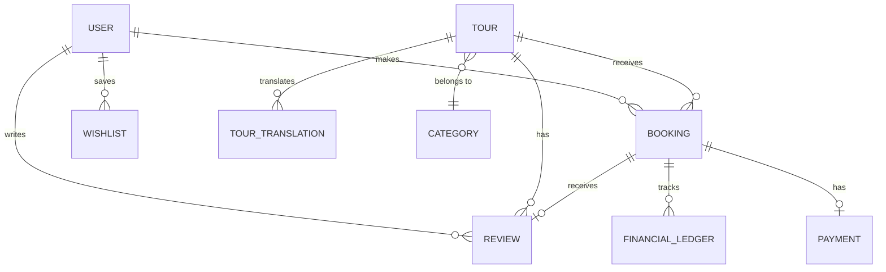

# Bookly Travel — Product Requirements Document (PRD)

> **Version**: 1.0.0  
> **Date**: 2026-06-02  
> **Author**: Product & Engineering  
> **Status**: Living Document  
> **Repository**: [bookly-travel](https://github.com/hatemsamirafifi/bookly-travel)

---

## Table of Contents

1. [Product Overview](#1-product-overview)
2. [Vision & Objectives](#2-vision--objectives)
3. [Target Users & Personas](#3-target-users--personas)
4. [Product Scope — Phase 1 (MVP)](#4-product-scope--phase-1-mvp)
5. [Functional Requirements](#5-functional-requirements)
6. [Non-Functional Requirements](#6-non-functional-requirements)
7. [System Architecture](#7-system-architecture)
8. [Data Model Overview](#8-data-model-overview)
9. [API Design](#9-api-design)
10. [User Flows](#10-user-flows)
11. [Frontend Architecture & Design System](#11-frontend-architecture--design-system)
12. [Internationalization (i18n)](#12-internationalization-i18n)
13. [SEO Strategy](#13-seo-strategy)
14. [Payment & Financial Requirements](#14-payment--financial-requirements)
15. [Security & Compliance](#15-security--compliance)
16. [Testing Strategy](#16-testing-strategy)
17. [Deployment & Infrastructure](#17-deployment--infrastructure)
18. [Feature Status & Roadmap](#18-feature-status--roadmap)
19. [Out of Scope (Phase 1)](#19-out-of-scope-phase-1)
20. [Risk Register](#20-risk-register)
21. [Success Metrics](#21-success-metrics)
22. [Glossary](#22-glossary)

---

## 1. Product Overview

**Bookly** is a multi-partner tours-only marketplace platform that connects travelers with tour operators across Europe. The platform enables travelers to search, discover, and book tours with instant confirmation, while providing tour partners with tools to manage listings, pricing, and availability, and giving administrators full operational oversight.

### Product Type

B2C marketplace with B2B partner management.

### Core Value Proposition

- **For Travelers**: A seamless, multilingual discovery-to-booking experience with instant confirmation, guest checkout, and transparent pricing.
- **For Partners**: A self-service portal to create, price, and manage tour listings with direct visibility into bookings and revenue.
- **For Admins**: Full-stack moderation, financial oversight, and audit capabilities via a dedicated admin dashboard.

---

## 2. Vision & Objectives

### Vision

Become the leading tours marketplace in Europe by delivering a premium booking experience in multiple languages with instant confirmation and transparent financial operations.

### Phase 1 Objectives

| Objective | Measurable Target |
|-----------|-------------------|
| Enable travelers to discover and book tours | End-to-end booking flow functional with Stripe payment |
| Support multi-language content | Full EN, ES, IT support across all surfaces |
| Process payments securely | Stripe Payment Intents with immutable financial ledger |
| Deliver SEO-optimized public pages | Lighthouse Performance ≥ 90 on public pages |
| Provide partner self-service tools | Partner tour CRUD, pricing, availability management |
| Enable admin oversight | Filament admin dashboard with moderation workflows |

---

## 3. Target Users & Personas

### 3.1 Traveler (Public User)

| Attribute | Detail |
|-----------|--------|
| **Who** | Individual travelers looking for tours and experiences in European destinations |
| **Goals** | Find tours by destination/category/date, compare options, book with instant confirmation |
| **Behavior** | May browse anonymously, may use guest checkout or create an account |
| **Languages** | English, Spanish, Italian |
| **Devices** | Mobile-first; desktop and tablet supported |

### 3.2 Partner (Tour Operator)

| Attribute | Detail |
|-----------|--------|
| **Who** | Tour operators and experience providers |
| **Goals** | List tours, manage pricing and availability, track bookings and revenue |
| **Behavior** | Self-registers, awaits admin approval, manages tours through the partner dashboard |
| **Constraints** | One account per partner (no multi-staff in Phase 1) |

### 3.3 Admin (Platform Operator)

| Attribute | Detail |
|-----------|--------|
| **Who** | Bookly platform administrators |
| **Goals** | Approve/reject partners and tours, moderate reviews, oversee bookings, track financials |
| **Behavior** | Uses the Filament admin dashboard for all operations |

---

## 4. Product Scope — Phase 1 (MVP)

### Included

| Area | Capabilities |
|------|--------------|
| **Authentication** | Traveler registration, login, logout, password reset, guest checkout, email verification, brute force protection |
| **Search & Discovery** | Full-text search, filters (location, category, price, duration, date), sort, pagination, homepage with featured tours |
| **Tour Listings** | Multi-language tour content (EN/ES/IT), image galleries, cover image, categories, destinations |
| **Booking** | Multi-step checkout, guest and authenticated booking, instant confirmation, idempotent creation, cancellation, auto-completion |
| **Payments** | Stripe Payment Intents, Stripe Elements, immutable financial ledger, webhook handling, refund tracking |
| **Reviews** | 1–5 star rating with text comment, display on tour detail pages, one review per completed booking, admin moderation |
| **Traveler Account** | Dashboard, booking history, booking detail, voucher access, profile management, wishlist, my reviews |
| **Partner Dashboard** | Tour CRUD, multi-language content, image management, pricing, availability calendar (Phases 4+) |
| **Admin Dashboard** | Partner approval/rejection, tour moderation, booking oversight, review moderation, financial ledger, audit logging |
| **Notifications** | Queued email notifications for all booking events, multi-language templates |
| **Vouchers** | PDF voucher generation with booking details and QR code |

### Key Design Decisions

| Decision | Resolution |
|----------|------------|
| Guest checkout | **Enabled** — no account required to book |
| Partner structure | One account per partner — no multi-staff |
| Notification channels | Email only — no SMS or push |
| Refunds | Manual via Stripe dashboard — no in-app automation |
| Booking completion | Auto-complete via scheduled job after tour date |
| Cancellation policy | Traveler-initiated before tour date — no penalties |
| Reviews | Submit only (rating + comment) — no partner replies |
| Languages | English, Spanish, Italian |
| Search engine | Meilisearch via Laravel Scout |
| Admin dashboard | Laravel Filament (server-rendered) |

---

## 5. Functional Requirements

### FR-001: Traveler Authentication

| ID | Requirement | Priority |
|----|-------------|----------|
| FR-001.1 | Travelers can register with email and password | Critical |
| FR-001.2 | Email verification is required after registration | Critical |
| FR-001.3 | Travelers can sign in with email/password and receive a Sanctum token | Critical |
| FR-001.4 | Travelers can sign out (token revocation) | Critical |
| FR-001.5 | Guest checkout captures email + name at booking time | Critical |
| FR-001.6 | Post-booking, guest is offered automatic account creation | High |
| FR-001.7 | If guest email matches an existing account, booking is linked to that account | High |
| FR-001.8 | Password reset flow via email | High |
| FR-001.9 | Account lockout after 5 failed login attempts within 15 minutes | Critical |
| FR-001.10 | Rate limiting: 10 auth requests per minute per IP | Critical |

### FR-002: Search & Discovery

| ID | Requirement | Priority |
|----|-------------|----------|
| FR-002.1 | Homepage displays featured tours, categories, and destinations | Critical |
| FR-002.2 | Full-text search across tour title, description, and location | Critical |
| FR-002.3 | Filter by: destination, category, price range, duration, date, language | Critical |
| FR-002.4 | Sort by: relevance, price (asc/desc), rating, newest | High |
| FR-002.5 | Paginated results (20 per page default) | High |
| FR-002.6 | Tour listing cards show: title, cover image, price, rating, location, duration | Critical |
| FR-002.7 | Only published tours with valid pricing and availability appear in results | Critical |
| FR-002.8 | Localized URLs: `/en/tours/...`, `/es/tours/...`, `/it/tours/...` | Critical |
| FR-002.9 | Category landing pages with filtered tour listings | High |
| FR-002.10 | Destination landing pages with filtered tour listings | High |
| FR-002.11 | Empty states displayed when no results match | Medium |
| FR-002.12 | Unpublished or unavailable tours return 404 if accessed directly | High |

### FR-003: Tour Detail

| ID | Requirement | Priority |
|----|-------------|----------|
| FR-003.1 | Tour detail page shows full information in the visitor's locale | Critical |
| FR-003.2 | Image gallery with cover image | Critical |
| FR-003.3 | Pricing display (per person) | Critical |
| FR-003.4 | Availability calendar showing bookable dates | Critical |
| FR-003.5 | Booking CTA ("Book Now") leading to checkout | Critical |
| FR-003.6 | Reviews section with aggregate rating and individual reviews | High |
| FR-003.7 | Tour details: duration, location, meeting point, inclusions, exclusions, highlights, group size | Critical |
| FR-003.8 | Related tours / category suggestions | Medium |

### FR-004: Booking & Checkout

| ID | Requirement | Priority |
|----|-------------|----------|
| FR-004.1 | Multi-step checkout: Select → Details → Payment → Confirmation | Critical |
| FR-004.2 | Guest checkout without account creation | Critical |
| FR-004.3 | Authenticated checkout with pre-filled traveler info | High |
| FR-004.4 | Collect: name, email, phone, participant count, special requests | Critical |
| FR-004.5 | Booking lifecycle: `created → pending_payment → confirmed → completed` with branches to `cancelled`, `expired`, `refunded` | Critical |
| FR-004.6 | Idempotent booking creation via client-generated idempotency key | Critical |
| FR-004.7 | Availability validated at booking time with row-level locking | Critical |
| FR-004.8 | Booking reference/confirmation code generated (8-char alphanumeric) | High |
| FR-004.9 | Financial snapshot (price, currency) locked at booking time | Critical |
| FR-004.10 | Confirmation page with booking summary and account creation offer | High |
| FR-004.11 | Traveler can cancel confirmed bookings before tour date | High |
| FR-004.12 | Auto-completion via scheduled job after tour date passes | High |
| FR-004.13 | 15-minute payment window; expired bookings release availability | High |

### FR-005: Payment Processing

| ID | Requirement | Priority |
|----|-------------|----------|
| FR-005.1 | Stripe Payment Intents API for payment creation | Critical |
| FR-005.2 | Stripe Elements for client-side card input (PCI-compliant) | Critical |
| FR-005.3 | Two-step orchestration: reserve availability → confirm payment | Critical |
| FR-005.4 | Webhook handling for: `payment_intent.succeeded`, `payment_intent.payment_failed`, `charge.refunded` | Critical |
| FR-005.5 | Immutable financial ledger (append-only, no edits, no deletes) | Critical |
| FR-005.6 | Ledger entries record: amount, currency, type, booking reference, Stripe references, status, timestamp | Critical |
| FR-005.7 | Automatic refund on eligible cancellation | High |
| FR-005.8 | Webhook event deduplication (idempotent processing) | Critical |
| FR-005.9 | Failed payment handling with user-facing error messages | High |

### FR-006: Reviews & Ratings

| ID | Requirement | Priority |
|----|-------------|----------|
| FR-006.1 | Review submission for completed bookings only | Critical |
| FR-006.2 | 1–5 star rating scale | Critical |
| FR-006.3 | Text comment (10–2000 characters) | High |
| FR-006.4 | One review per booking per traveler | Critical |
| FR-006.5 | Reviews displayed on tour detail page with average rating | High |
| FR-006.6 | Review editing within 48-hour window after submission | Medium |
| FR-006.7 | "Edited" indicator on modified reviews | Medium |
| FR-006.8 | Admin can hide/reinstate reviews | High |
| FR-006.9 | Aggregate rating and review count on tour listing cards | High |
| FR-006.10 | Review eligibility window: 30 days after booking completion | Medium |

### FR-007: Traveler Account

| ID | Requirement | Priority |
|----|-------------|----------|
| FR-007.1 | Dashboard with upcoming and past bookings overview | High |
| FR-007.2 | Booking list filterable by status (confirmed, completed, cancelled, refunded) | High |
| FR-007.3 | Booking detail with full info, voucher download, cancel action, review action | High |
| FR-007.4 | Profile management: name, email, phone, password change | High |
| FR-007.5 | Language preference setting (EN, ES, IT) | Medium |
| FR-007.6 | Wishlist: save/unsave tours, wishlist page with pagination | Medium |
| FR-007.7 | My Reviews page with pagination and edit links | Medium |
| FR-007.8 | Auth guard: unauthenticated users redirected to login with return URL | Critical |

### FR-008: Partner Management

| ID | Requirement | Priority |
|----|-------------|----------|
| FR-008.1 | Partner self-registration with business details | Critical |
| FR-008.2 | Admin approval required before tour creation access | Critical |
| FR-008.3 | Partner status lifecycle: `pending → approved → active` (with `rejected`, `suspended` branches) | Critical |
| FR-008.4 | Tour CRUD: create, edit, archive tours | Critical |
| FR-008.5 | Multi-language content entry (EN, ES, IT) for all translatable fields | Critical |
| FR-008.6 | Image upload: max 10 images, 5MB each, JPEG/PNG/WebP, cover image designation | High |
| FR-008.7 | Tour status lifecycle: `draft → pending_review → published` (with `rejected`, `archived` branches) | Critical |
| FR-008.8 | Per-person pricing with currency support (EUR primary, USD, GBP) | Critical |
| FR-008.9 | Availability calendar with capacity per slot | Critical |
| FR-008.10 | Partner booking and revenue visibility | High |
| FR-008.11 | Partner profile management | Medium |

### FR-009: Admin Moderation

| ID | Requirement | Priority |
|----|-------------|----------|
| FR-009.1 | Partner approval/rejection workflow with notifications | Critical |
| FR-009.2 | Tour moderation: approve (→ publish), reject (with reason), unpublish | Critical |
| FR-009.3 | Booking management: list, filter, view details | High |
| FR-009.4 | Review moderation: hide, reinstate | High |
| FR-009.5 | Financial ledger overview and partner financial summary | High |
| FR-009.6 | Audit logging for all admin actions | Critical |
| FR-009.7 | Partner suspension/unsuspension | High |
| FR-009.8 | Dashboard with platform metrics and KPIs | Medium |

### FR-010: Notifications & Vouchers

| ID | Requirement | Priority |
|----|-------------|----------|
| FR-010.1 | Booking confirmation email to traveler (with voucher) | Critical |
| FR-010.2 | Booking cancellation email to traveler | High |
| FR-010.3 | New booking notification to partner | High |
| FR-010.4 | Partner approval/rejection notification | High |
| FR-010.5 | All emails available in EN, ES, IT | Critical |
| FR-010.6 | All emails queued via Redis with retry (3 attempts, exponential backoff) | Critical |
| FR-010.7 | Email delivery failures do NOT affect booking status | Critical |
| FR-010.8 | PDF voucher with: booking reference, tour details, date, time, participants, meeting point, QR code | High |
| FR-010.9 | Voucher downloadable from traveler account | High |

---

## 6. Non-Functional Requirements

### Performance

| Requirement | Target |
|-------------|--------|
| Lighthouse Performance score (public pages) | ≥ 90 |
| Lighthouse Accessibility score (public pages) | ≥ 95 |
| First Contentful Paint | < 1.5s |
| Time to Interactive | < 3.5s |
| API response time (95th percentile) | < 500ms |
| Search query response time | < 200ms |

### Scalability

| Requirement | Detail |
|-------------|--------|
| Concurrent users | Support 1,000+ concurrent users |
| Database | PostgreSQL with connection pooling (PgBouncer) |
| Caching | Redis for application caching and queue processing |
| Search | Meilisearch for fast full-text search |

### Availability

| Requirement | Target |
|-------------|--------|
| Uptime SLA | 99.9% |
| Planned maintenance windows | Off-peak hours with advance notice |
| Database backups | Automated daily backups |

### Reliability

| Requirement | Detail |
|-------------|--------|
| Queue retry | 3 attempts with exponential backoff (10s, 60s, 300s) |
| Webhook idempotency | Deduplication by event ID |
| Financial consistency | Immutable ledger, no data loss |
| Booking integrity | Row-level locking prevents overbooking |

---

## 7. System Architecture

### Three-Surface Architecture

```
┌───────────────────────────────────────────────────────────────────────┐
│                        CLOUDFLARE (CDN / Edge)                       │
└───────────────┬───────────────────────────────────┬───────────────────┘
                │                                   │
    ┌───────────▼───────────┐           ┌───────────▼───────────┐
    │    Next.js 16 (SSR)   │           │   Laravel Filament    │
    │  ┌─────────────────┐  │           │   (Admin Dashboard)   │
    │  │ Public Website  │  │           │   Server-Rendered     │
    │  │ (SSR/SSG)       │  │           └───────────┬───────────┘
    │  ├─────────────────┤  │                       │
    │  │ Partner Dash    │  │                       │
    │  │ (Client-Side)   │  │                       │
    │  └────────┬────────┘  │                       │
    └───────────┼───────────┘                       │
                │                                   │
    ┌───────────▼───────────────────────────────────▼───────────┐
    │                   LARAVEL API (API-Only)                  │
    │  ┌──────────┐ ┌──────────┐ ┌──────────┐ ┌────────────┐  │
    │  │ /api/    │ │ /api/    │ │ /api/    │ │ Filament   │  │
    │  │ public/* │ │partner/* │ │ admin/*  │ │ Routes     │  │
    │  └──────────┘ └──────────┘ └──────────┘ └────────────┘  │
    │                                                          │
    │  ┌─────────────────────────────────────────────────┐     │
    │  │              Service Layer                       │     │
    │  │  Auth · Tours · Bookings · Payments · Reviews   │     │
    │  │  Partners · Pricing · Notifications · Finance   │     │
    │  └─────────────────────────────────────────────────┘     │
    └───────┬──────────┬──────────┬────────────┬───────────────┘
            │          │          │            │
    ┌───────▼──┐ ┌─────▼────┐ ┌──▼─────┐ ┌───▼──────────┐
    │PostgreSQL│ │  Redis   │ │ Stripe │ │ Meilisearch  │
    │          │ │Cache/    │ │        │ │ (Search)     │
    │          │ │Queue     │ │        │ │              │
    └──────────┘ └──────────┘ └────────┘ └──────────────┘
```

### Surface Mapping

| Surface | Technology | Route Prefix | Rendering |
|---------|-----------|-------------|-----------|
| Public traveler website | Next.js 16 | `/[locale]/` | SSR/SSG |
| Partner dashboard | Next.js 16 | `/partner/` | CSR |
| Admin dashboard | Laravel Filament | `/admin/` | Server-rendered |
| Backend API | Laravel 11 | `/api/public/*`, `/api/partner/*`, `/api/admin/*` | JSON |

### Technology Stack

#### Backend

| Component | Technology | Version |
|-----------|-----------|---------|
| Framework | Laravel | 11.x |
| Admin panel | Laravel Filament | Latest |
| Auth | Laravel Sanctum | 4.x |
| Database | PostgreSQL | 15 |
| Cache & Queue | Redis | 7 |
| Search | Meilisearch (via Laravel Scout) | 1.10 |
| Payments | Stripe (stripe-php) | 13.x |
| Testing | Pest (PHPUnit) | 3.x |
| PHP | PHP | 8.2+ |

#### Frontend

| Component | Technology | Version |
|-----------|-----------|---------|
| Framework | Next.js (App Router) | 16.x |
| Language | TypeScript (strict) | 5.x |
| React | React | 19.x |
| Styling | Tailwind CSS | 4.x |
| i18n | next-intl | 4.x |
| State (server) | TanStack React Query | 5.x |
| State (client) | Zustand | 5.x |
| Forms | React Hook Form + Zod | 7.x / 4.x |
| Payments UI | @stripe/react-stripe-js | 6.x |
| Testing | Jest + Playwright | 30.x / 1.x |
| Error tracking | Sentry | 10.x |

#### Infrastructure

| Component | Technology |
|-----------|-----------|
| CDN / Edge | Cloudflare |
| Reverse proxy | Nginx |
| Containerization | Docker Compose |
| Object storage | Cloudflare R2 (S3-compatible) |

### Domain Boundaries

```
Domains:
├── Auth               → Registration, login, sessions, guest identity
├── Search             → Full-text search, filters, discovery
├── Booking            → Lifecycle, checkout, cancellation, auto-complete
├── Payment            → Stripe integration, charges, refund tracking
├── Reviews            → Submission, ratings, display, moderation
├── Traveler           → Profile, wishlist, booking management
├── Partners           → Onboarding, approval, profiles
├── Tours              → CRUD, statuses, translations, images
├── Pricing            → Per-person pricing, currency
├── Availability       → Calendar, capacity, overbooking protection
├── Finance            → Immutable ledger, financial records
├── Notifications      → Email queuing, voucher generation
└── Admin Operations   → Moderation, audit logging, platform ops
```

---

## 8. Data Model Overview

### Core Entities

```
users
├── id, email, password, name, phone, role (traveler/partner/admin),
│   locale, email_verified_at, avatar_url, bio, login_attempts,
│   locked_until, verification_email_sent_at, created_at, updated_at

guest_identities
├── id, email, name, phone, device_fingerprint, ip_address,
│   user_id (nullable), created_at, updated_at

categories
├── id, name, slug, icon, sort_order, created_at, updated_at

tours
├── id, partner_id, category_id, status, slug, duration_minutes,
│   location, destination, meeting_point, min_group_size,
│   max_group_size, price_cents, currency, cover_image_url,
│   average_rating, review_count, is_featured, created_at, updated_at

tour_translations
├── id, tour_id, locale (en/es/it), title, description,
│   highlights, inclusions, exclusions, created_at, updated_at

bookings
├── id, tour_id, traveler_id (nullable), guest_email, guest_name,
│   guest_phone, participant_count, special_requests, status,
│   total_amount_cents, currency, price_snapshot_cents,
│   idempotency_key, booking_reference, stripe_payment_intent_id,
│   confirmed_at, cancelled_at, completed_at, anonymized_at,
│   created_at, updated_at

payments
├── id, booking_id, stripe_payment_intent_id, stripe_charge_id,
│   amount_cents, currency, status, type, metadata, created_at

financial_ledger_entries
├── id, booking_id, type (charge/refund), amount_cents, currency,
│   stripe_payment_intent_id, stripe_charge_id, status, metadata,
│   created_at  ← immutable, append-only

stripe_webhook_events
├── id, stripe_event_id, type, payload, processed_at, created_at

reviews
├── id, booking_id, traveler_id, tour_id, rating (1-5), comment,
│   locale, is_visible, is_hidden_by_admin, submitted_at,
│   edited_at, created_at, updated_at

wishlists
├── id, user_id, tour_id, created_at

auth_audit_logs
├── id, user_id, action, ip_address, user_agent,
│   metadata, created_at

booking_audit_logs
├── id, booking_id, action, actor_type, actor_id,
│   before_state, after_state, created_at
```

### Entity Relationships



---

## 9. API Design

### URL Structure

```
/api/public/*      → Unauthenticated or traveler-authenticated
/api/partner/*     → Partner-authenticated (role: partner)
/api/admin/*       → Admin-authenticated (role: admin)
```

### Response Format

**Success (single resource)**:
```json
{
  "data": { ... }
}
```

**Success (collection)**:
```json
{
  "data": [ ... ],
  "meta": {
    "current_page": 1,
    "last_page": 5,
    "per_page": 20,
    "total": 100
  }
}
```

**Error**:
```json
{
  "error": {
    "code": "VALIDATION_ERROR",
    "message": "Human-readable message",
    "details": { ... }
  }
}
```

### Key Endpoints

#### Public API (`/api/public/`)

| Method | Endpoint | Description |
|--------|---------|-------------|
| POST | `/auth/register` | Register traveler |
| POST | `/auth/login` | Login (returns Sanctum token) |
| POST | `/auth/logout` | Logout (revoke token) |
| GET | `/auth/email/verify/{id}/{hash}` | Verify email |
| GET | `/search/tours` | Search tours with filters |
| GET | `/tours/{slug}` | Tour detail |
| GET | `/tours/{slug}/reviews` | Tour reviews (paginated) |
| GET | `/categories` | List categories |
| GET | `/categories/{slug}/tours` | Tours by category |
| GET | `/destinations` | List destinations |
| GET | `/destinations/{slug}/tours` | Tours by destination |
| GET | `/homepage` | Homepage data |
| GET | `/sitemap.xml` | XML sitemap |
| POST | `/bookings` | Create booking (auth required) |
| GET | `/my-bookings` | Traveler's bookings (auth required) |
| GET | `/my-bookings/{reference}` | Booking detail (auth required) |
| POST | `/my-bookings/{reference}/cancel` | Cancel booking (auth required) |
| POST | `/reviews` | Submit review (auth required) |
| PUT | `/reviews/{review}` | Edit review (auth required) |
| POST | `/webhooks/stripe` | Stripe webhook (unauthenticated, signed) |

#### Traveler API (`/api/public/traveler/`)

| Method | Endpoint | Description |
|--------|---------|-------------|
| GET | `/profile` | Get traveler profile |
| PUT | `/profile` | Update profile |
| POST | `/profile/change-password` | Change password |
| GET | `/wishlist` | Get wishlist |
| POST | `/wishlist` | Add to wishlist |
| DELETE | `/wishlist/{tour_id}` | Remove from wishlist |
| GET | `/wishlist/status` | Check wishlist status |
| GET | `/reviews` | Traveler's own reviews |
| GET | `/bookings` | Traveler's bookings |
| GET | `/bookings/{reference}` | Booking detail |
| POST | `/bookings/{reference}/cancel` | Cancel booking |

#### Partner API (`/api/partner/`)

| Method | Endpoint | Description |
|--------|---------|-------------|
| GET | `/bookings` | Partner's bookings |
| PATCH | `/bookings/{reference}/status` | Update booking status |
| GET | `/financial-summary` | Partner financial overview |
| GET | `/reviews` | Reviews for partner's tours |

#### Admin API (`/api/admin/`)

| Method | Endpoint | Description |
|--------|---------|-------------|
| GET | `/audit/bookings` | Booking audit trail |
| GET | `/audit/bookings/{reference}` | Booking audit detail |
| GET | `/financial-ledger` | Financial ledger entries |
| GET | `/reviews` | All reviews (moderation queue) |
| POST | `/reviews/{review}/hide` | Hide a review |
| POST | `/reviews/{review}/reinstate` | Reinstate a hidden review |

### Rate Limiting

| Endpoint Group | Limit |
|---------------|-------|
| Auth endpoints | 10 req/min per IP |
| Search | 60 req/min per IP |
| Tour detail | 120 req/min per IP |
| Listings | 120 req/min per IP |
| Booking creation | 5 req/min per user |
| Booking retrieval | 60 req/min per user |
| Reviews | 10 req/hour per user |
| Traveler area | 120 req/min per user |
| Partner API | 120 req/min per token |
| Admin API | 300 req/min per token |

---

## 10. User Flows

### 10.1 Traveler Booking Flow

```
┌─────────┐    ┌──────────┐    ┌──────────┐    ┌─────────┐    ┌──────────────┐
│ Homepage │───→│ Search / │───→│  Tour    │───→│Checkout │───→│ Confirmation │
│          │    │ Browse   │    │  Detail  │    │ (4-step)│    │              │
└─────────┘    └──────────┘    └──────────┘    └─────────┘    └──────────────┘
                                                    │
                                              ┌─────▼─────┐
                                              │ Payment   │
                                              │ (Stripe)  │
                                              └───────────┘
```

**Checkout Steps**:
1. **Select** — Pick date, time slot, number of participants
2. **Details** — Enter name, email, phone, special requests
3. **Payment** — Stripe Elements card input
4. **Confirmation** — Booking reference, summary, account creation offer

### 10.2 Booking Lifecycle

```
                ┌─────────┐
                │ created │
                └────┬────┘
                     │ Stripe PaymentIntent created
                ┌────▼──────────┐
                │pending_payment│
                └──┬─────────┬──┘
                   │         │
    payment        │         │ 15-min timeout
    succeeds       │         │
          ┌────────▼┐  ┌─────▼───┐
          │confirmed│  │ expired │
          └──┬───┬──┘  └─────────┘
             │   │
  traveler   │   │ tour date passes
  cancels    │   │ (scheduled job)
    ┌────────▼┐ ┌▼──────────┐
    │cancelled│ │ completed │
    └────────┬┘ └───────────┘
             │
    admin refunds
    (via Stripe)
    ┌────────▼┐
    │refunded │
    └─────────┘
```

### 10.3 Partner Onboarding Flow

```
Self-Register → pending → [Admin Review] → approved ──→ active (can create tours)
                                         → rejected ──→ can re-apply
                       approved → suspended (admin action)
                       suspended → approved (admin action)
```

### 10.4 Tour Publishing Flow

```
draft → pending_review → [Admin Review] → published
                                        → rejected (with reason, can edit and resubmit)
                       published → archived (partner action)
```

### 10.5 Review Submission Flow

```
1. Booking reaches "completed" status (via auto-complete job)
2. Traveler prompted to review (email + in-account CTA)
3. Traveler submits review (1-5 stars + comment)
4. Review immediately visible on tour detail page
5. Editable within 48-hour window
6. Admin can hide/reinstate inappropriate reviews
```

---

## 11. Frontend Architecture & Design System

### Routing Structure

```
/[locale]/                              → Homepage (SSR/SSG)
/[locale]/tours/[slug]                  → Tour detail (SSR)
/[locale]/search                        → Tour search/listing (SSR)
/[locale]/categories/[slug]             → Category listing (SSR)
/[locale]/destinations/[slug]           → Destination listing (SSR)
/[locale]/booking/...                   → Checkout flow
/[locale]/auth/login                    → Login
/[locale]/auth/register                 → Register
/[locale]/my-bookings                   → Traveler bookings (CSR, auth-protected)
/[locale]/my-bookings/[reference]       → Booking detail (CSR, auth-protected)
/[locale]/my-reviews                    → My reviews (CSR, auth-protected)
/[locale]/wishlist                      → Wishlist (CSR, auth-protected)
/[locale]/profile                       → Profile settings (CSR, auth-protected)
/[locale]/privacy                       → Privacy policy (SSG)
/[locale]/terms                         → Terms of service (SSG)
```

### Rendering Strategy

| Route Group | Rendering | Rationale |
|-------------|-----------|-----------|
| `(public)` | SSR/SSG | SEO-critical, crawlable HTML |
| `(auth)` | SSR + client forms | Fast first paint |
| `(traveler)` | CSR with auth guard | Protected user data, no SEO |
| `(partner)` | CSR with role guard | Protected partner data |

### Design Tokens

| Category | Tokens |
|----------|--------|
| **Brand** | Navy `#0A2540`, Gold `#FFB800` |
| **Background** | Page `#F7F9FB`, Surface `#FFFFFF` |
| **Text** | Primary `#102033`, Secondary `#5D6B7A`, Inverse `#FFFFFF` |
| **State** | Success `#11845B`, Warning `#B76E00`, Danger `#C62828` |
| **Typography** | Inter (body), 400/500/600/700 weights |
| **Spacing** | 8px base grid: 4, 8, 12, 16, 24, 32, 48, 64px |
| **Radius** | sm 8px, default 12px, lg 16px, full 9999px |
| **Shadows** | sm, card, dropdown, modal elevation levels |
| **Breakpoints** | Mobile 390px, Tablet 780px, Desktop 1280px |
| **Transitions** | Fast 150ms, Default 200ms, Slow 300ms |

### Component Library

Built in-house with Tailwind CSS:

| Category | Components |
|----------|-----------|
| **UI primitives** | Button, Card, Input, Select, Modal, Toast, Badge, Avatar, Tabs, EmptyState, ErrorState, LoadingSkeleton |
| **Layout** | Header, Footer, Sidebar, MobileNav, ProtectedLayout, AuthGuard |
| **Tour** | TourCard, TourGrid, TourDetail, TourGallery, TourFilters, SearchBar |
| **Booking** | CheckoutStepper, BookingCard, BookingDetail, PaymentForm, CancelBookingModal |
| **Account** | DashboardStats, BookingList, ProfileForm, PasswordChangeForm, WishlistGrid, WishlistButton |
| **Reviews** | ReviewList, AggregateRating, ReviewCard, StarRating, ReviewForm, MyReviewsList |
| **Partner** | PartnerStats, TourForm, TourList, AvailabilityCalendar |

---

## 12. Internationalization (i18n)

### Supported Languages

| Language | Code | URL Prefix |
|----------|------|------------|
| English | `en` | `/en/` |
| Spanish | `es` | `/es/` |
| Italian | `it` | `/it/` |

### Implementation

| Layer | Approach |
|-------|----------|
| **Frontend routing** | `next-intl` middleware with `[locale]` prefix |
| **UI translations** | JSON message files per locale (`messages/en.json`, `messages/es.json`, `messages/it.json`) |
| **Content translations** | `tour_translations` table with `locale` column |
| **API** | Accepts `locale` query parameter; fallback to English |
| **Email templates** | Multi-language templates, sent in traveler's preferred locale |
| **SEO** | `hreflang` tags, localized canonical URLs, per-locale meta tags |

---

## 13. SEO Strategy

| Technique | Implementation |
|-----------|---------------|
| **SSR/SSG** | All public pages rendered server-side for crawlable HTML |
| **Meta tags** | Unique `<title>` and `<meta description>` per page |
| **Open Graph** | OG tags for social sharing on tour detail and landing pages |
| **Structured data** | JSON-LD (TouristAttraction / Product schema) on tour pages |
| **hreflang** | Tags for EN, ES, IT language alternatives |
| **Canonical URLs** | Canonical tags on all pages to prevent duplicate content |
| **Sitemap** | XML sitemap auto-generated at `/sitemap.xml` |
| **robots.txt** | Proper crawl directives |
| **Image optimization** | Next.js `<Image>` with lazy loading, WebP format |
| **Performance** | Target Lighthouse ≥ 90 |

---

## 14. Payment & Financial Requirements

### Stripe Integration

| Aspect | Detail |
|--------|--------|
| API | Stripe Payment Intents API |
| Client | Stripe Elements via `@stripe/react-stripe-js` |
| Idempotency | Client-generated idempotency key per checkout |
| Webhooks | `payment_intent.succeeded`, `payment_intent.payment_failed`, `charge.refunded` |
| PCI Compliance | No card data stored; all card input via Stripe Elements |

### Pricing Model

| Aspect | Detail |
|--------|--------|
| Model | Per-person pricing (single tier in Phase 1) |
| Currencies | EUR (primary), USD, GBP |
| Storage | Integer (cents) to avoid floating-point issues |
| Snapshot | Booked price immutable at booking time |

### Financial Ledger

| Rule | Detail |
|------|--------|
| Immutability | Append-only — no UPDATE or DELETE on ledger entries |
| Entry types | `charge`, `refund` |
| Corrections | All corrections are new ledger entries |
| Refund tracking | `charge.refunded` webhook → new `refund` entry + booking status update |

---

## 15. Security & Compliance

### Authentication & Authorization

| Layer | Implementation |
|-------|---------------|
| Authentication | Laravel Sanctum (token-based for API, session for Filament) |
| Roles | `traveler`, `partner`, `admin` on `users.role` column |
| Authorization | Laravel Policies per model (ownership verification) |
| Brute force | Account lockout after 5 failed attempts in 15 minutes |
| Rate limiting | Per-route rate limits (see API section) |

### Data Protection

| Aspect | Detail |
|--------|--------|
| Passwords | Bcrypt hashed, never stored in plaintext |
| PCI | No card data stored; Stripe Elements handles card input |
| GDPR readiness | Booking anonymization support (`anonymized_at` column) |
| Secrets | `.env` files excluded from version control |
| Audit trail | All admin actions and auth events logged with actor, timestamp, IP |

---

## 16. Testing Strategy

### Test Pyramid

```
         ╱╲     E2E Tests (Playwright)
        ╱  ╲    → Critical user flows
       ╱────╲
      ╱      ╲   Integration Tests (Pest)
     ╱        ╲  → API endpoints, service interactions
    ╱──────────╲
   ╱            ╲  Unit Tests (Pest + Jest)
  ╱              ╲ → Services, validators, utils, components
 ╱────────────────╲
```

### Critical Test Coverage

| Flow | Test Type | Priority |
|------|----------|----------|
| Traveler registration & login | Integration | Critical |
| Tour search & discovery | Integration | High |
| Booking creation (guest + auth) | Integration | Critical |
| Payment charge flow | Integration | Critical |
| Booking cancellation | Integration | High |
| Booking auto-completion | Unit | High |
| Availability overbooking prevention | Integration | Critical |
| Review submission eligibility | Integration | High |
| Idempotent booking creation | Integration | Critical |
| Webhook handling (Stripe) | Integration | Critical |
| Financial ledger immutability | Unit | Critical |
| Auth guard redirects | E2E | High |
| Checkout E2E flow | E2E | Critical |

### Tools

| Layer | Tool |
|-------|------|
| Backend unit/integration | Pest 3.x (PHPUnit wrapper) |
| Frontend unit | Jest 30.x + React Testing Library |
| E2E | Playwright 1.x |
| Accessibility | axe-core via Playwright |
| Performance | Lighthouse CI |
| Linting | ESLint (frontend), Laravel Pint (backend) |

---

## 17. Deployment & Infrastructure

### Environments

| Environment | Database | Stripe | Purpose |
|-------------|----------|--------|---------|
| Local (Docker) | PostgreSQL (local) | Test keys | Development |
| Staging | PostgreSQL (staging) | Test keys | QA & review |
| Production | PostgreSQL (prod) | Live keys | Live |

### Docker Compose Services

| Service | Container | Purpose |
|---------|-----------|---------|
| `nextjs` | `bookly-frontend` | Next.js frontend (SSR) |
| `laravel` | `bookly-backend` | Laravel API |
| `queue` | `bookly-queue` | Laravel queue worker |
| `scheduler` | `bookly-scheduler` | Laravel task scheduler |
| `nginx` | `bookly-nginx` | Reverse proxy |
| `postgres` | `bookly-postgres` | PostgreSQL 15 database |
| `redis` | `bookly-redis` | Cache & queue |
| `meilisearch` | `bookly-meilisearch` | Search engine |

### Deployment Pipeline

```
Push to feature branch
  → CI runs (lint, type-check, tests)
  → PR review
  → Merge to main
  → Auto-deploy to staging
  → Manual promotion to production
```

---

## 18. Feature Status & Roadmap

### Phase 1 (MVP) — Feature Status

| # | Feature | Backend | Frontend | Overall |
|---|---------|---------|----------|---------|
| 001 | Traveler Auth (Architecture) | ✅ Done | — | ✅ |
| 002 | Foundational Implementation | ✅ Done | ✅ Done | ✅ |
| 003 | Traveler Registration | ✅ Done | ✅ Done | ✅ |
| 004 | Traveler Sign-in | ✅ Done | ✅ Done | ✅ |
| 005 | Brute Force Protection | ✅ Done | — | ✅ |
| 006 | Public Search & Discovery | ✅ Done | ✅ Done | ✅ |
| 007 | Tour Booking | ✅ Done | ✅ Done | ✅ |
| 008 | Payment Processing | ✅ Done | ✅ Done | ✅ |
| 009 | Reviews & Ratings | ✅ Done | ✅ Done | ✅ |
| 010 | Public Frontend | ✅ Done | ✅ Done | ✅ |
| 011 | Tour Management (Traveler Account) | ✅ Done | ✅ Done | ✅ |
| 012 | Pricing & Availability | 🔲 Not started | 🔲 Not started | 🔲 |
| 013 | Admin Moderation | 🔲 Not started | 🔲 Not started | 🔲 |
| 014 | Notifications & Vouchers | 🔲 Not started | 🔲 Not started | 🔲 |
| 015 | Partner Onboarding | 🔲 Not started | 🔲 Not started | 🔲 |

### Dependency Graph

```
--- COMPLETED ---
001 → 002 → 003 → 004 → 005 → 006 → 007 → 008 → 009 → 010 → 011

--- REMAINING ---
015 Partner Onboarding ──→ 012 Pricing & Availability
                               │
                               └──→ 013 Admin Moderation

014 Notifications & Vouchers  (depends on 007 ✅)
```

### Recommended Next Steps

1. **Specify & build 015 (Partner Onboarding)** — no dependencies, unlocks 012 → 013
2. **Specify & build 014 (Notifications & Vouchers)** — dependencies satisfied (007 ✅)
3. **Build 012 (Pricing & Availability)** — depends on 015
4. **Build 013 (Admin Moderation)** — depends on 012

### Future Phases (Post-MVP)

| Feature | Description |
|---------|-------------|
| 016 | Blog & Travel Insights — content marketing pages |
| 017 | Enhanced Wishlist — guest prompt, availability tracking |
| Social login | OAuth (Google, Facebook) |
| SMS/push notifications | Additional notification channels |
| Automated refunds | In-app refund automation |
| Partner payouts | Automated partner payment distribution |
| Multi-staff partners | Team roles and permissions |
| Tiered pricing | Adult/child/infant pricing |
| Advanced review moderation | Fraud detection, sentiment analysis |
| Partner replies | Partners can respond to reviews |

---

## 19. Out of Scope (Phase 1)

| Feature | Reason |
|---------|--------|
| Social login (OAuth) | Deferred to Phase 2 |
| SMS / push notifications | Email only in Phase 1 |
| Automated refunds | Manual via Stripe dashboard |
| Partial refunds | Full refunds only |
| Partner payouts | No automated payout system |
| Multi-staff partner accounts | One account per partner |
| Tiered pricing (adult/child) | Single per-person rate |
| Partner replies to reviews | Submit only in Phase 1 |
| Review fraud detection | Basic admin moderation only |
| Mobile app (native) | Web-only |
| Multi-currency pricing per tour | Single currency per tour |
| Installment payments | Full payment at booking |
| Request-to-book | Instant booking only |

---

## 20. Risk Register

| Risk | Impact | Likelihood | Mitigation |
|------|--------|-----------|------------|
| Overbooking race condition | High | Medium | Row-level locking (`SELECT FOR UPDATE`); atomic `booked_count` increment within transaction |
| Payment success but booking fails | High | Low | Stripe webhook as source of truth; reconciliation job; idempotency keys |
| Webhook delivery failure | Medium | Low | Stripe retries automatically; webhook event deduplication; reconciliation cron job |
| Image upload failures | Medium | Medium | Client-side retry; presigned URL uploads to R2; async thumbnail generation |
| Search index out of sync | Medium | Low | Scout observers for real-time sync; periodic full reindex job |
| Email delivery failures | Low | Medium | Queue retries (3 attempts); dead letter queue; booking not affected |
| Guest identity conflicts | Medium | Low | Email-based deduplication; merge strategy for duplicate guest records |
| Multi-language content gaps | Low | Medium | English required as fallback; admin validation before publishing |
| Stripe API downtime | High | Low | Graceful degradation; queued retry; user-facing error messaging |
| Database connection exhaustion | High | Low | PgBouncer connection pooling; query optimization; connection limits |

---

## 21. Success Metrics

### Technical Metrics

| Metric | Target |
|--------|--------|
| Lighthouse Performance (public pages) | ≥ 90 |
| Lighthouse Accessibility (public pages) | ≥ 95 |
| API response time (p95) | < 500ms |
| Search response time | < 200ms |
| Zero financial data inconsistencies | 0 ledger errors |
| Test coverage (critical flows) | 100% of critical paths |
| Uptime | 99.9% |

### Product Metrics (Post-Launch)

| Metric | Description |
|--------|-------------|
| Booking conversion rate | % of tour detail visitors who complete a booking |
| Search-to-detail rate | % of search results that lead to a tour detail view |
| Guest-to-account conversion | % of guest bookings that result in account creation |
| Average review rating | Platform-wide average star rating |
| Partner approval time | Median time from application to approval |
| Repeat booking rate | % of travelers who book more than once |

---

## 22. Glossary

| Term | Definition |
|------|-----------|
| **Traveler** | End user who searches, discovers, and books tours |
| **Partner** | Tour operator who creates and manages tour listings |
| **Admin** | Platform administrator with moderation and oversight capabilities |
| **Booking reference** | 8-character alphanumeric unique identifier for a booking |
| **Financial ledger** | Immutable, append-only record of all financial transactions |
| **Guest checkout** | Booking flow that does not require account creation |
| **Idempotency key** | Client-generated unique key to prevent duplicate booking submissions |
| **Payment Intent** | Stripe's representation of a payment attempt |
| **Sanctum token** | Laravel Sanctum API authentication token |
| **Scout** | Laravel Scout — search abstraction layer (backed by Meilisearch) |
| **SSR** | Server-Side Rendering — HTML generated on each request |
| **SSG** | Static Site Generation — HTML generated at build time |
| **CSR** | Client-Side Rendering — HTML rendered in the browser |
| **Filament** | Laravel admin panel framework used for the admin dashboard |

---

*This PRD is derived from the [Implementation Plan](implementation-plan.md), [Specification Strategy](specification-strategy.md), [Frontend Implementation Plan](frontend-implementation-plan.md), and all feature specifications in `specs/001–011`. It is a living document and will be updated as new features are specified and built.*
