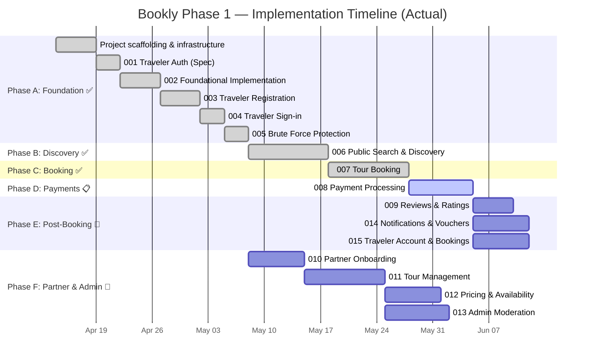

# Bookly — Phase 1 Implementation Plan

> **Version**: 2.0.0
> **Date**: 2026-04-13 (revised 2026-05-13)
> **Constitution**: v1.1.0
> **Specification Strategy**: v2.0.0
> **Status**: In Progress

---

## Table of Contents

1. [Executive Summary](#1-executive-summary)
2. [Architecture Overview](#2-architecture-overview)
3. [Technology Stack & Infrastructure](#3-technology-stack--infrastructure)
4. [Repository & Project Structure](#4-repository--project-structure)
5. [Execution Phases](#5-execution-phases)
6. [Feature Implementation Details](#6-feature-implementation-details)
7. [Cross-Cutting Concerns](#7-cross-cutting-concerns)
8. [Database Design Strategy](#8-database-design-strategy)
9. [API Design Conventions](#9-api-design-conventions)
10. [Frontend Architecture](#10-frontend-architecture)
11. [Testing Strategy](#11-testing-strategy)
12. [Deployment Strategy](#12-deployment-strategy)
13. [Risk Register](#13-risk-register)
14. [Pre-Implementation Checklist](#14-pre-implementation-checklist)

---

## 1. Executive Summary

Bookly Phase 1 delivers the **core booking MVP** for a tours-only marketplace. It spans **11 feature specifications** across **three application surfaces** (public website, partner dashboard, admin dashboard) backed by a **shared Laravel API**.

### Goals

- ~~Enable travelers to search, discover, and book tours with instant confirmation~~ ✅ (search, discovery, booking implemented)
- Enable partners to create, price, and manage tour listings
- Enable admins to moderate partners, tours, and oversee operations
- Support multi-language content (EN, ES, IT)
- Process payments through Stripe with full financial auditability

### Key Constraints

| Constraint | Decision |
|-----------|----------|
| Guest checkout | Enabled — no account required to book |
| Partner structure | One account per partner — no multi-staff |
| Notifications | Email only — no SMS or push |
| Refunds | Manual via Stripe dashboard — no automation |
| Booking completion | Auto-complete via scheduled job after tour date |
| Cancellation | Traveler-initiated before tour date — no penalties |
| Reviews | Submit only (rating + comment) — no partner replies |
| Languages | English, Spanish, Italian |

---

## 2. Architecture Overview

### High-Level Architecture

```
┌───────────────────────────────────────────────────────────────────────┐
│                        CLOUDFLARE (CDN / Edge)                       │
└───────────────┬───────────────────────────────────┬───────────────────┘
                │                                   │
    ┌───────────▼───────────┐           ┌───────────▼───────────┐
    │    Next.js 16 (SSR)   │           │   Laravel Filament    │
    │  ┌─────────────────┐  │           │   (Admin Dashboard)   │
    │  │ Public Website  │  │           │   Server-Rendered     │
    │  │ (SSR/SSG)       │  │           └───────────┬───────────┘
    │  ├─────────────────┤  │                       │
    │  │ Partner Dash    │  │                       │
    │  │ (Client-Side)   │  │                       │
    │  └────────┬────────┘  │                       │
    └───────────┼───────────┘                       │
                │                                   │
    ┌───────────▼───────────────────────────────────▼───────────┐
    │                   LARAVEL API (API-Only)                  │
    │  ┌──────────┐ ┌──────────┐ ┌──────────┐ ┌────────────┐  │
    │  │ /api/    │ │ /api/    │ │ /api/    │ │ Filament   │  │
    │  │ public/* │ │partner/* │ │ admin/*  │ │ Routes     │  │
    │  └──────────┘ └──────────┘ └──────────┘ └────────────┘  │
    │                                                          │
    │  ┌─────────────────────────────────────────────────┐     │
    │  │              Service Layer                       │     │
    │  │  Auth · Tours · Bookings · Payments · Reviews   │     │
    │  │  Partners · Pricing · Notifications · Finance   │     │
    │  └─────────────────────────────────────────────────┘     │
    └───────┬──────────┬──────────┬────────────┬───────────────┘
            │          │          │            │
    ┌───────▼──┐ ┌─────▼────┐ ┌──▼─────┐ ┌───▼──────────┐
    │PostgreSQL│ │  Redis   │ │ Stripe │ │ Cloudflare   │
    │          │ │Cache/    │ │        │ │ R2 (Storage) │
    │          │ │Queue     │ │        │ │              │
    └──────────┘ └──────────┘ └────────┘ └──────────────┘
```

### Three-Surface Architecture

| Surface | Technology | Route Prefix | Rendering |
|---------|-----------|-------------|-----------|
| Public traveler website | Next.js 16 | `/en/`, `/es/`, `/it/` | SSR/SSG |
| Partner dashboard | Next.js 16 | `/partner/` | CSR |
| Admin dashboard | Laravel Filament | `/admin/` | Server-rendered |
| Backend API | Laravel | `/api/public/*`, `/api/partner/*`, `/api/admin/*` | JSON |

### Domain Boundaries

The backend is organized into modular business domains with clear service boundaries:

```
Domains:
├── Auth               → Registration, login, sessions, guest identity
├── Partners           → Onboarding, approval, profiles
├── Tours              → CRUD, statuses, translations, images
├── Pricing            → Per-person pricing, currency
├── Availability       → Calendar, capacity, overbooking protection
├── Bookings           → Lifecycle, checkout, cancellation, auto-complete
├── Payments           → Stripe integration, charges, refund tracking
├── Finance            → Immutable ledger, financial records
├── Reviews            → Submission, ratings, display
├── Notifications      → Email queuing, voucher generation
├── Translation        → Multi-language content (EN, ES, IT)
└── Admin Operations   → Moderation, audit logging, platform ops
```

---

## 3. Technology Stack & Infrastructure

### Backend

| Component | Technology | Purpose |
|-----------|-----------|---------|
| Framework | Laravel (latest stable) | API-only backend |
| Admin panel | Laravel Filament | Server-rendered admin dashboard |
| Authentication | Laravel Sanctum | Token-based API auth |
| Database | PostgreSQL | Primary data store |
| Cache | Redis | Application caching |
| Queue | Redis | Background job processing |
| Search | Laravel Scout | Search abstraction layer |
| Object storage | Cloudflare R2 | Image/file storage (S3-compatible) |
| Payments | Stripe (Payment Intents API) | Payment processing |
| Email | Laravel Mail (queued) | Notification delivery |
| Platform settings | spatie/laravel-settings | Admin platform settings storage (Spec 013 US9/FR-015) — owns its `settings` table; no custom key/value table |

### Frontend

| Component | Technology | Purpose |
|-----------|-----------|---------|
| Framework | Next.js 16 (App Router) | Public website + partner dashboard |
| Language | TypeScript (strict) | Type safety |
| Styling | Tailwind CSS | Utility-first CSS |
| Rendering | SSR/SSG | SEO for public pages |
| i18n | next-intl or similar | Multi-language routing |
| HTTP client | Axios or fetch | API communication |
| State management | React Context + SWR/TanStack Query | Server state caching |
| Forms | React Hook Form + Zod | Form handling + validation |

### Infrastructure

| Component | Technology | Purpose |
|-----------|-----------|---------|
| CDN / Edge | Cloudflare | Edge caching, DDoS protection |
| Web server | Nginx | Reverse proxy |
| Process manager | Supervisor | Queue workers, scheduler |
| Containerization | Docker | Development and deployment consistency |

---

## 4. Repository & Project Structure

```
bookly-travel/
├── backend/                         → Laravel Application
│   ├── app/
│   │   ├── Actions/                 → Single-purpose business actions
│   │   ├── Console/
│   │   │   └── Commands/            → Artisan commands (scheduler, etc.)
│   │   ├── Domains/                 → Domain-organized business logic
│   │   │   ├── Auth/
│   │   │   │   ├── Services/
│   │   │   │   ├── Actions/
│   │   │   │   └── Events/
│   │   │   ├── Tours/
│   │   │   │   ├── Services/
│   │   │   │   ├── Actions/
│   │   │   │   ├── Events/
│   │   │   │   └── Enums/
│   │   │   ├── Bookings/
│   │   │   ├── Payments/
│   │   │   ├── Partners/
│   │   │   ├── Reviews/
│   │   │   ├── Notifications/
│   │   │   └── Finance/
│   │   ├── Http/
│   │   │   ├── Controllers/
│   │   │   │   ├── Public/          → /api/public/* controllers
│   │   │   │   ├── Partner/         → /api/partner/* controllers
│   │   │   │   └── Admin/           → /api/admin/* controllers
│   │   │   ├── Middleware/
│   │   │   ├── Requests/            → Form Request validation classes
│   │   │   └── Resources/           → API response transformers
│   │   ├── Models/                  → Eloquent models
│   │   ├── Policies/                → Authorization policies
│   │   ├── Jobs/                    → Queued jobs (retry-safe)
│   │   ├── Mail/                    → Mailable classes
│   │   ├── Observers/               → Model observers
│   │   └── Providers/
│   ├── database/
│   │   ├── migrations/
│   │   ├── seeders/
│   │   └── factories/
│   ├── routes/
│   │   ├── api/
│   │   │   ├── public.php           → Public API routes
│   │   │   ├── partner.php          → Partner API routes
│   │   │   └── admin.php            → Admin API routes
│   │   └── web.php                  → Filament admin routes
│   ├── tests/
│   │   ├── Unit/
│   │   ├── Feature/
│   │   └── Integration/
│   └── config/
├── frontend/                        → Next.js Application
│   ├── src/
│   │   ├── app/
│   │   │   ├── [locale]/            → Localized public routes
│   │   │   │   ├── page.tsx         → Homepage
│   │   │   │   ├── tours/
│   │   │   │   │   ├── page.tsx     → Tour listing
│   │   │   │   │   └── [slug]/
│   │   │   │   │       └── page.tsx → Tour detail
│   │   │   │   ├── checkout/
│   │   │   │   ├── auth/
│   │   │   │   └── account/
│   │   │   └── partner/             → Partner dashboard routes
│   │   │       ├── tours/
│   │   │       ├── bookings/
│   │   │       └── settings/
│   │   ├── components/
│   │   │   ├── ui/                  → Design system components
│   │   │   ├── tours/               → Tour-specific components
│   │   │   ├── booking/             → Booking-specific components
│   │   │   ├── layout/              → Layout components
│   │   │   └── shared/              → Shared components
│   │   ├── lib/
│   │   │   ├── api/                 → API client modules
│   │   │   ├── hooks/               → Custom React hooks
│   │   │   ├── utils/               → Utility functions
│   │   │   └── validators/          → Zod schemas
│   │   ├── i18n/
│   │   │   ├── en/                  → English translations
│   │   │   ├── es/                  → Spanish translations
│   │   │   └── it/                  → Italian translations
│   │   ├── styles/
│   │   │   └── globals.css
│   │   └── types/                   → TypeScript type definitions
│   ├── public/
│   └── tests/
├── docs/                            → Project documentation
├── specs/                           → Feature specifications
│   ├── 001-traveler-auth/           → ✅ Implemented
│   ├── 002-foundational-impl/       → ✅ Implemented
│   ├── 003-traveler-registration/   → ✅ Implemented
│   ├── 004-traveler-signin/         → ✅ Implemented
│   ├── 005-brute-force-protection/  → ✅ Implemented
│   ├── 006-public-search-discovery/ → ✅ Implemented
│   ├── 007-tour-booking/            → ✅ Implemented
│   ├── 008-payment-processing/      → 📋 Ready to build
│   ├── 009-reviews-ratings/         → 📝 Partial spec
│   └── 010–015 (TBD)               → 🔲 Not started
└── .specify/                        → Spec Kit config and templates
```

---

## 5. Execution Phases

Implementation is organized into **5 phases**, following the dependency graph defined in the specification strategy. Each phase groups features that can be worked on in parallel after their dependencies are satisfied.

> **NOTE — v2.0.0 Revision**: The original plan used numbering from
> the v1.0.0 specification strategy (11 features, 001–011). During
> implementation, the Traveler Auth feature (original 001) was
> expanded into 5 granular specs (001–005), and subsequent features
> were renumbered. See the updated specification strategy v2.0.0 for
> the full numbering mapping.

### Phase Overview



---

### Phase A: Foundation (Specs 001–005) — ✅ COMPLETE

**Objective**: Scaffold the project, establish core authentication, and implement traveler identity with security hardening.

| Task | Status | Description | Priority |
|------|--------|------------|----------|
| A.0 | ✅ Done | Project scaffolding — initialize Laravel backend with PostgreSQL, Redis, and Filament. Initialize Next.js frontend with TypeScript, Tailwind, and i18n. Set up Docker dev environment. | **Critical** |
| A.1 | ✅ Done | Constitution patch to v1.0.1 — add Filament to approved stack table, codify three-surface architecture | **Critical** |
| A.2 | ✅ Done | 001 — Traveler Auth — Architecture, data model, event infrastructure spec | **Critical** |
| A.3 | ✅ Done | 002 — Foundational Implementation — Database schema, models, events, API scaffolding, frontend auth infra | **Critical** |
| A.4 | ✅ Done | 003 — Traveler Registration — Registration flow, email verification, guest booking linkage, multi-language | **Critical** |
| A.5 | ✅ Done | 004 — Traveler Sign-in — Login, logout, session management with Sanctum tokens | **Critical** |
| A.6 | ✅ Done | 005 — Brute Force Protection — Account lockout, rate limiting, login failure tracking | **Critical** |

**Dependencies**: None (foundation layer)

**Deliverables** (all completed):
- ✅ Working Laravel API with Sanctum authentication
- ✅ Working Next.js frontend with i18n routing
- ✅ Docker Compose development environment
- ✅ Traveler registration/login/logout flows
- ✅ Brute force protection and account lockout
- ✅ Event infrastructure and audit logging

---

### Phase B: Discovery (Spec 006) — ✅ COMPLETE

**Objective**: Build public-facing search and discovery experience.

| Task | Status | Description | Priority |
|------|--------|------------|----------|
| B.1 | ✅ Done | 006 — Public Search & Discovery — Homepage, tour search with filters, tour detail pages, SEO optimization, localized routes | **Critical** |

**Dependencies**: Phase A (auth infrastructure required)

**Deliverables** (all completed):
- ✅ Public homepage with featured tours and categories
- ✅ Search with text, filters (location, category, price, date, duration), and sorting
- ✅ Tour detail pages with full information
- ✅ SEO: SSR/SSG, meta tags, Open Graph, structured data
- ✅ Localized URLs (`/en/tours/...`, `/es/tours/...`, `/it/tours/...`)

---

### Phase C: Booking (Spec 007) — ✅ COMPLETE

**Objective**: Implement the booking and checkout pipeline.

| Task | Status | Description | Priority |
|------|--------|------------|----------|
| C.1 | ✅ Done | 007 — Tour Booking — Checkout flow, guest/authenticated, booking lifecycle, cancellation, auto-completion, idempotency, concurrency control, audit trail | **Critical** |

**Dependencies**: Phase B (Public tour pages must exist)

**Deliverables** (all completed):
- ✅ Multi-step checkout flow
- ✅ Guest checkout with post-booking account creation offer
- ✅ Booking lifecycle (created → confirmed → completed, with cancelled/refunded branches)
- ✅ Idempotent booking creation (duplicate submission protection)
- ✅ Race condition handling for availability
- ✅ Scheduled job for auto-completing bookings after tour date
- ✅ Traveler cancellation flow (before tour date only)

---

### Phase D: Payments (Spec 008) — ✅ COMPLETE

**Objective**: Implement Stripe payment processing with financial auditability.

| Task | Status | Description | Priority |
|------|--------|------------|----------|
| D.1 | ✅ Done | 008 — Payment Processing — Stripe Payment Intents, Stripe Elements, two-step booking/payment orchestration, webhook handling, immutable financial ledger, refund tracking | **Critical** |

**Dependencies**: Phase C (Booking system must exist) ✅

**Deliverables**:
- Stripe Payment Intents integration with Stripe Elements
- Two-step orchestration: reserve availability → confirm payment
- `pending_payment` and `expired` booking statuses
- Webhook handling for payment events
- Immutable financial ledger (append-only)
- Automatic refund on eligible cancellation
- Partner financial summary (visibility only, no payouts)
- Admin payment failure alerts

---

### Phase E: Post-Booking (Specs 009, 014, 015) — 🔲 PENDING

**Objective**: Deliver post-booking experiences — reviews, notifications, vouchers, and account management.

| Task | Status | Description | Priority |
|------|--------|------------|----------|
| E.1 | 📝 Partial | 009 — Reviews & Ratings — Review submission for completed bookings, rating + comment, display on tour pages, partner views, admin moderation | **Medium** |
| E.2 | 🔲 Not started | 014 — Notifications & Vouchers — Email notifications (queued), booking voucher generation (PDF), multi-language templates | **High** |
| E.3 | 🔲 Not started | 015 — Traveler Account & Bookings — Traveler dashboard, booking history, voucher download, profile management, language preference | **High** |

**Dependencies**: Phase D (Payments must exist for 009; Bookings must exist for 014, 015)

**Deliverables**:
- Review submission with 1–5 star rating and text comment
- Review display on tour detail pages (average rating, individual reviews)
- Admin review moderation in Filament
- Queued email notifications for all booking events
- Multi-language email templates (EN, ES, IT)
- PDF voucher generation with booking details and QR code
- Voucher download from traveler account
- Traveler dashboard with booking list/detail views
- Profile management (name, email, phone, password, language preference)
- Booking history with status filtering

---

### Phase F: Partner & Admin (Specs 010, 011, 012, 013) — 🔲 PENDING

**Objective**: Build the partner onboarding, tour management, pricing/availability, and admin moderation systems.

| Task | Status | Description | Priority |
|------|--------|------------|----------|
| F.1 | 🔲 Not started | 010 — Partner Onboarding — Self-registration, admin invitation, account states, approval gate | **Critical** |
| F.2 | 🔲 Not started | 011 — Tour Management — Partner tour CRUD, multi-language content (EN/ES/IT), image uploads to R2, draft/submit/publish workflow | **Critical** |
| F.3 | 🔲 Not started | 012 — Pricing & Availability — Per-person pricing, currency handling, availability calendar, capacity management, overbooking protection | **Critical** |
| F.4 | 🔲 Not started | 013 — Admin Moderation — Filament resources for partner/tour moderation, booking oversight, refund tracking, audit logging | **High** |

**Dependencies**: Phase A (auth infrastructure) ✅; F.2 depends on F.1; F.3 and F.4 depend on F.2

**Deliverables**:
- Partner registration and profile management
- Admin ability to approve/reject/suspend partners
- Partner tour CRUD with multi-language content
- Image upload to Cloudflare R2 with cover image designation
- Tour status lifecycle (draft → pending_review → published/rejected)
- Pricing model with per-person rates
- Availability calendar with capacity per departure
- Filament admin dashboard with full moderation workflows
- Audit log for all admin actions
- Lighthouse Performance score ≥ 90

---

## 6. Feature Implementation Details

### 001 — Traveler Authentication

#### Backend (Laravel)

| Component | Implementation |
|-----------|---------------|
| **Models** | `User` (with `role` enum: `traveler`, `partner`, `admin`) |
| **Controllers** | `RegisterController`, `LoginController`, `LogoutController`, `PasswordResetController` |
| **Services** | `AuthService` — registration, login, session, guest identity resolution |
| **Form Requests** | `RegisterRequest`, `LoginRequest`, `ResetPasswordRequest` |
| **Middleware** | `auth:sanctum`, role-based middleware |
| **Routes** | `POST /api/public/auth/register`, `POST /api/public/auth/login`, `POST /api/public/auth/logout`, `POST /api/public/auth/forgot-password`, `POST /api/public/auth/reset-password` |

#### Frontend (Next.js)

| Component | Implementation |
|-----------|---------------|
| **Pages** | `/[locale]/auth/login`, `/[locale]/auth/register`, `/[locale]/auth/forgot-password`, `/[locale]/auth/reset-password` |
| **Components** | `LoginForm`, `RegisterForm`, `ForgotPasswordForm`, `ResetPasswordForm` |
| **State** | Auth context provider with token management |

#### Guest Checkout Identity

- Guest checkout captures email + name at booking time
- System checks for existing user by email
- If no account exists, a "shadow" user record is created after booking
- Post-booking screen offers to set a password to activate the account
- If email matches an existing account, booking is linked to that account

---

### 002 — Partner Onboarding

#### Backend

| Component | Implementation |
|-----------|---------------|
| **Models** | `Partner` (belongs to `User`), with status enum: `pending`, `approved`, `suspended`, `rejected` |
| **Controllers** | `PartnerRegistrationController`, `PartnerProfileController` |
| **Services** | `PartnerOnboardingService` — registration, approval workflow |
| **Filament Resources** | `PartnerResource` — list, approve, reject, suspend |
| **Routes** | `POST /api/public/partners/register`, `GET/PUT /api/partner/profile` |

#### Onboarding Fields

- Business name (required)
- Contact email and phone (required)
- Business description (required)
- Tax/legal identifier (optional, varies by region)
- Address / country (required)

#### Partner Status Lifecycle

```
Self-Register → pending → [Admin Review] → approved ──→ active
                                          → rejected ──→ can re-apply
                        approved → suspended (admin action)
                        suspended → approved (admin action)
```

---

### 003 — Tour Management

#### Backend

| Component | Implementation |
|-----------|---------------|
| **Models** | `Tour`, `TourTranslation`, `TourImage` |
| **Controllers** | `PartnerTourController` (CRUD), `AdminTourModerationController` |
| **Services** | `TourService`, `TourImageService`, `TourTranslationService` |
| **Enums** | `TourStatus`: `draft`, `pending_review`, `published`, `rejected`, `archived` |
| **Storage** | Cloudflare R2 via Laravel's S3-compatible filesystem driver |

#### Translation Architecture

```
tours                          tour_translations
┌──────────────┐               ┌─────────────────────┐
│ id           │──────────────→│ tour_id             │
│ partner_id   │               │ locale (en/es/it)   │
│ status       │               │ title               │
│ duration     │               │ description          │
│ location     │               │ highlights           │
│ category     │               │ inclusions           │
│ meeting_point│               │ exclusions           │
│ min_group    │               └─────────────────────┘
│ max_group    │
│ created_at   │
└──────────────┘
```

#### Image Handling

- Max 10 images per tour
- Allowed types: JPEG, PNG, WebP
- Max size: 5 MB per image
- One image designated as cover
- Image ordering via `sort_order` column
- Stored in R2 under `tours/{tour_id}/{uuid}.{ext}`
- Thumbnails generated via queued job

---

### 004 — Pricing & Availability

#### Backend

| Component | Implementation |
|-----------|---------------|
| **Models** | `TourPricing`, `TourAvailability` |
| **Services** | `PricingService`, `AvailabilityService` |
| **Validation** | Capacity > 0, price > 0, no past dates, no overlapping slots |

#### Pricing Model (Phase 1)

- Per-person pricing (single tier — no adult/child differentiation in Phase 1)
- Currency: EUR (primary), USD, GBP supported
- Price stored as integer (cents) to avoid floating-point issues
- Booked price is **snapshotted and immutable** at booking time

#### Availability Structure

```
tour_availabilities
┌──────────────────────┐
│ id                   │
│ tour_id              │
│ date                 │
│ start_time           │
│ capacity             │  ← max participants for this slot
│ booked_count         │  ← current bookings (optimistic lock)
│ is_active            │
│ created_at           │
└──────────────────────┘
```

- Availability checked at booking time with row-level locking to prevent overbooking
- `booked_count` incremented atomically within a database transaction

---

### 005 — Admin Moderation (Filament)

#### Filament Resources

| Resource | Actions |
|----------|---------|
| `PartnerResource` | List, View, Approve, Reject, Suspend, Unsuspend |
| `TourResource` | List, View, Approve (→ publish), Reject (with reason), Unpublish |
| `BookingResource` | List, View, Filter by status |
| `AuditLogResource` | List, View, Filter by actor/action/target |

#### Audit Log Schema

```
audit_logs
┌──────────────────────┐
│ id                   │
│ actor_id             │
│ actor_type           │
│ action               │
│ target_type          │
│ target_id            │
│ before_state (JSON)  │
│ after_state (JSON)   │
│ ip_address           │
│ user_agent           │
│ created_at           │
└──────────────────────┘
```

---

### 006 — Public Search & Discovery

#### Backend

| Component | Implementation |
|-----------|---------------|
| **Search** | Laravel Scout with searchable `Tour` model |
| **Filters** | Location, category, price range, duration, date, language |
| **Controllers** | `PublicTourController` (index, show), `PublicSearchController` |

#### Frontend (Next.js)

| Page | Rendering | Path |
|------|-----------|------|
| Homepage | SSG with ISR | `/[locale]/` |
| Tour listing | SSR | `/[locale]/tours` |
| Tour detail | SSR with caching | `/[locale]/tours/[slug]` |
| Category page | SSR | `/[locale]/tours/category/[slug]` |
| Destination page | SSR | `/[locale]/tours/destination/[slug]` |

#### SEO Implementation

- Meta title, description per page
- Open Graph tags for social sharing
- JSON-LD structured data (TouristAttraction / Product schema)
- `hreflang` tags for language alternatives
- Canonical tags
- XML sitemap generation (`/sitemap.xml`)
- `robots.txt`
- Target: Lighthouse Performance ≥ 90

---

### 007 — Booking & Checkout

#### Booking Lifecycle

```
                ┌─────────┐
                │ created │
                └────┬────┘
                     │ payment succeeds
                ┌────▼─────┐
                │confirmed │
                └──┬────┬──┘
                   │    │
    traveler       │    │ tour date passes
    cancels        │    │ (scheduled job)
         ┌─────────▼┐ ┌▼──────────┐
         │cancelled │ │ completed │
         └─────────┬┘ └───────────┘
                   │
          admin refunds
          (via Stripe)
         ┌─────────▼┐
         │ refunded │
         └──────────┘
```

#### Checkout Flow (Frontend)

1. **Select** — Pick date, time slot, number of participants
2. **Details** — Enter name, email, phone, special requests
3. **Payment** — Stripe Elements (card input)
4. **Confirmation** — Booking reference, summary, account creation offer

#### Idempotency

- Client generates a unique `idempotency_key` per checkout attempt
- Backend checks for existing booking with same key before processing
- Stripe Payment Intent created with the same idempotency key
- Duplicate submissions return the existing booking

#### Auto-Completion Job

```php
// Runs daily via scheduler
class AutoCompleteBookingsJob implements ShouldQueue
{
    public function handle(): void
    {
        Booking::where('status', 'confirmed')
            ->whereHas('availability', fn ($q) =>
                $q->where('date', '<', now()->startOfDay())
            )
            ->each(fn ($booking) =>
                $booking->update(['status' => 'completed'])
            );
    }
}
```

---

### 008 — Payments & Finance

#### Stripe Integration

| Component | Implementation |
|-----------|---------------|
| **Payment creation** | Stripe Payment Intents API |
| **Client-side** | Stripe Elements (card input) |
| **Webhooks** | `payment_intent.succeeded`, `payment_intent.payment_failed`, `charge.refunded` |
| **Idempotency** | Idempotency key on Payment Intent creation |

#### Financial Ledger

```
financial_ledger
┌──────────────────────────┐
│ id                       │
│ booking_id               │
│ type (charge/refund)     │
│ amount (integer, cents)  │
│ currency                 │
│ stripe_payment_intent_id │
│ stripe_charge_id         │
│ status                   │
│ metadata (JSON)          │
│ created_at               │  ← immutable, append-only
└──────────────────────────┘
```

- **Immutability**: No UPDATE or DELETE on ledger entries. All corrections are new entries.
- **Refund tracking**: When admin processes a refund via Stripe dashboard, the `charge.refunded` webhook creates a ledger entry of type `refund` and updates booking status to `refunded`.

---

### 009 — Notifications & Vouchers

#### Email Notifications

| Trigger | Recipient | Template |
|---------|-----------|----------|
| Booking confirmed | Traveler | `booking_confirmed` |
| Booking cancelled | Traveler | `booking_cancelled` |
| Booking voucher | Traveler | `booking_voucher` (with PDF) |
| New booking | Partner | `partner_new_booking` |
| Booking cancelled | Partner | `partner_booking_cancelled` |
| Partner approved | Partner | `partner_approved` |
| Partner rejected | Partner | `partner_rejected` |

- All emails queued via Redis
- Retry: 3 attempts with exponential backoff (10s, 60s, 300s)
- Each email template available in EN, ES, IT
- Email failures are logged but do NOT affect booking status

#### Voucher Generation

- PDF generated via a Laravel package (e.g., DomPDF or Browsershot)
- Contains: booking reference, tour name, date, time, participants, meeting point, QR code
- Attached to confirmation email AND downloadable from traveler account
- QR code encodes the booking reference for partner-side verification

---

### 010 — Traveler Reviews

#### Backend

| Component | Implementation |
|-----------|---------------|
| **Model** | `Review` (belongs to `Booking` and `User`) |
| **Validation** | Booking must be `completed`, one review per booking, rating 1–5, comment 10–2000 chars |
| **Display** | Average rating and review count on tour cards; paginated reviews on detail page |

#### Review Flow

1. Booking reaches `completed` status (via auto-complete job)
2. Traveler receives email prompt to leave a review
3. Traveler submits review (rating 1–5 + text comment)
4. Review immediately visible on tour detail page
5. Admin can hide/remove inappropriate reviews from Filament

---

### 011 — Traveler Account & Bookings

#### Frontend Pages

| Page | Path | Features |
|------|------|----------|
| Dashboard | `/[locale]/account` | Upcoming bookings, past bookings overview |
| Booking list | `/[locale]/account/bookings` | Filterable by status |
| Booking detail | `/[locale]/account/bookings/[id]` | Full details, voucher download, cancel, review |
| Profile | `/[locale]/account/profile` | Name, email, phone, password, language preference |

---

## 7. Cross-Cutting Concerns

### 7.1 Authentication & Authorization

| Layer | Implementation |
|-------|---------------|
| Authentication | Laravel Sanctum tokens (API), session (Filament) |
| Role check | `role` column on `users` table (`traveler`, `partner`, `admin`) |
| Permission check | Laravel Policies per model |
| Ownership check | Policy methods verify `$user->id === $model->user_id` or partner ownership |

### 7.2 Multi-Language (i18n)

**Backend**:
- Translatable content stored in `*_translations` tables (tour title, description, etc.)
- API accepts `locale` parameter to return localized content
- Fallback: English if requested locale not available

**Frontend**:
- Localized routes: `/en/`, `/es/`, `/it/`
- Translation files per locale in `i18n/` directory
- `hreflang` meta tags for SEO

### 7.3 Error Handling

**Backend**:
- Consistent JSON error response format:
  ```json
  {
    "error": {
      "code": "VALIDATION_ERROR",
      "message": "The given data was invalid.",
      "details": { "email": ["The email field is required."] }
    }
  }
  ```
- HTTP status codes: 400 (validation), 401 (unauthenticated), 403 (unauthorized), 404 (not found), 409 (conflict), 422 (unprocessable), 500 (server error)

**Frontend**:
- Global error boundary for unhandled errors
- Toast notifications for user-facing errors
- Form validation errors displayed inline

### 7.4 Rate Limiting

- Auth endpoints: 10 requests/minute per IP
- Public API: 60 requests/minute per IP
- Partner API: 120 requests/minute per token
- Admin API: 300 requests/minute per token

### 7.5 Logging & Monitoring

- Application logs: Laravel Log (daily rotation)
- Audit logs: Database-stored (see Section 6.5)
- Queue monitoring: Laravel Horizon (optional) or built-in logging
- Error tracking: Sentry (recommended)

---

## 8. Database Design Strategy

### Naming Conventions

- Tables: `snake_case`, plural (`users`, `tours`, `bookings`)
- Columns: `snake_case` (`created_at`, `tour_id`)
- Foreign keys: `{related_table_singular}_id` (`partner_id`, `booking_id`)
- Indexes: `idx_{table}_{column(s)}`
- Enums: Backed by PHP enums, stored as strings in PostgreSQL

### Key Tables Overview

```
users
├── id, email, password, name, phone, role, locale, email_verified_at,
│   created_at, updated_at

partners
├── id, user_id, business_name, description, contact_email, contact_phone,
│   address, country, tax_id, status, approved_at, created_at, updated_at

tours
├── id, partner_id, status, duration_minutes, location, category,
│   meeting_point, min_group_size, max_group_size, created_at, updated_at

tour_translations
├── id, tour_id, locale, title, description, highlights, inclusions,
│   exclusions, created_at, updated_at

tour_images
├── id, tour_id, path, filename, mime_type, size_bytes, is_cover,
│   sort_order, created_at

tour_pricings
├── id, tour_id, amount (cents), currency, created_at, updated_at

tour_availabilities
├── id, tour_id, date, start_time, capacity, booked_count, is_active,
│   created_at, updated_at

bookings
├── id, tour_id, availability_id, user_id (nullable for guests),
│   guest_email, guest_name, guest_phone, participant_count,
│   special_requests, status, total_amount, currency,
│   idempotency_key, booking_reference, confirmed_at,
│   cancelled_at, completed_at, created_at, updated_at

financial_ledger
├── id, booking_id, type, amount, currency, stripe_payment_intent_id,
│   stripe_charge_id, status, metadata, created_at

reviews
├── id, booking_id, user_id, tour_id, rating, comment,
│   is_visible, created_at, updated_at

audit_logs
├── id, actor_id, actor_type, action, target_type, target_id,
│   before_state, after_state, ip_address, user_agent, created_at

notifications_log
├── id, type, recipient_email, booking_id, status, attempts,
│   last_attempted_at, sent_at, created_at
```

### Migration Order

Migrations follow the dependency graph:

1. `users`
2. `partners`
3. `tours`
4. `tour_translations`
5. `tour_images`
6. `tour_pricings`
7. `tour_availabilities`
8. `bookings`
9. `financial_ledger`
10. `reviews`
11. `audit_logs`
12. `notifications_log`

---

## 9. API Design Conventions

### URL Structure

```
/api/public/*      → Unauthenticated or traveler-authenticated
/api/partner/*     → Partner-authenticated only
/api/admin/*       → Admin-authenticated only (API for non-Filament needs)
```

### Response Format

**Success (single resource)**:
```json
{
  "data": { ... }
}
```

**Success (collection)**:
```json
{
  "data": [ ... ],
  "meta": {
    "current_page": 1,
    "last_page": 5,
    "per_page": 20,
    "total": 100
  }
}
```

**Error**:
```json
{
  "error": {
    "code": "ERROR_CODE",
    "message": "Human-readable message",
    "details": { ... }
  }
}
```

### Key API Endpoints

#### Public API (`/api/public/`)

| Method | Endpoint | Description |
|--------|---------|-------------|
| POST | `/auth/register` | Register traveler account |
| POST | `/auth/login` | Login (returns Sanctum token) |
| POST | `/auth/logout` | Logout (revoke token) |
| POST | `/auth/forgot-password` | Initiate password reset |
| POST | `/auth/reset-password` | Complete password reset |
| GET | `/tours` | List/search published tours |
| GET | `/tours/{slug}` | Get tour detail |
| GET | `/tours/{slug}/availability` | Get tour availability |
| GET | `/tours/{slug}/reviews` | Get tour reviews |
| POST | `/bookings` | Create booking (guest or authenticated) |
| GET | `/bookings/{reference}` | Get booking by reference |
| POST | `/bookings/{reference}/cancel` | Cancel booking |
| POST | `/bookings/{id}/reviews` | Submit review |
| GET | `/account/profile` | Get traveler profile |
| PUT | `/account/profile` | Update traveler profile |
| GET | `/account/bookings` | List traveler bookings |
| GET | `/account/bookings/{id}` | Get booking detail |
| GET | `/account/bookings/{id}/voucher` | Download voucher PDF |

#### Partner API (`/api/partner/`)

| Method | Endpoint | Description |
|--------|---------|-------------|
| POST | `/register` | Partner registration |
| GET | `/profile` | Get partner profile |
| PUT | `/profile` | Update partner profile |
| GET | `/tours` | List partner's tours |
| POST | `/tours` | Create tour |
| GET | `/tours/{id}` | Get tour detail |
| PUT | `/tours/{id}` | Update tour |
| POST | `/tours/{id}/submit` | Submit for review |
| POST | `/tours/{id}/archive` | Archive tour |
| POST | `/tours/{id}/images` | Upload tour images |
| DELETE | `/tours/{id}/images/{imageId}` | Delete tour image |
| PUT | `/tours/{id}/pricing` | Set/update pricing |
| GET | `/tours/{id}/availability` | Get availability calendar |
| POST | `/tours/{id}/availability` | Add availability slots |
| PUT | `/tours/{id}/availability/{slotId}` | Update availability slot |
| DELETE | `/tours/{id}/availability/{slotId}` | Remove availability slot |
| GET | `/bookings` | List partner's bookings |
| GET | `/bookings/{id}` | Get booking detail |

---

## 10. Frontend Architecture

### Design System

- **Typography**: Inter (body), Outfit (headings) — via Google Fonts
- **Color palette**: Custom design tokens via Tailwind CSS
- **Component library**: Built in-house with Tailwind — Button, Card, Input, Select, Modal, Toast, Badge, Avatar, Skeleton, Pagination
- **Responsive**: Mobile-first, breakpoints at `sm`, `md`, `lg`, `xl`

### State Management

| Pattern | Use Case |
|---------|----------|
| React Context | Auth state, locale, global UI state |
| TanStack Query (React Query) | Server state (tours, bookings, etc.) |
| React Hook Form + Zod | Form state and validation |
| URL search params | Filters, pagination, search state |

### Routing Structure

```
/[locale]/                          → Homepage
/[locale]/tours                     → Tour search/listing
/[locale]/tours/[slug]              → Tour detail
/[locale]/tours/category/[slug]     → Category listing
/[locale]/tours/destination/[slug]  → Destination listing
/[locale]/checkout/[tourSlug]       → Checkout flow
/[locale]/booking/[reference]       → Booking confirmation
/[locale]/auth/login                → Login
/[locale]/auth/register             → Register
/[locale]/auth/forgot-password      → Forgot password
/[locale]/auth/reset-password       → Reset password
/[locale]/account                   → Traveler dashboard
/[locale]/account/bookings          → Booking history
/[locale]/account/bookings/[id]     → Booking detail
/[locale]/account/profile           → Profile settings
/partner/                           → Partner dashboard home
/partner/tours                      → Partner tours list
/partner/tours/new                  → Create tour
/partner/tours/[id]/edit            → Edit tour
/partner/tours/[id]/pricing         → Manage pricing
/partner/tours/[id]/availability    → Manage availability
/partner/bookings                   → Partner bookings
/partner/settings                   → Partner settings
```

---

## 11. Testing Strategy

### Test Pyramid

```
         ╱╲     E2E Tests (Cypress/Playwright)
        ╱  ╲    → Critical user flows
       ╱────╲
      ╱      ╲   Integration Tests (PHPUnit + Pest)
     ╱        ╲  → API endpoints, service interactions
    ╱──────────╲
   ╱            ╲  Unit Tests (PHPUnit + Pest, Jest/Vitest)
  ╱              ╲ → Services, actions, validators, utils
 ╱────────────────╲
```

### Critical Test Coverage (Mandatory)

| Flow | Test Type | Priority |
|------|----------|----------|
| Traveler registration & login | Integration | Critical |
| Tour creation & submission | Integration | Critical |
| Booking creation (guest + auth) | Integration | Critical |
| Payment charge flow | Integration | Critical |
| Booking cancellation | Integration | High |
| Booking auto-completion | Unit | High |
| Availability overbooking prevention | Integration | Critical |
| Review submission eligibility | Integration | High |
| Admin tour approval/rejection | Integration | High |
| Idempotent booking creation | Integration | Critical |
| Webhook handling (Stripe) | Integration | Critical |
| Financial ledger immutability | Unit | Critical |

### Tools

| Layer | Tool |
|-------|------|
| Backend unit/integration | Pest (PHPUnit wrapper) |
| Frontend unit | Vitest + React Testing Library |
| E2E | Playwright |
| API testing | Pest + Laravel HTTP tests |

---

## 12. Deployment Strategy

### Environments

| Environment | Purpose | Database | Stripe |
|-------------|---------|----------|--------|
| Local (Docker) | Development | PostgreSQL (local) | Test keys |
| Staging | QA & review | PostgreSQL (staging) | Test keys |
| Production | Live | PostgreSQL (prod) | Live keys |

### Deployment Pipeline

```
Push to feature branch
  → CI runs (lint, type-check, tests)
  → PR review
  → Merge to main
  → Auto-deploy to staging
  → Manual promotion to production
```

### Infrastructure Checklist

- [ ] Docker Compose for local development
- [ ] PostgreSQL with connection pooling (PgBouncer)
- [ ] Redis for cache and queue
- [ ] Nginx as reverse proxy
- [ ] Supervisor for queue workers
- [ ] Laravel scheduler (cron)
- [ ] Cloudflare R2 bucket configured
- [ ] Stripe webhook endpoint registered
- [ ] SSL certificates
- [ ] Environment variables secure and rotated

---

## 13. Risk Register

| Risk | Impact | Likelihood | Mitigation |
|------|--------|-----------|------------|
| Overbooking race condition | High | Medium | Row-level locking with `SELECT FOR UPDATE` on availability; atomic `booked_count` increment within transaction |
| Payment success but booking fails | High | Low | Stripe webhook as source of truth; reconciliation job; idempotency keys |
| Webhook delivery failure | Medium | Low | Stripe retries automatically; implement webhook event deduplication; reconciliation cron job |
| Image upload failures | Medium | Medium | Client-side retry mechanism; presigned URL uploads direct to R2; async thumbnail generation |
| Search index out of sync | Medium | Low | Scout observers for real-time sync; periodic full reindex job |
| Email delivery failures | Low | Medium | Queue retries (3 attempts); dead letter queue; booking is never affected by email failure |
| Guest checkout identity conflicts | Medium | Low | Email-based deduplication; merge strategy for duplicate guest records |
| Multi-language content gaps | Low | Medium | English required as fallback; admin validation before publishing |

---

## 14. Pre-Implementation Checklist

- [x] Constitution patched to v1.0.1 (add Filament, codify three-surface architecture)
- [x] Constitution amended to v1.1.0 (ratify Internal Admin Exception under API-First; add Filament to Approved Core Stack)
- [x] `specs/` directory created at project root
- [x] Specification strategy document saved and committed
- [x] Docker Compose configuration prepared (PostgreSQL, Redis, Nginx)
- [x] Laravel project initialized in `backend/`
- [x] Next.js project initialized in `frontend/`
- [x] Git branching strategy documented (feature branches per spec)
- [x] CI/CD pipeline configured (GitHub Actions — lint, type-check, test)
- [ ] Cloudflare R2 bucket created and credentials provisioned
- [ ] Stripe test API keys provisioned
- [ ] All feature specs written and clarified

---

## 15. Current Status (as of 2026-05-13)

### Progress Summary

| Phase | Features | Status |
|-------|----------|--------|
| Phase A: Foundation | 001–005 | ✅ Complete |
| Phase B: Discovery | 006 | ✅ Complete |
| Phase C: Booking | 007 | ✅ Complete |
| Phase D: Payments | 008 | 📋 Ready to build |
| Phase E: Post-Booking | 009, 014, 015 | 🔲 Pending (009 partially specified) |
| Phase F: Partner & Admin | 010–013 | 🔲 Not started |

### Recommended Next Actions

1. **Implement 008 (Payment Processing)** — fully specified, ready to build
2. **Complete 009 (Reviews & Ratings) planning** — needs `/speckit.tasks`
3. **Specify 014 (Notifications & Vouchers)** — dependencies satisfied
4. **Specify 015 (Traveler Account & Bookings)** — dependencies satisfied
5. **Specify 010 (Partner Onboarding)** — unlocks 011 → 012 → 013 chain

---

*This plan is derived from the [Bookly Constitution v1.1.0](.specify/memory/constitution.md) and the [Specification Strategy v2.0.0](docs/specification-strategy.md). All implementation decisions are subject to constitution compliance review.*
