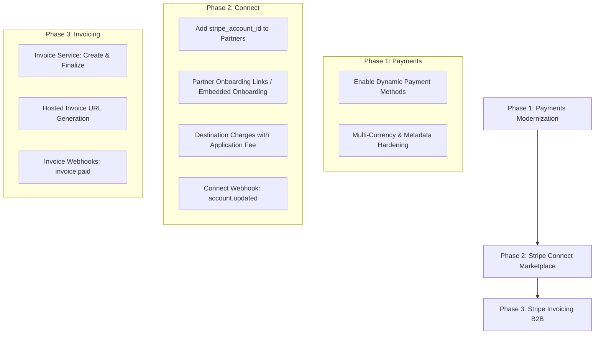

# Stripe Integration & Modernization Plan — Bookly Travel

Review of the existing Stripe implementation against best-practice architecture generated via the Stripe Implementation Planner for **Payments**, **Connect**, and **Invoicing**.

---

## 1. Executive Summary & Current State Review

Bookly Travel currently has a functional foundation for direct consumer payments, but lacks marketplace payout mechanics (**Stripe Connect**) and B2B billing capabilities (**Stripe Invoicing**).

### Existing Implementation Audit
| Domain | Current Implementation | Status | Gaps & Limitations |
| :--- | :--- | :--- | :--- |
| **Payments** | `StripeService` + `CreatePaymentIntentAction` + `PaymentElement` | 🟡 Partial | No Dynamic Payment Methods flag, no multi-currency handling on Stripe side, no explicit capture/auth hold options, simple single-account charge. |
| **Connect** | None | 🔴 Missing | `partners` table has no `stripe_account_id`; platform currently collects 100% of funds with no programmatic split or destination payout to tour providers; no Express onboarding flow. |
| **Invoicing** | None | 🔴 Missing | No B2B invoice generation, no Hosted Invoice Page links, no automated payment reminders for corporate/custom tour groups. |
| **Webhooks** | `ProcessStripeWebhookAction` handles `payment_intent.*` & `charge.*` | 🟡 Partial | Missing Connect webhooks (`account.updated`, `capability.updated`) and Invoicing webhooks (`invoice.paid`, `invoice.payment_failed`). |

---

## 2. Recommended Architectural Decisions

Based on the Stripe Implementation Planner and best practices for travel marketplaces:

1. **Marketplace Model**: Destination charges (`transfer_data[destination] = partner.stripe_account_id`).
   - Platform acts as the merchant of record (manages transaction risk and cardholder relations).
   - Platform takes an `application_fee_amount` (commission) per tour booking.
   - Net proceeds transfer automatically to the tour operator's connected account.
2. **Connected Account Type**: Stripe **Express** Accounts.
   - Lightweight, Stripe-hosted onboarding and compliance verification (KYC/AML).
   - Tour operators receive a pre-built Express dashboard login link or embedded components to view earnings and payout schedules.
3. **Invoicing**: Stripe Invoicing API for B2B Corporate & Group Bookings.
   - Programmatically generates finalized invoices with `auto_advance: true`.
   - Sends customer to the Stripe **Hosted Invoice Page** or sends direct email invoice links.
   - Listens to `invoice.paid` to auto-confirm bookings and create ledger records.

---

## 3. Phased Implementation Roadmap

---

## 4. Proposed Changes

### Phase 1: Payments Modernization & Hardening

#### [MODIFY] [StripeService.php](file:///f:/Travel%20Website/bookly%20travel/backend/app/Domains/Payment/Services/StripeService.php)
- Add `automatic_payment_methods[enabled] => true` and `automatic_payment_methods[allow_redirects] => 'always'` to `createPaymentIntent` to unlock Apple Pay, Google Pay, Klarna, iDEAL, and Bancontact automatically without frontend code changes.
- Add support for destination charges: accept optional `destinationAccountId` and `applicationFeeAmount`.

#### [MODIFY] [StripePaymentForm.tsx](file:///f:/Travel%20Website/bookly%20travel/frontend/src/components/booking/StripePaymentForm.tsx)
- Ensure Stripe Elements uses Dynamic Payment Methods with auto layout and localized currency formatting.

---

### Phase 2: Stripe Connect for Tour Operators / Partners

#### [NEW] Migration: `add_stripe_connect_columns_to_partners_table.php`
- Adds:
  - `stripe_account_id` (string, nullable, unique)
  - `stripe_charges_enabled` (boolean, default false)
  - `stripe_payouts_enabled` (boolean, default false)
  - `stripe_onboarding_completed` (boolean, default false)
  - `stripe_details_submitted` (boolean, default false)

#### [NEW] [StripeConnectService.php](file:///f:/Travel%20Website/bookly%20travel/backend/app/Domains/Payment/Services/StripeConnectService.php)
- `createExpressAccount(Partner $partner)`: Calls `accounts.create` with `type: 'express'`, country, email, business profile.
- `createAccountLink(Partner $partner, string $returnUrl, string $refreshUrl)`: Generates onboarding URL for the partner.
- `createLoginLink(Partner $partner)`: Generates single sign-on link to the partner's Express dashboard.
- `syncAccountStatus(string $stripeAccountId)`: Pulls live capability and verification status from Stripe.

#### [NEW] Controllers & Routes:
- `POST /api/v1/partner/stripe/onboard`: Initiates Express onboarding and returns redirect link.
- `GET /api/v1/partner/stripe/dashboard`: Returns one-time login link to Express dashboard.
- `GET /api/v1/partner/stripe/status`: Returns current payout readiness and account status.

#### [MODIFY] [CreatePaymentIntentAction.php](file:///f:/Travel%20Website/bookly%20travel/backend/app/Domains/Payment/Actions/CreatePaymentIntentAction.php)
- When a booking is tied to a tour with a partner who has an active `stripe_account_id`:
  - Calculate platform commission (e.g. 15% platform commission or partner-specific rate).
  - Pass `transfer_data[destination] = partner.stripe_account_id` and `application_fee_amount = platformCommission`.
  - Record the fee and destination in `payments.metadata` and financial ledger.

#### [MODIFY] [ProcessStripeWebhookAction.php](file:///f:/Travel%20Website/bookly%20travel/backend/app/Domains/Payment/Actions/ProcessStripeWebhookAction.php)
- Add handler for `account.updated`:
  - Updates `partners` record (`stripe_charges_enabled`, `stripe_payouts_enabled`, `stripe_details_submitted`).
  - Dispatches `PartnerStripeAccountUpdated` event.

---

### Phase 3: Stripe Invoicing for B2B & Group Bookings

#### [NEW] [StripeInvoiceService.php](file:///f:/Travel%20Website/bookly%20travel/backend/app/Domains/Payment/Services/StripeInvoiceService.php)
- `createInvoiceForBooking(Booking $booking)`:
  - Gets or creates Stripe Customer for traveler / company.
  - Adds InvoiceItem (`amount`, `currency`, `description` with tour name & booking ref).
  - Creates Invoice with `collection_method: 'send_invoice'`, `days_until_due: 7` or custom payment terms.
  - Finalizes invoice and returns `hosted_invoice_url` and `invoice_pdf`.

#### [MODIFY] [ProcessStripeWebhookAction.php](file:///f:/Travel%20Website/bookly%20travel/backend/app/Domains/Payment/Actions/ProcessStripeWebhookAction.php)
- Add handlers for:
  - `invoice.paid`: Confirms corresponding booking, creates ledger entry, notifies customer.
  - `invoice.payment_failed`: Marks invoice payment failed, sends reminder.
  - `invoice.finalized`: Stores hosted invoice URL on booking.

---

## 5. Verification Plan

### Automated Testing
- **Pest / PHPUnit**:
  - `ConnectAccountCreationTest`: Verify Express account creation and URL generation.
  - `DestinationChargePaymentIntentTest`: Verify `transfer_data` and `application_fee_amount` calculations and params.
  - `ConnectWebhookTest`: Test `account.updated` webhook handling and DB sync.
  - `StripeInvoiceCreationTest`: Verify invoice item creation, finalization, and webhook reconciliation.
- **Frontend Tests**:
  - `StripePaymentForm.test.tsx`: Test dynamic payment element rendering and success/error callbacks.
  - `PartnerStripeConnectCard.test.tsx`: Test connect onboarding button and status badge.

### Manual Verification in Stripe Sandbox (`acct_1UH98GCI0BNPpPsO`)
1. Create a test connected account using the new service and complete test onboarding via Stripe test flow.
2. Execute a booking checkout on a tour owned by the connected account and verify in Stripe Dashboard that:
   - Charge is created on platform.
   - Platform fee is retained.
   - Net funds transfer to the connected test account.
3. Generate a test invoice for a corporate booking, pay it via the Hosted Invoice Page test payment, and verify webhook triggers booking confirmation.
