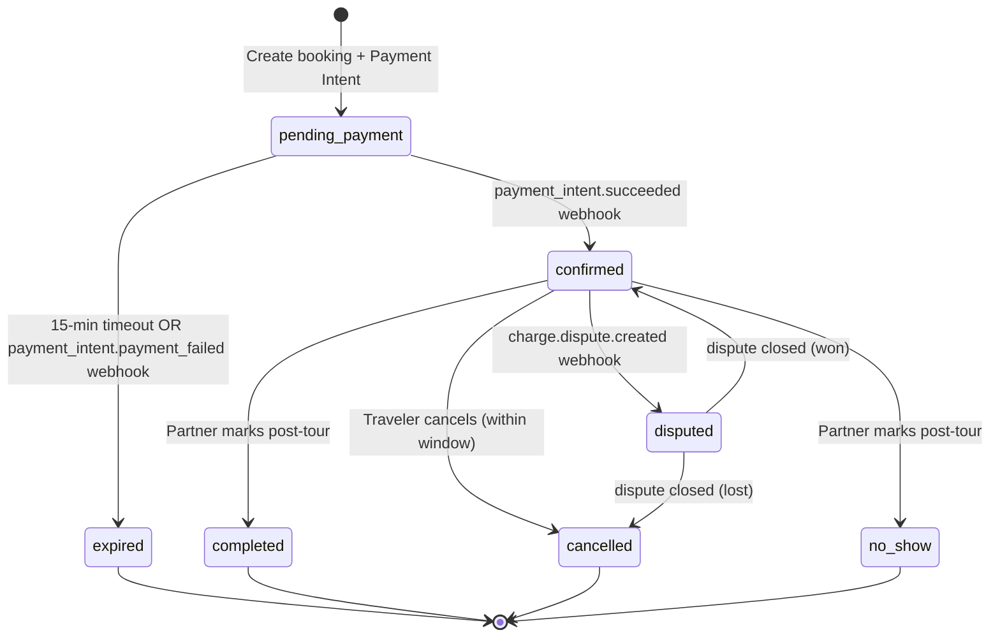

# Data Model: Payment Processing (008)

**Date**: 2026-05-11  
**Feature**: [spec.md](./spec.md)

## Entity Relationship Diagram

```mermaid
erDiagram
    BOOKING ||--o{ PAYMENT : "has"
    PAYMENT ||--o{ FINANCIAL_LEDGER_ENTRY : "produces"
    STRIPE_WEBHOOK_EVENT ||--o| PAYMENT : "updates"
    BOOKING {
        bigint id PK
        string reference UK
        bigint traveler_id FK
        bigint tour_id FK
        date tour_date
        int participant_count
        int price_per_person
        int total_price
        string currency
        string status "pending_payment|confirmed|completed|cancelled|no_show|expired"
        string idempotency_key UK
        string stripe_payment_intent_id "nullable, added by 008"
        timestamp payment_confirmed_at "nullable, added by 008"
        timestamp pending_expires_at "nullable, added by 008"
        string cancellation_policy
        int cancellation_window_hours
        timestamp cancelled_at
        string cancellation_reason
        timestamp confirmation_email_sent_at
        string locale
        timestamp anonymized_at
        timestamps created_at updated_at
    }
    PAYMENT {
        bigint id PK
        bigint booking_id FK
        string stripe_payment_intent_id UK
        string stripe_refund_id "nullable, for refund-type entries"
        string type "charge|refund"
        int amount "in cents"
        string currency "EUR"
        string status "pending|succeeded|failed|refunded|disputed"
        string card_last_four "nullable"
        string card_brand "nullable (visa, mastercard, etc.)"
        jsonb metadata "nullable, for additional Stripe data"
        timestamps created_at updated_at
    }
    FINANCIAL_LEDGER_ENTRY {
        bigint id PK
        bigint booking_id FK
        bigint payment_id FK
        string entry_type "debit|credit"
        int amount "in cents, always positive"
        string currency "EUR"
        string actor "system|admin"
        string description
        timestamp created_at "NO updated_at - immutable"
    }
    STRIPE_WEBHOOK_EVENT {
        bigint id PK
        string stripe_event_id UK
        string event_type "payment_intent.succeeded, etc."
        string processing_status "received|processed|skipped|failed"
        string payload_hash "SHA-256 of raw payload"
        text raw_payload "nullable, stored for debugging"
        timestamp processed_at "nullable"
        timestamp created_at
    }
```

## Table: `payments`

| Column | Type | Constraints | Description |
|--------|------|-------------|-------------|
| id | bigint | PK, auto-increment | |
| booking_id | bigint | FK → bookings.id, NOT NULL, INDEX | Owning booking |
| stripe_payment_intent_id | varchar(255) | UNIQUE, NOT NULL | Stripe PI identifier |
| stripe_refund_id | varchar(255) | NULLABLE, INDEX | Set for refund-type records |
| type | varchar(20) | NOT NULL, CHECK(charge\|refund) | Transaction type |
| amount | integer | NOT NULL | Amount in cents |
| currency | varchar(3) | NOT NULL, DEFAULT 'EUR' | ISO 4217 |
| status | varchar(20) | NOT NULL, DEFAULT 'pending' | pending\|succeeded\|failed\|refunded\|disputed |
| card_last_four | varchar(4) | NULLABLE | For traveler receipt display |
| card_brand | varchar(20) | NULLABLE | visa, mastercard, amex, etc. |
| metadata | jsonb | NULLABLE | Additional Stripe metadata |
| created_at | timestamp | NOT NULL | |
| updated_at | timestamp | NOT NULL | Updated on webhook state changes |

**Indexes**: `(booking_id)`, `(stripe_payment_intent_id)` UNIQUE, `(stripe_refund_id)`, `(status, created_at)`

## Table: `financial_ledger_entries`

| Column | Type | Constraints | Description |
|--------|------|-------------|-------------|
| id | bigint | PK, auto-increment | |
| booking_id | bigint | FK → bookings.id, NOT NULL, INDEX | |
| payment_id | bigint | FK → payments.id, NOT NULL, INDEX | Source payment |
| entry_type | varchar(10) | NOT NULL, CHECK(debit\|credit) | debit = charge, credit = refund |
| amount | integer | NOT NULL | Amount in cents (always positive) |
| currency | varchar(3) | NOT NULL, DEFAULT 'EUR' | |
| actor | varchar(20) | NOT NULL | system, admin |
| description | varchar(500) | NOT NULL | Human-readable event description |
| created_at | timestamp | NOT NULL | **No `updated_at` — immutable** |

**Indexes**: `(booking_id, created_at)`, `(payment_id)`, `(entry_type, created_at)`

**Immutability enforcement**:
- Eloquent model: `const UPDATED_AT = null`; no `update()` or `delete()` methods
- Optional DB trigger: `BEFORE UPDATE OR DELETE ON financial_ledger_entries → RAISE EXCEPTION`

## Table: `stripe_webhook_events`

| Column | Type | Constraints | Description |
|--------|------|-------------|-------------|
| id | bigint | PK, auto-increment | |
| stripe_event_id | varchar(255) | UNIQUE, NOT NULL | Stripe event ID for idempotency |
| event_type | varchar(100) | NOT NULL, INDEX | e.g., `payment_intent.succeeded` |
| processing_status | varchar(20) | NOT NULL, DEFAULT 'received' | received\|processed\|skipped\|failed |
| payload_hash | varchar(64) | NOT NULL | SHA-256 of raw payload |
| raw_payload | text | NULLABLE | Full webhook body (debug) |
| processed_at | timestamp | NULLABLE | Set when processing completes |
| created_at | timestamp | NOT NULL | |

**Indexes**: `(stripe_event_id)` UNIQUE, `(event_type, processing_status)`, `(created_at)`

## Columns Added to `bookings` Table (migration)

| Column | Type | Constraints | Description |
|--------|------|-------------|-------------|
| stripe_payment_intent_id | varchar(255) | NULLABLE, INDEX | Links booking to Stripe PI |
| payment_confirmed_at | timestamp | NULLABLE | When payment was confirmed via webhook |
| pending_expires_at | timestamp | NULLABLE, INDEX | When the pending_payment hold expires |

## Status Lifecycle (Booking — extended)


