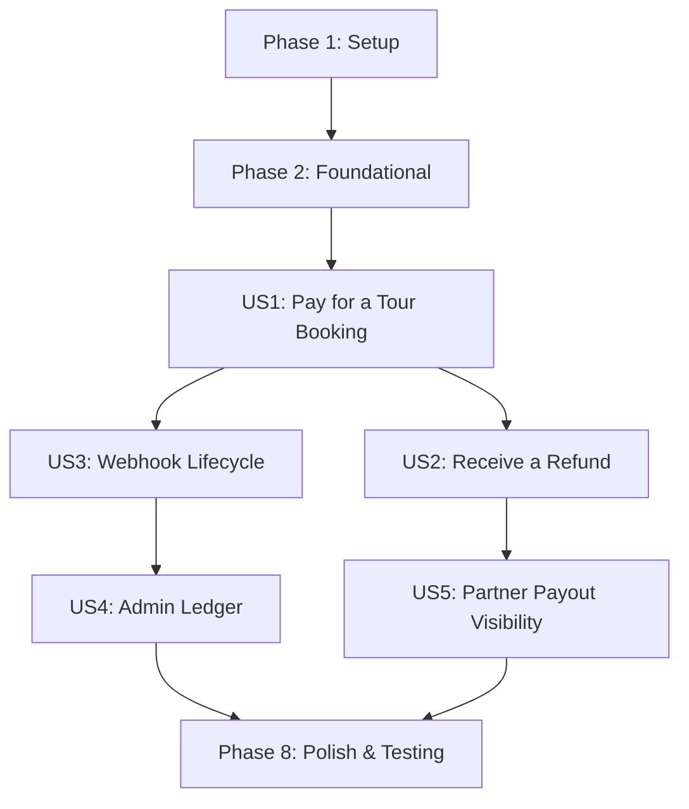

# Implementation Tasks: Payment Processing (008)

**Feature**: 008-payment-processing  
**Source Plan**: [plan.md](./plan.md)  
**Spec**: [spec.md](./spec.md)  
**Date**: 2026-05-11  

> **Implementation Strategy Note**: This task list is highly granular to enable reliable implementation by less capable/cheaper LLMs. File paths are exact. Best practices (like separation of concerns, idempotency, and explicit type checking) are baked into the task definitions. Follow the order strictly as later phases depend on the foundation built in earlier phases.

## Phase 1: Setup

- [X] T001 `backend/composer.json`: Add `"stripe/stripe-php": "^13.0"` to the `require` block (run `composer update` inside backend container).
- [X] T002 `frontend/package.json`: Add `"@stripe/stripe-js": "^3.0"` and `"@stripe/react-stripe-js": "^2.5"` to `dependencies` (run `npm install` inside frontend container).
- [X] T003 `backend/database/migrations/2026_05_11_100001_create_payments_table.php`: Create migration for the `payments` table matching schema in `data-model.md`.
- [X] T004 `backend/database/migrations/2026_05_11_100002_create_financial_ledger_entries_table.php`: Create migration for the `financial_ledger_entries` table matching schema in `data-model.md` (no `updated_at` column).
- [X] T005 `backend/database/migrations/2026_05_11_100003_create_stripe_webhook_events_table.php`: Create migration for the `stripe_webhook_events` table.
- [X] T006 `backend/database/migrations/2026_05_11_100004_add_payment_columns_to_bookings_table.php`: Create migration to add `stripe_payment_intent_id` (string, nullable), `payment_confirmed_at` (timestamp, nullable), and `pending_expires_at` (timestamp, nullable) to the existing `bookings` table.
- [X] T007 `backend/config/services.php`: Add a `stripe` array block containing `key`, `secret`, and `webhook_secret` mapping to `env('STRIPE_KEY')`, `env('STRIPE_SECRET')`, and `env('STRIPE_WEBHOOK_SECRET')`.

## Phase 2: Foundational

- [X] T008 [P] `backend/app/Domains/Payment/Models/Payment.php`: Create the `Payment` Eloquent model with `$fillable` array matching the schema, and a `booking()` `belongsTo` relationship.
- [X] T009 [P] `backend/app/Domains/Payment/Models/FinancialLedgerEntry.php`: Create the `FinancialLedgerEntry` Eloquent model. Crucially, set `const UPDATED_AT = null;` to enforce immutability at the ORM level.
- [X] T010 [P] `backend/app/Domains/Payment/Models/StripeWebhookEvent.php`: Create the `StripeWebhookEvent` Eloquent model with `$fillable` properties for tracking webhook processing status.
- [X] T011 `backend/app/Domains/Booking/Models/Booking.php`: Add constants `STATUS_PENDING_PAYMENT = 'pending_payment'` and `STATUS_EXPIRED = 'expired'`. Add the 3 new columns to `$fillable`. Add a `payment()` `hasOne` relationship to `App\Domains\Payment\Models\Payment`.
- [X] T012 `backend/app/Domains/Payment/Services/StripeService.php`: Create service class. Initialize Stripe client in constructor. Add `createPaymentIntent(int $amount, string $currency, string $idempotencyKey): string` returning the `client_secret`, and a `refund(string $paymentIntentId): string` method returning the refund ID.
- [X] T013 `backend/app/Domains/Payment/Services/LedgerService.php`: Create service class with `recordCharge(Payment $payment): void` and `recordRefund(Payment $payment): void` to encapsulate safe, append-only writes to `financial_ledger_entries`.

## Phase 3: User Story 1 (Pay for a Tour Booking - P1)

- [X] T014 [US1] `backend/app/Domains/Payment/Actions/CreatePaymentIntentAction.php`: Implement action using `StripeService` to create a Stripe Payment Intent. It should save a new `Payment` record in the database with status `pending`.
- [X] T015 [US1] `backend/app/Domains/Booking/Services/AvailabilityService.php`: Update `checkAndReserve` to sum both `STATUS_CONFIRMED` and `STATUS_PENDING_PAYMENT` bookings when calculating used capacity.
- [X] T016 [US1] `backend/app/Domains/Booking/Actions/CreateBookingAction.php`: Refactor to create the booking with `STATUS_PENDING_PAYMENT`, calculate `pending_expires_at` (now + 15 mins), call `CreatePaymentIntentAction`, save the intent ID on the booking, and return the `client_secret` in the `BookingResponseDTO`.
- [X] T017 [US1] `backend/app/Domains/Payment/Jobs/ExpirePendingBookingsJob.php`: Create a job that queries bookings where `status = pending_payment` and `pending_expires_at <= now()`. Update their status to `expired`. Register this job in `backend/routes/console.php` to run `everyFiveMinutes()`.
- [X] T018 [US1] `frontend/src/lib/stripe/stripe-client.ts`: Create module exporting a singleton `loadStripe(process.env.NEXT_PUBLIC_STRIPE_PUBLISHABLE_KEY)` promise.
- [X] T019 [US1] `frontend/src/components/booking/StripePaymentForm.tsx`: Create a React component wrapping Stripe's `<PaymentElement />`. Add a submit handler using `useStripe()` and `useElements()` to call `stripe.confirmPayment()`.
- [X] T020 [US1] `frontend/src/components/booking/BookingForm.tsx`: Integrate `StripePaymentForm` via the `<Elements>` provider. Update flow: Step 1 calls API to get `client_secret`, Step 2 mounts Stripe form for card entry.
- [X] T021 [US1] `backend/app/Domains/Booking/Controllers/Public/TravelerBookingController.php`: Update `show` method to eager load the `payment` relationship and append payment status details to the JSON response.
- [X] T022 [US1] `frontend/src/components/booking/PaymentStatus.tsx`: Create a UI component to display the payment receipt (amount, card last 4 digits, paid at timestamp) on the booking confirmation page.

## Phase 4: User Story 3 (Payment Lifecycle via Webhooks - P2)

- [X] T023 [US3] `backend/app/Domains/Payment/Events/PaymentSucceeded.php`: Create standard Laravel event passing the `Payment` and `Booking` models.
- [X] T024 [US3] `backend/app/Domains/Payment/Events/PaymentFailed.php`: Create standard Laravel event passing the `Payment` and `Booking` models.
- [X] T025 [US3] `backend/app/Domains/Payment/Actions/ProcessStripeWebhookAction.php`: Verify signature via `\Stripe\Webhook::constructEvent`. Use DB transaction to check/insert `stripe_webhook_events` (ensuring idempotency). Switch on event type, update `Payment` status, and dispatch Laravel events.
- [X] T026 [US3] `backend/app/Domains/Payment/Controllers/Public/StripeWebhookController.php`: Create controller invoking `ProcessStripeWebhookAction`. Return 200 on success, or 400 on signature validation errors.
- [X] T027 [US3] `backend/routes/api/public.php`: Register POST `/webhooks/stripe` pointing to `StripeWebhookController`.
- [X] T028 [US3] `backend/app/Domains/Payment/Listeners/ConfirmBookingOnPayment.php`: Listen to `PaymentSucceeded`. Update booking status to `STATUS_CONFIRMED`, write debit to `LedgerService`, and dispatch the existing `SendBookingConfirmationEmail` job.
- [X] T029 [US3] `backend/app/Domains/Payment/Listeners/ExpireBookingOnPaymentFailure.php`: Listen to `PaymentFailed`. Update booking status to `STATUS_EXPIRED`.
- [X] T042 [US3] `backend/app/Domains/Payment/Listeners/NotifyAdminOnPaymentFailure.php`: Listen to `PaymentFailed`. Dispatch an admin notification via the existing notification pipeline (spec 007 FR-028) alerting that a payment failed after booking creation. Include booking reference, traveler ID, failure reason, and timestamp in the alert payload.
- [X] T043 [US3] `backend/app/Domains/Payment/Actions/ProcessStripeWebhookAction.php`: Add dispute event handling branches to the existing webhook action. For `charge.dispute.created`: update `Payment` status to `disputed`, trigger admin alert via `NotifyAdminOnPaymentFailure` (or a dedicated `DisputeOpened` event). For `charge.dispute.closed`: read the dispute outcome — if won, restore payment status to `succeeded` and booking to `confirmed`; if lost, update payment to `refunded` and booking to `cancelled`, and append a credit ledger entry via `LedgerService`.
- [X] T030 [US3] `backend/app/Providers/EventServiceProvider.php`: Register the new payment events and listeners in the `$listen` array. Ensure `NotifyAdminOnPaymentFailure` is registered as a listener for `PaymentFailed` alongside `ExpireBookingOnPaymentFailure`.

## Phase 5: User Story 2 (Receive a Refund on Cancellation - P2)

- [X] T031 [US2] `backend/app/Domains/Payment/Actions/ProcessRefundAction.php`: Call `StripeService->refund()`. Update the associated `Payment` record status to `refunded` and type to `refund`. Call `LedgerService->recordRefund()` to append a credit entry.
- [X] T032 [US2] `backend/app/Domains/Booking/Actions/CancelBookingAction.php`: Refactor to check if booking is `STATUS_CONFIRMED` and within the cancellation window. If so, invoke `ProcessRefundAction` before transitioning status to `cancelled`.

## Phase 6: User Story 4 (Admin Financial Audit Trail - P3)

- [X] T033 [US4] `backend/app/Domains/Payment/Controllers/Admin/FinancialLedgerController.php`: Implement `index` method returning paginated `FinancialLedgerEntry` records. Support filtering by `booking_reference`, `entry_type`, and date ranges.
- [X] T034 [US4] `backend/routes/api/admin.php`: Register GET `/financial-ledger` route to `FinancialLedgerController` (protected by admin middleware).

## Phase 7: User Story 5 (Partner Payout Visibility - P3)

- [X] T035 [US5] `backend/app/Domains/Payment/Controllers/Partner/FinancialSummaryController.php`: Implement `index` method calculating aggregate total revenue, total refunds, and net revenue from the `payments` and `bookings` tables for tours owned by the authenticated partner.
- [X] T036 [US5] `backend/routes/api/partner.php`: Register GET `/financial-summary` route to `FinancialSummaryController` (protected by partner middleware).

## Phase 8: Polish & Testing

- [X] T037 `frontend/src/i18n/en.json`: Add English keys for payment statuses (`pending_payment`, `expired`), Stripe Elements labels, and financial summary headers.
- [X] T038 `frontend/src/i18n/es.json`: Add Spanish translations for the new payment keys.
- [X] T039 `frontend/src/i18n/it.json`: Add Italian translations for the new payment keys.
- [X] T040 `backend/tests/Feature/Payment/WebhookTest.php`: Write test verifying webhook signature validation and asserting that duplicate Stripe event IDs do not process twice.
- [X] T041 `backend/tests/Feature/Payment/PendingExpiryTest.php`: Write test verifying that `ExpirePendingBookingsJob` correctly identifies 16-minute-old pending bookings and successfully transitions them to `expired`, thereby freeing capacity.
- [X] T044 `frontend/src/components/booking/__tests__/StripePaymentForm.test.tsx`: Write Jest test for the `StripePaymentForm` component. Mock `@stripe/react-stripe-js` hooks (`useStripe`, `useElements`). Verify: (1) the PaymentElement renders, (2) submit handler calls `stripe.confirmPayment` with the correct `client_secret`, (3) error states are displayed when `confirmPayment` returns an error, (4) the submit button is disabled during processing.
- [X] T045 `frontend/src/components/booking/__tests__/PaymentStatus.test.tsx`: Write Jest test for the `PaymentStatus` component. Verify: (1) payment receipt displays amount, card last 4, card brand, and timestamp when payment data is present, (2) component handles null/missing payment data gracefully.

---

## Dependencies

