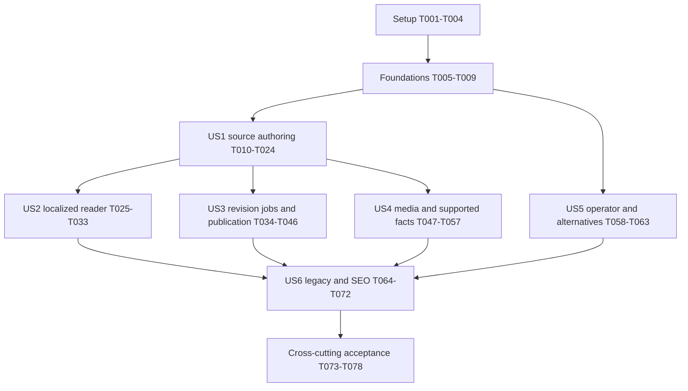

# Tasks: Spec 019 Tour Content Data Model and API

**Input**: [spec.md](spec.md), [plan.md](plan.md), [research.md](research.md), [data-model.md](data-model.md), [contracts/](contracts/), [quickstart.md](quickstart.md).
**Branch / baseline**: `codex/019-tour-content-data`; original predecessor `codex/bookly-ui-redesign-all-work` at `84ae4e5` is preserved in ancestry. PR #27 is merged; the branch was rebased onto `origin/main` at `f1a1f37`. Phase 1 PR #28 is also merged as of 2026-10-03; do not duplicate its inherited work. Main `803048e` is integrated by merge `60ce24d` after verified foundation commit `fb5c718`; reviewed runtime source is unchanged.
**Spec / program phase**: `019`; UI master-plan Phase 2, Tasks 2.1-2.4. The numbered phases below organize execution of this spec only.
**Governance**: [Constitution v2.1.0](../../.specify/memory/constitution.md).
**Generated**: 2026-10-02.
**Status**: 24/78 tasks independently accepted: T001-T024. US1 source authoring and browser acceptance were independently verified on 2026-10-04; see verification section 20. This increment follows source commit `93474ab`. Later stories, full Spec 019 acceptance and current-head CI remain pending; inherited baseline passes are regression evidence.
**Tests**: Required by Constitution VII and the specification's independent acceptance scenarios. Add regression cases before fixing critical defects; demonstrate failure for the relevant behavior rather than require inherited passing cases to fail.
**Organization**: Setup, shared foundations, six story phases in specification priority order, then cross-cutting acceptance. Reuse inherited code and applied migrations; implementation means closing the documented gap, not duplicating working foundations.

## Format and Path Conventions

Each task uses `- [ ] Tnnn [P?] [USn?] description with exact repository-relative file paths`. `[P]` means eligible within the ready wave described below; it never overrides prerequisites or shared-file ownership. New files are identified explicitly. Paths start at `backend/`, `frontend/` or `specs/019-tour-content-data/`. Record results in the new `specs/019-tour-content-data/verification.md` during implementation; this evidence file is not generated or populated with assumed results now.

The requested Spec Kit artifact is `tasks.md`. The separate project TODO store and `.todo` file are not modified by this workflow. Preserve Spec 018 and avoid importing its historical test totals as Spec 019 evidence.

## Phase 1: Setup

**Purpose**: Verify the existing dependent baseline and establish reproducible acceptance inputs.

- [X] T001 Verify branch, HEAD ancestry, active feature pointer, Spec 018 preservation and current prerequisite PR status against `specs/019-tour-content-data/plan.md` and `.specify/feature.json`; create `specs/019-tour-content-data/verification.md` with baseline/dependency facts and separate implementation, runtime, CI, merge and release statuses.
- [X] T002 Verify disposable PostgreSQL/Meilisearch isolation and fake-provider setup in `backend/phpunit.pgsql.xml`, `backend/tests/bootstrap.php` and `docker-compose.test.yml`; record the single backend-suite owner and forbid live provider traffic in automated tests in `specs/019-tour-content-data/verification.md`.
- [X] T003 [P] Read `frontend/AGENTS.md` and the installed guides under `frontend/node_modules/next/dist/docs/` relevant to server fetches, App Router metadata and affected forms; verify `frontend/package.json` and `frontend/playwright.config.ts` commands, SSR fixture prerequisites and seeded partner projects before frontend changes.
- [X] T004 Inventory existing schema, active authoring consumers and focused baseline results using `backend/database/migrations/2026_09_25_000001_add_guide_languages_and_localized_itinerary.php`, `backend/database/migrations/2026_09_25_000002_create_tour_translation_states_table.php`, `frontend/src/lib/api/partner.ts` and `specs/019-tour-content-data/quickstart.md`; record findings in `specs/019-tour-content-data/verification.md`, without editing applied migrations or counting baseline passes as new acceptance.

**Checkpoint**: Dependencies and test environment verified; any actual baseline failure is independently recorded before changes.

## Phase 2: Foundational

**Purpose**: Shared revision, input, media-reader and consumer contracts needed by multiple stories.

- [X] T005 [P] Add failing hash/current-status and shared-lock-boundary regressions in new `backend/tests/Feature/Partner/TourContentRevisionTest.php` before refining helpers in `backend/app/Domains/Partner/Services/TourTranslationService.php`: fixed outer source fields, fixed day/stop key order, preserved array order and null/empty distinctions; introduce a reusable transaction boundary with lock order Tour -> EN -> states in es/it order, keeping network calls outside locks and checking fresh source on completion.
- [X] T006 [P] Align shared read/write DTOs in `frontend/src/lib/api/types.ts`, `frontend/src/types/tour.ts` and `frontend/src/types/partner.ts` with structured source/itinerary, nullable difficulty, spoken guide codes, sanitized readiness, additive operator verified and optional image alt_locale; preserve existing fields and eliminate casts through unknown in affected consumers.
- [X] T007 [P] Add failing legacy/new-type ordering/dedup/cover-fallback regressions in new `backend/tests/Feature/Search/TourMediaReaderTest.php`, then make shared image readers in `backend/app/Models/Tour.php` accept legacy image plus cover/gallery rows, preserve cover-first/sorted unique HTTP(S) URLs and use the legacy cover only when no usable media exists; complete this reader compatibility before T051 changes writer types.
- [X] T008 Add boundary-level normalization/forgery regressions in new `backend/tests/Feature/Partner/TourContentInputTest.php` first, then establish a reusable English input boundary in new `backend/app/Domains/Partner/Requests/TourContentRules.php` and existing `backend/app/Domains/Partner/Requests/StoreTourRequest.php` and `backend/app/Domains/Partner/Requests/UpdateTourRequest.php`: explicit nested EN keys win, shorthand fills missing keys, omitted updates preserve values, null/[] retain their distinct meanings, authored ES/IT and platform-owned state/hash fields receive field-specific 422 errors; keep ownership in scoped domain services and snapshot payloads separate.
- [X] T009 [P] Add deterministic EN/current/missing/stale/failed fixtures and fake provider barriers in new `backend/tests/Support/TourContentFixtures.php`; support independent PostgreSQL connections/processes for race tests and partner-record IDs different from user IDs, without real credentials or network calls.

**Checkpoint**: T005-T009 complete before any story implementation. Existing tour/translation/state schema is reused; nullable media alt storage is introduced only in US4.

## Phase 3: User Story 1 - Maintain English Tour Content (P1)

**Goal**: Owned English content and structured itinerary values survive save/reopen/edit; incomplete snapshots remain available while invalid canonical changes fail atomically.
**Independent test**: Through existing partner create/update/draft routes, round-trip every source field and ordering, reject boundary errors and another partner's ID, and restore incomplete/legacy snapshots. Provider calls remain fake. Legacy corrective adoption is delivered and accepted in US6.

### Tests first

- [X] T010 [P] [US1] Extend `backend/tests/Feature/Partner/TourCreateTest.php` with all English-field create/update round trips, nested-versus-shorthand precedence, omitted/null/[] semantics, exact title/list/text/itinerary boundaries, IDOR with distinct user/partner IDs, ES/IT/state forgery and atomic content/media rejection; assert existing 201/200 data envelopes and required non-source create fields (FR-001-007, FR-011, FR-030).
- [X] T011 [P] [US1] Extend `backend/tests/Feature/Partner/TourDraftTest.php` with unchanged opaque payload-array round trips, incomplete/legacy string-array itinerary snapshots, owner isolation, latest-no-draft 404, and no generation or live source write from snapshot autosave; materialization must validate normalized source (FR-002/004/007).
- [X] T012 [P] [US1] Extend `frontend/src/lib/validators/__tests__/partner.test.ts` and add `frontend/src/components/partner/tours/__tests__/ItineraryEditor.test.tsx` and `frontend/src/components/partner/tours/__tests__/TourWizard.test.tsx` for source-field preservation, numeric/null duration bounds, ordered day/stop edits, localized nested errors and incomplete older-state restoration (FR-001/005-007/030).

### Implementation

- [X] T013 [US1] Complete source field rules in `backend/app/Domains/Partner/Requests/TourContentRules.php`: title "String, max 120 characters; existing create requires it; publication requires trimmed nonempty EN"; description "Nullable draft source string, max 5,000; preserve existing top-level create 100-character minimum; publication requires trimmed nonempty EN"; highlights/inclusions/exclusions/important_information "Nullable/list of at most 30 strings, each max 500"; meeting_point "Nullable string, max 500"; cancellation_policy "Nullable string, max 2,000"; keep top-level create basic-field requirements and do not allow published-source clearing.
- [X] T014 [US1] Complete itinerary rules/normalization in `backend/app/Domains/Partner/Requests/TourContentRules.php`: itinerary "Nullable storage for not-yet-adopted data; accepted authored array max 30; public empty output always `[]`"; day "Required integer 1-30"; day/stop title "Required nonblank string, max 160"; day/stop description "String max 2,000 or null"; stops "Ordered array max 20; absent optional legacy value normalizes to `[]`"; duration_minutes "Integer 1-1,440 or null"; permit []/zero stops and repeated valid day numbers, preserve array order and return exact nested error paths.
- [X] T015 [US1] Wire the validated Requests into actual create/update paths in `backend/app/Domains/Partner/Controllers/TourController.php`; move affected business queries to `backend/app/Domains/Partner/Services/TourService.php`, preserve existing authentication/throttling/role behavior and scoped cross-partner 404, and avoid fixing only unused Request classes.
- [X] T016 [US1] Apply the complete English patch and media atomically in `backend/app/Domains/Partner/Services/TourService.php` using T005's Tour-first boundary and T013-T014 rules; preserve omitted values and old derivative rows, keep authored itinerary in EN rather than new legacy writes, and leave opaque draft snapshot saves unchanged until validated materialization.
- [X] T017 [US1] Align source/itinerary form validation in `frontend/src/lib/validators/partner.ts` with T013-T014's exact bounds, integer/null handling and nonblank titles; retain distinct Save Draft versus publication validation and field-specific localized error mapping.
- [X] T018 [US1] Normalize persisted older wizard state in `frontend/src/lib/stores/tourWizard.ts` with missing-array defaults and legacy itinerary conversion on restoration; preserve stored opaque snapshots and missing/null old difficulty, without injecting the new-tour default into an older tour or creating an unsaved-blank-tour server promise.
- [X] T019 [US1] Add duration input and field error wiring to `frontend/src/components/partner/tours/ItineraryEditor.tsx` with "Integer 1-1,440 or null", day/stop limits from T014, accessible labels/focus and localized copy; preserve ordered edits and valid zero-stop days.
- [X] T020 [US1] Complete EN-only source controls and DTO submission in `frontend/src/components/partner/tours/TourWizard.tsx` and `frontend/src/components/partner/tours/TourContentPreview.tsx`, including inclusions/exclusions/important information/meeting point/cancellation policy; preserve existing valid basic-field draft creation and separate incomplete local persistence from Submit behavior.
- [X] T021 [US1] Complete English read/edit/save and existing owned snapshot restoration in `frontend/src/app/[locale]/(partner)/partner/tours/[id]/edit/page.tsx` and `frontend/src/lib/api/partner.ts`; normalize a restored snapshot before canonical validation, retain omitted source/media, include optional source fields, and never apply snapshot-owned readiness/hash fields.
- [X] T022 [US1] Add EN/ES/IT source controls, duration, nested-error and draft/publication feedback to `frontend/messages/en.json`, `frontend/messages/es.json` and `frontend/messages/it.json`; use existing key conventions and accessible announced feedback (FR-030).
- [X] T023 [US1] Extend `frontend/tests/e2e/partner/tour-create.spec.ts` and `frontend/tests/e2e/partner/tour-edit.spec.ts` with owned English round-trip, saved/restored draft, duration ordering, localized invalid-field and cross-partner-denial scenarios on seeded non-production data, using actual API responses rather than browser-only SSR mocks.
- [X] T024 [US1] Run the affected backend/create/draft and frontend validation/editor/wizard/browser suites from `specs/019-tour-content-data/quickstart.md`; record commands, fixtures, locale/viewport and results in `specs/019-tour-content-data/verification.md` and verify SC-001, including rollback on invalid media, without claiming later-story adoption/publication acceptance.

**Checkpoint**: Owned canonical source entry/edit and snapshot restoration accepted. This is the source-authoring MVP, not a release of the full Phase 2 contract.

## Phase 4: User Story 2 - Read Current Content in the Requested Language (P1)

**Goal**: Current general content and itinerary choose languages independently; nonempty English fallbacks are disclosed and a next detail load sees new current derivatives.
**Independent test**: Seed EN/ES/IT current/missing/pending/stale/failed/hash-mismatched rows and a controlled ready transition; assert public JSON, rendered language/notices and fresh SSR reload. Live generation is not needed to accept this reader story.

### Tests first

- [ ] T025 [P] [US2] Extend `backend/tests/Feature/Search/TourDetailTest.php` with every public locale-selection row, missing derivative/state and apparent-ready hash mismatch, null versus explicit [] derived itinerary, empty EN itinerary, independent nonempty fallback, status/privacy and unchanged 422/404/410/unavailable behavior (FR-014-016/027; SC-002).
- [ ] T026 [P] [US2] Extend `frontend/src/components/tour/__tests__/TourDetail.test.tsx` and add `frontend/src/components/partner/tours/__tests__/TourContentPreview.test.tsx` for separate notices, actual lang attributes, empty itinerary suppression, repeated valid day numbers without duplicate React keys, and sanitized pending/stale/failed/ready displays in all locales.
- [ ] T027 [P] [US2] Extend `frontend/tests/e2e/tour-detail.spec.ts` with its real SSR API fixture server for current/general-versus-itinerary fallback and controlled ready-next-load transitions; assert stable URLs and spoken guide codes, without relying on browser route mocks to intercept server fetches (FR-016; SC-002).

### Implementation

- [ ] T028 [US2] Apply T005 current-hash selection in `backend/app/Domains/Search/Actions/GetTourDetailAction.php`: only row+ready+matching translated_hash is current, EN status is source, general/itinerary language selection is independent, null derivative itinerary may use nonempty EN, explicit [] stays empty, empty output has no misleading warning, and existing partial_translation remains the compatible summary value.
- [ ] T029 [US2] Render separate localized notices, source lang containers and empty itinerary behavior in `frontend/src/components/tour/TourDetail.tsx`; use position/composite keys for repeated day numbers and keep guide-language labels separate from content readiness.
- [ ] T030 [US2] Render sanitized readiness and actual source/preview language in `frontend/src/components/partner/tours/TourContentPreview.tsx` using the shared DTOs; retain English authoring and avoid exposing hashes, provider errors or generated-field editing.
- [ ] T031 [US2] Preserve fresh detail SSR fetches in `frontend/src/lib/api/tours.ts`, `frontend/src/lib/api/client.ts` and `frontend/src/app/[locale]/(public)/tours/[slug]/page.tsx`; use explicit no-store where the installed Next.js guide requires it, without changing caching for unrelated endpoints or adding polling/SLA promises.
- [ ] T032 [US2] Add independent fallback and readiness interface copy in `frontend/messages/en.json`, `frontend/messages/es.json` and `frontend/messages/it.json`; page language controls labels while displayed text declares its actual language (FR-030).
- [ ] T033 [US2] Run affected backend/detail, frontend/detail/preview and SSR transition suites from `specs/019-tour-content-data/quickstart.md`; record all locale/state selections and SC-002 outcomes in `specs/019-tour-content-data/verification.md`.

**Checkpoint**: Reader behavior accepted with controlled revision fixtures; provider/job race acceptance remains US3.

## Phase 5: User Story 3 - Publish While Translations Progress Safely (P1)

**Goal**: English saves/publication succeed independently of derived-language availability; old/duplicate jobs cannot damage current content, and lost dispatch is recoverable.
**Independent test**: Save changed/unchanged EN, submit/approve with missing derivatives, and control true PostgreSQL save/completion/retry interleavings with a fake provider; force lost queue/index dispatch and reconcile.

### Tests first

- [ ] T034 [P] [US3] Extend `backend/tests/Feature/Partner/TourTranslationTest.php` and add `backend/tests/Feature/Partner/TourTranslationConcurrencyTest.php` with changed/unchanged/key-reordered saves, old completion versus new source, simultaneous completions, concurrent source edits, terminal failure after ready, transaction rollback, dispatch failure after commit and bounded reconciliation/refresh-ready repeatability; use independent PostgreSQL connections/processes and provider barriers, not sequential hash tests alone (FR-010-013; SC-004).
- [ ] T035 [P] [US3] Add `backend/tests/Feature/Partner/TourTranslationProviderTest.php` for exact expected output keys, preserved numbers/nulls/ordering, invalid lengths/duplicate or missing keys, blocked/config/HTTP failure categories and bounded retries; fake HTTP and assert no credential/provider-body/prompt leakage.
- [ ] T036 [P] [US3] Extend `backend/tests/Feature/Admin/TourModerationTest.php` and `backend/tests/Feature/Admin/Filament/TourResourceTest.php` for submit/approve with pending/failed ES/IT, missing trimmed English refusal, existing pricing/media/lifecycle/audit requirements and authorization; do not weaken existing moderation gates (FR-004; SC-003).

### Implementation

- [ ] T037 [US3] Preserve and harden `backend/app/Models/TourTranslationState.php` and `backend/app/Domains/Partner/Services/TourTranslationService.php`: tour_id "Existing Tour FK, cascade delete"; locale "`es` or `it`; unique with tour"; source_hash "64-character SHA-256 of desired normalized current EN projection"; translated_hash "Nullable hash identifying stored derivative's source"; status "pending / stale / ready / failed"; last_error_code "Nullable sanitized category, max existing 40; never raw body/prompt/key"; timestamps "Operational record only, not source identity"; hide internal fields and reuse existing constraints/table.
- [ ] T038 [US3] Complete source revision transitions and after-commit generation in `backend/app/Domains/Partner/Services/TourService.php` and `backend/app/Domains/Partner/Services/TourTranslationService.php`: persist desired pending/stale state for changed EN, retain old derivatives, skip unchanged/media-only/settings changes, use T005 locks, and keep a committed save successful when dispatch fails with sanitized recoverable state.
- [ ] T039 [US3] Harden `backend/app/Domains/Partner/Jobs/GenerateTourTranslationJob.php` with current precheck, provider work outside locks and shared Tour -> EN -> es/it completion locks; current-only atomic derivative/ready write, superseded no-op, matching-ready provider/write no-op with optional fresh projection refresh, and no late-failure demotion of ready/newer content.
- [ ] T040 [US3] Validate translated output in `backend/app/Domains/Partner/Services/GeminiTourTranslator.php` and `backend/app/Domains/Partner/Services/TourTranslationService.php` against T013-T014 bounds after exact-key reconstruction; preserve numbers/nulls/order and existing structured request/provider interface, classify sanitized permanent versus transient failures and retain four attempts with 5/15/60-second backoff.
- [ ] T041 [US3] Extend `backend/app/Console/Commands/QueueTourTranslations.php` with bounded current pending/stale/failed reconciliation, including orphan pending dispatch, `--after-id`, "limit 1-500", and optional `--refresh-ready` that repairs lost index/cache dispatch without provider calls or derivative rewrites; report resume cursor/counts without content/secrets and cover repeated runs in `backend/tests/Feature/Partner/TourTranslationTest.php`.
- [ ] T042 [P] [US3] First extend `backend/tests/Feature/Search/TourSearchIndexTest.php` with failing rollback and lost-ready-dispatch recovery cases, then make affected source/completion indexing dispatch occur after commit through `backend/app/Providers/EventServiceProvider.php` and `backend/app/Domains/Search/Actions/IndexTourAction.php`; queued projection refresh must load current source/state, not older captured strings, and remain retry-safe.
- [ ] T043 [US3] Verify asynchronous deployed Redis translation dispatch and environment-configured backend/worker secrets in `backend/config/queue.php`, `backend/config/services.php` and `docker-compose.yml`; align provider timeout 40 seconds, job timeout 60 and retry-after 90, with worker timeout not exceeding effective job timeout; record actual values in `specs/019-tour-content-data/verification.md` without embedding keys or changing unrelated queue behavior.
- [ ] T044 [US3] Enforce trimmed required English on submission and approval in `backend/app/Domains/Partner/Services/TourService.php` and `backend/app/Domains/Admin/Actions/ApproveTourAction.php`; protect published live English from clearing, preserve all existing lifecycle/pricing/cover/actor/audit rules, and never require ES/IT readiness.
- [ ] T045 [US3] Retain current-hash-aware sanitized owned translation_statuses and response envelopes in `backend/app/Domains/Partner/Controllers/TourController.php` and `backend/app/Domains/Partner/Services/TourService.php`; move any affected detail business query to the scoped service and explicitly exclude loaded state models/hashes/provider details from serialization (FR-011/013/027).
- [ ] T046 [US3] Run translation/provider/moderation/index and real PostgreSQL concurrency suites from `specs/019-tour-content-data/quickstart.md`; prove queue and ready-projection recovery with fake dispatch failures and record SC-003/004 plus source HTTP independence in `specs/019-tour-content-data/verification.md`.

**Checkpoint**: English publication, revision races and recovery accepted; no exactly-once provider-call or live-model-entitlement claim.

## Phase 6: User Story 4 - Maintain Truthful Difficulty, Guide Languages and Photos (P2)

**Goal**: Saved supported facts and complete real galleries reach travelers without fabricated difficulty, stale cover injection or incorrect alt language.
**Independent test**: Round-trip supported difficulty/guide codes and ordered media, reject duplicate authored URLs, read legacy duplicate/cover-only/no-photo tours, retain omitted media/alt, and render English-specific alt correctly on ES/IT pages.

### Tests first

- [ ] T047 [P] [US4] Extend `backend/tests/Feature/Partner/TourCreateTest.php` and `backend/tests/Feature/Search/TourDetailTest.php` for nullable old difficulty, guide alias precedence, media atomicity/omission/alt retention, cover/gallery/image reads, duplicate authored rejection versus legacy read dedup, selected-title alt fallback and actual alt_locale (FR-017-021; SC-006).
- [ ] T048 [P] [US4] Extend `frontend/src/components/tour/__tests__/ImageGallery.test.tsx` and `frontend/src/components/partner/tours/__tests__/ImageUploader.test.tsx` and US1 form tests for null difficulty restoration/unrelated save, guide-code independence, media ordering/alt editing and image/caption lang distinct from page-language action labels.

### Implementation

- [ ] T049 [US4] Add new forward migration `backend/database/migrations/2026_10_02_000001_add_alt_text_to_tour_media_table.php` and update `backend/app/Domains/Partner/Models/TourMedia.php` for "nullable text `tour_media.alt_text`, validated at max 500 characters"; keep existing schema/data and no mandatory caption backfill/AI subsystem, with ordinary application rollback retaining the column.
- [ ] T050 [US4] Complete rules in `backend/app/Domains/Partner/Requests/TourContentRules.php`, `backend/app/Domains/Partner/Requests/StoreTourRequest.php` and `backend/app/Domains/Partner/Requests/UpdateTourRequest.php`: difficulty "Existing nullable string; supplied value easy/moderate/challenging"; guide_languages "Existing nullable JSONB code list, at most 20 distinct values" and "Normalize stable 2/3-letter language codes and existing code subtags; never infer from derivatives"; languages "Existing compatibility input/output alias" with guide_languages winning; media at most 20/distinct URLs, optional nullable alt_text max 500, no inferred difficulty.
- [ ] T051 [US4] After T007/T049/T050, normalize writes in `backend/app/Domains/Partner/Services/TourService.php` to type cover/gallery, first flagged or first valid cover, remaining input order and synchronized legacy cover_image_url ("Retained nullable URL"); omitted media preserves rows, replacement is atomic with EN, omitted alt on an existing URL preserves it and explicit null clears it.
- [ ] T052 [US4] Project real ordered images and optional alt_locale in `backend/app/Domains/Search/Actions/GetTourDetailAction.php` and ensure `backend/app/Models/Tour.php` readers remain compatible: specific English alt has en, fallback uses selected title/content locale, no usable gallery uses real legacy cover, and no images yields [] (FR-019-021).
- [ ] T053 [US4] Complete difficulty/guide/optional specific alt input round trips in `frontend/src/lib/validators/partner.ts`, `frontend/src/components/partner/tours/ImageUploader.tsx`, `frontend/src/components/partner/tours/TourWizard.tsx` and `frontend/src/app/[locale]/(partner)/partner/tours/[id]/edit/page.tsx`; preserve missing/null old difficulty on restoration and omit untouched missing values on updates, with no casts or translated guide-code meaning.
- [ ] T054 [US4] Consume image alt_locale and truthful selected-title fallback in `frontend/src/components/tour/ImageGallery.tsx` and `frontend/src/components/tour/TourDetail.tsx`; appropriate lang attributes cover alt/caption text while action labels stay page-localized, and empty media does not invent a tour photo.
- [ ] T055 [US4] Add bounded media-alt/difficulty/guide labels and validation copy to `frontend/messages/en.json`, `frontend/messages/es.json` and `frontend/messages/it.json`; match existing shared token/accessible-control conventions (FR-030).
- [ ] T056 [US4] Extend `frontend/tests/e2e/partner/tour-edit.spec.ts` and `frontend/tests/e2e/tour-detail.spec.ts` with integrated media/difficulty/guide updates and public reads, legacy null difficulty preservation, cover-first display and EN alt on ES/IT page-language controls.
- [ ] T057 [US4] Run affected source/media/detail/frontend/gallery/browser suites from `specs/019-tour-content-data/quickstart.md`; record SC-006 and additive migration/compatible-reader evidence in `specs/019-tour-content-data/verification.md` before enabling new typed writers in a rollout.

**Checkpoint**: Additive storage and all consumers agree on saved facts and photos; legacy image-only rollback requires the documented compatible-reader patch.

## Phase 7: User Story 5 - Evaluate the Operator and Eligible Alternatives (P2)

**Goal**: Safe approved-active operator facts and truthful eligible aggregates accompany deterministic bookable alternatives.
**Independent test**: Seed inactive/unapproved profiles, zero/hidden/flagged reviews, expired tours, ranking ties and more than 32 invalid candidates ahead of valid recommendations; assert exact allowlists, counts, order and limits.

### Tests first

- [ ] T058 [P] [US5] Add `backend/tests/Feature/Search/PublicOperatorSummaryTest.php` for approved/active/public-name prerequisites, verified semantics, exact published/future-bookable tour IDs, visible/flagged eligible review aggregates and zero average=null; recursively exclude contact/address/tax/payout/Stripe/user/state/provider/private fields (FR-022-024; SC-007).
- [ ] T059 [P] [US5] Add `backend/tests/Feature/Search/RelatedToursTest.php` for current/duplicate/unpublished/unbookable exclusions, destination then category then genuine rating/review-count/ID ordering, more than 32 ineligible leading candidates, fewer real results, default four and absolute eight ceiling without a public limit parameter (FR-025/026; SC-007).
- [ ] T060 [P] [US5] Add `frontend/src/components/tour/__tests__/OperatorSummary.test.tsx` and extend `frontend/src/components/tour/__tests__/TourDetail.test.tsx` for eligible verified summary, null/zero-review handling, unavailable summary and unchanged related TourCard display without invented claims.

### Implementation

- [ ] T061 [P] [US5] Refine `backend/app/Domains/Search/Actions/GetPublicOperatorSummaryAction.php` with eager-loaded availability and exact shared public-bookability checks before counts/review aggregates; preserve the public allowlist, add verified only for approved-active eligible profiles, and return null summary or null average appropriately without N+1 candidate queries.
- [ ] T062 [P] [US5] Refine `backend/app/Domains/Search/Actions/GetRelatedToursAction.php` with bounded ordered candidate pages until four exact eligible cards or exhaustion, deterministic destination/category/rating/review-count/ID ordering and internal limit clamp eight; preserve `backend/app/Domains/Search/Transformers/TourCardTransformer.php` fields and avoid changing the public API query surface.
- [ ] T063 [US5] Consume approved verified/nullable aggregate fields in `frontend/src/components/tour/OperatorSummary.tsx`, localize any changed copy in `frontend/messages/en.json`, `frontend/messages/es.json` and `frontend/messages/it.json`, and run US5 backend/component suites; record SC-007/privacy/eligibility/query evidence in `specs/019-tour-content-data/verification.md`.

**Checkpoint**: Summary privacy and exact discovery eligibility accepted. Related lists remain unpadded and operator ratings remain evidence-based.

## Phase 8: User Story 6 - Preserve Older Tours and Consistent Search Descriptions (P2)

**Goal**: Corrective legacy adoption preserves real source/order; existing consumers and URLs survive and SEO describes the same selected visible facts.
**Independent test**: Dry-run/apply/repeat adoption on valid/invalid/partial/populated/missing-EN fixtures, race adoption against source edits, then inspect public consumers/SSR metadata/structured data for real itinerary, meeting point, gallery and genuine/no-review ratings.

### Tests first

- [ ] T064 [P] [US6] Add `backend/tests/Feature/Partner/TourItineraryAdoptionTest.php` for bounded dry-run/apply/repeat, null versus populated EN including [], string/structured legacy arrays, malformed/partially invalid/empty input, missing EN, resume cursor/counts, source-change races and after-commit generation; preserve raw legacy source and require no dry-run writes/jobs (FR-008/009; SC-005).
- [ ] T065 [P] [US6] Extend `frontend/src/components/seo/__tests__/StructuredData.test.tsx` and `frontend/src/app/[locale]/(public)/tours/[slug]/__tests__/page.test.tsx` for selected actual languages, ordered real days/stops, actual meeting Place tripOrigin, every safe gallery URL, escaped JSON, no fabricated coordinates/offers and no aggregateRating without eligible reviews (FR-028/029; SC-008).
- [ ] T066 [P] [US6] Extend `backend/tests/Feature/Search/TourDetailTest.php` and `backend/tests/Feature/Search/TourSearchIndexTest.php` with preserved old response fields/links/canonicals/spoken aliases, 404/410/unavailable and booking eligibility semantics, and delayed index updates that cannot present an old derivative as current (FR-027/028; SC-008).

### Implementation

- [ ] T067 [US6] Add new `backend/app/Console/Commands/AdoptLegacyTourItineraries.php` for `tours:adopt-itineraries --dry-run --after-id=0 --limit=100`, "limit 1-500", ID-order resumable counts/cursor and existing-null-EN-only adoption; reuse/extract normalizer into new `backend/app/Domains/Partner/Services/LegacyTourItineraryNormalizer.php`, map valid strings/structured days to T014 bounds, make malformed/partially invalid/empty whole records [], retain raw legacy values and report missing EN without fabricating rows.
- [ ] T068 [US6] Use T005's Tour-first lock and source/hash/state service in `backend/app/Console/Commands/AdoptLegacyTourItineraries.php` to recheck null EN eligibility under lock, preserve concurrently entered or populated arrays including intentional [], schedule only changed accepted source after commit, and ensure dry-run creates no source/state/jobs; leave original applied migrations unchanged.
- [ ] T069 [US6] Extend `frontend/src/components/seo/StructuredData.tsx` with real ordered day/stop facts and documented tripOrigin Place only for actual starting meeting point; use selected content/itinerary languages and all safe real gallery URLs, retain script escaping and genuine eligible ratings only, without unsupported meetingPlace/coordinates/attraction claims.
- [ ] T070 [US6] Align selected visible content with metadata/canonical/hreflang in `frontend/src/app/[locale]/(public)/tours/[slug]/page.tsx` using the installed Next.js guide and current shared detail contract; preserve routes, prices/booking/availability behavior and existing consumers.
- [ ] T071 [US6] Extend `frontend/tests/e2e/tour-detail.spec.ts` with legacy/adopted/current/fallback/no-review/no-photo responses and actual backend seeded source writes followed by public SSR/SEO reads; verify existing booking actions and money remain server-authoritative without changing payment flows.
- [ ] T072 [US6] Run adoption/race/public/index/SEO/page/browser scenarios from `specs/019-tour-content-data/quickstart.md`; record SC-005/008, dry-run/count/cursor output and compatibility/adoption proof in `specs/019-tour-content-data/verification.md`, retaining legacy source and rows.

**Checkpoint**: All six stories have their own acceptance evidence. Adoption and SEO consistency are accepted; release-wide gates remain distinct.

## Phase 9: Polish and Cross-Cutting Acceptance

- [ ] T073 Extend `frontend/tests/e2e/a11y/tour-detail-a11y.spec.ts` and `frontend/tests/e2e/a11y/partner-a11y.spec.ts` where affected and review manual keyboard/focus, labels, announced errors, motion and loading/empty/error/success/disabled/denied states in EN/ES/IT at 390/768/1024/1440; retain screenshots/manual evidence paths in `specs/019-tour-content-data/verification.md` (FR-030; Constitution VI/VII).
- [ ] T074 Run full backend PostgreSQL suites, Pint and PHPStan via `specs/019-tour-content-data/quickstart.md` with configurations in `backend/phpunit.pgsql.xml` and `backend/phpstan.neon`; fix introduced failures and record reproducible output in `specs/019-tour-content-data/verification.md`, including authorization/publishing/booking/payment regression coverage.
- [ ] T075 Run full frontend lint/typecheck/Jest/build/Playwright/Axe gates including T073 additions using `frontend/package.json` and `specs/019-tour-content-data/quickstart.md`; record actual output/build/environment in `specs/019-tour-content-data/verification.md`, distinguishing unreachable, failed and passed gates.
- [ ] T076 Audit affected reachable primary public pages from a production build under `frontend/lighthouserc.js` or the verified existing Lighthouse configuration identified by T003; require Performance >=90 under documented conditions and record reports in `specs/019-tour-content-data/verification.md`; an unreachable/failed audit is not acceptance.
- [ ] T077 Rehearse additive schema -> compatible readers -> EN writers -> async workers -> dependent UI ordering, bounded adoption/recovery, configured-model staging generation, queue monitoring and compatible application/worker rollback from `specs/019-tour-content-data/quickstart.md`; record sanitized actual values/results and retained-data proof in `specs/019-tour-content-data/verification.md`, with no destructive migration rollback or production deployment implied by a completed rehearsal.
- [ ] T078 Reconcile every FR/SC and Constitution Check against actual evidence in `specs/019-tour-content-data/verification.md`, `specs/019-tour-content-data/plan.md` and `docs/bookly-ui-redesign-spec-kit-master-plan.md`; update only evidenced task/implementation status, keep CI/merge/release separately pending where applicable, preserve Spec 018 and resolve or explicitly retain predecessor PR dependencies before merge.

## Requirement and Outcome Traceability

The ranges below map every requirement; cross-cutting tasks supplement story-specific proof. All acceptance remains pending until implementation executes it.

| Requirements | Implementation / contract tasks | Verification tasks | Outcomes |
|---|---|---|---|
| FR-001-003 | T008, T013-T021 | T010-T012, T023-T024 | SC-001 |
| FR-004 | T020-T022, T044 | T011, T023, T036, T046 | SC-003 |
| FR-005-007 | T014, T016-T019 | T010-T012, T023-T024 | SC-001 |
| FR-008-009 | T067-T068 | T064, T072 | SC-005 |
| FR-010-013 | T005, T037-T045 | T034-T036, T041-T042, T046 | SC-003/004 |
| FR-014-016 | T028-T032, T039-T042 | T025-T027, T033, T034, T046 | SC-002/004 |
| FR-017-021 | T007, T049-T055 | T047-T048, T056-T057 | SC-006 |
| FR-022-024 | T061, T063 | T058, T060, T063 | SC-007 |
| FR-025-026 | T062-T063 | T059-T060, T063 | SC-007 |
| FR-027 | T006, T015, T028, T031, T045, T070 | T025, T066, T071-T072 | SC-008 |
| FR-028-029 | T042, T069-T070 | T065-T066, T071-T072 | SC-008 |
| FR-030 | T017-T023, T029-T032, T053-T055, T063 | T012, T023, T026-T027, T048, T056, T060, T073, T075 | Interface/Constitution VI/VII |

SC-001: T024; SC-002: T033; SC-003/004: T046; SC-005: T072; SC-006: T057; SC-007: T063; SC-008: T072. T073-T078 collect the final regression, release and traceability gates, not substitutes for these scenario checks.

## Dependencies and Execution Order

### Phase and story graph

The graph describes logical prerequisites. Shared-file gates below further limit concurrency. Default execution is ascending T001-T078; foundations precede stories and each story's tests precede its fixes. US1/US2/US3 are P1; US4/US5/US6 are P2. US2 uses seeded current-state fixtures and can be independently tested before the US3 provider pipeline. US5 can use seeded tours independently of authoring, but final integration uses all stories. US6 adopts through the accepted source/revision service and validates complete public gallery/operator facts.

### Task-specific and shared-file gates

- T001 -> T002/T003; T004 follows setup/environment verification. T005/T006/T007/T009 form a disjoint foundation wave; T008 completes before stories.
- In each story, its tests-first wave completes before implementation; implementation tasks proceed in listed order except explicitly ready `[P]` groups.
- T013 -> T014 -> T015 -> T016; T017/T018 -> T019/T020 -> T021 -> T022 -> T023 -> T024. T005 is mandatory for T016 even though US3 later hardens dispatch/completion.
- T028 -> T029/T030/T031 -> T032 -> T033. Keep one owner for GetTourDetailAction and TourDetail while US4 later extends the same files.
- T037/T038/T039/T040 -> T041; T042 may proceed after T039 with exclusive ownership of EventServiceProvider, IndexTourAction and its test; T043/T044/T045 then T046. Source/job concurrency tests use one disposable database owner.
- T007 plus T049/T050 -> T051 -> T052; additive migration and compatible readers precede typed writes. T053/T054/T055 -> T056 -> T057. Finish US1 edits before US4 touches TourService, Requests, wizard, edit page, validators or their tests.
- T058/T059/T060 -> T061/T062 (disjoint Actions) -> T063. Operator/related test files differ; related changes must not alter shared TourCard fields.
- T064/T065/T066 -> T067 -> T068 and T069 -> T070 -> T071 -> T072. T068 requires US3 locking/dispatch acceptance; T069/T070 requires US2 selection and US4 gallery contract, and uses US5 genuine review facts.
- Locale catalogs, shared DTOs, `verification.md`, TourDetailTest, TourTranslationTest, TourService, TourTranslationService, TourWizard, edit/page and SSR tests have one writer at a time. Cross-story message/test changes are serialized; no `[P]` permission for these shared writes across stories.
- T073 adds affected accessibility coverage before T075 runs the full frontend gates. T074 and T075 may run against separate backend/frontend resources, but their evidence writes serialize. Mutable seeded browser tests and PostgreSQL suites remain serialized. T073-T077 collect actual acceptance before T078 records completion; release/merge still require their own successful gates.

## Parallel Execution Examples

These examples are implementation scheduling guidance; no agents are dispatched by generating this document.

| Story | Ready parallel example | Integration boundary |
|---|---|---|
| US1 | T010 TourCreateTest, T011 TourDraftTest, T012 frontend validator/editor/wizard tests after foundations | Tests first; T013-T024 then integrate canonical writes/forms |
| US2 | T025 backend detail tests, T026 component/preview tests, T027 SSR fixture tests after US1 | T028-T033 implement and accept actual-language reader behavior |
| US3 | T034 translation/race tests, T035 provider tests, T036 moderation/Filament tests after US1 | Test authoring can overlap; database execution serializes; T042 is ready only after T039 |
| US4 | T047 backend media/source/detail tests and T048 frontend gallery/uploader/form tests after US1 and shared-file readers settle | T049/T050/T007 must precede T051 typed writers; no parallel TourDetail/source-file edits with US2/US3 |
| US5 | T058 operator tests, T059 related tests, T060 component tests; then T061 operator Action and T062 related Action | T063 integrates consumer/copy and collects evidence after both Actions |
| US6 | T064 adoption tests, T065 SEO/page tests, T066 backend compatibility/index tests after their shared-file dependencies | T067-T072 join adoption, accepted revision locks and complete reader/SEO contracts |

There are 25 tasks carrying `[P]`; readiness and shared-file rules apply even when branches of the story graph are logically independent.

## Implementation Strategy

### MVP first

Complete setup and foundations, then US1 (T001-T024). Demonstrate owned source entry, ordered itinerary, incomplete snapshot restoration, localized validation and atomic failure using fakes. This is a reviewable authoring increment; the full Phase 2 public/revision/adoption contract requires all six stories and final gates before a release claim. No deployment is authorized merely by passing this checkpoint.

### Incremental delivery

1. Deliver US1 source round trips and accepted input boundaries.
2. Deliver US2 current-state reading with controlled fixtures and separate notices.
3. Deliver US3 safe asynchronous generation, publication and dispatch/projection recovery.
4. Deliver US4 additive alt storage, compatible media readers/writers and truthful facts.
5. Deliver US5 exact eligible operator/related projections.
6. Deliver US6 corrective legacy adoption and visible-content-consistent SEO.
7. Complete T073-T078 acceptance and record implementation/CI/merge/release separately.

Use focused commits per accepted logical increment during implementation and preserve the dependent baseline. Skip LiveReview as requested using the repository's supported per-review skip mechanism when committing; do not globally disable hooks. This task-generation step does not commit, create a PR, merge prerequisites or implement runtime behavior.

## Notes

- Only independently reviewed tasks are checked; reuse is not evidence that new acceptance cases passed.
- Keep provider configuration and monitoring backend-only; fake automated traffic and sanitized logs do not prove live model availability.
- Full detail layout belongs to Spec 020 and full partner editor redesign to Spec 024. Bounded controls here serve the source/public contract.
- Generation setup used the local resolved tasks template through a temporary PowerShell Resolve-TemplateContent compatibility helper because the installed setup script references a missing common function; no infrastructure script was modified.
- Runtime checks follow quickstart; record exact commands and output, including independently reproduced pre-existing failures. Preserve raw legacy data, applied migrations and derived rows through adoption/rollback.
